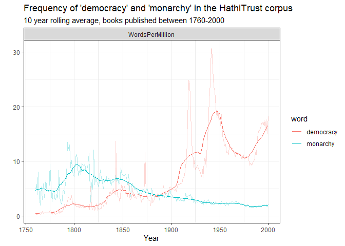
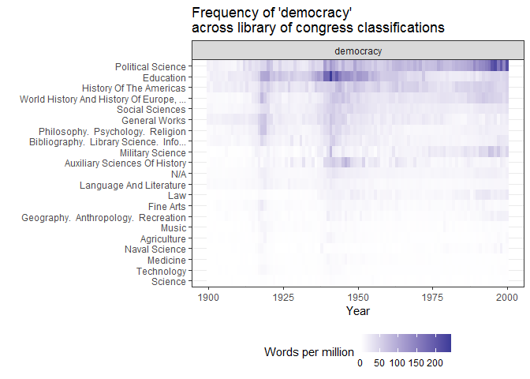
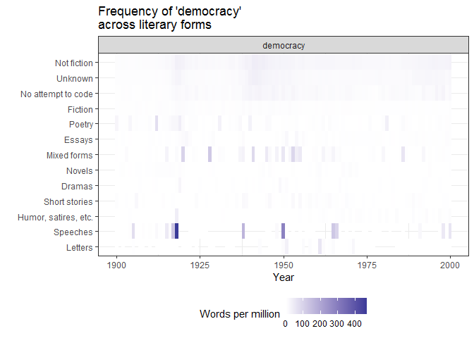
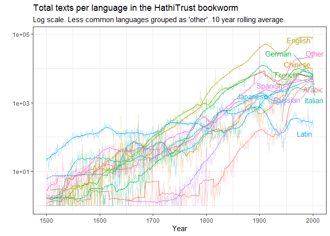

<!-- README.md is generated from README.Rmd. Please edit that file -->

# hathiTools

<!-- badges: start -->

[](https://github.com/xmarquez/hathiTools/actions)
<!-- badges: end -->

This package allows you to interact with various free data resources
made available by the Hathi Trust digital library, including the Hathi
Trust [Bookworm](https://bookworm.htrc.illinois.edu/develop/), a tool
similar to the [Google ngram viewer](https://books.google.com/ngrams)
and the Hathi Trust [Workset Builder
2.0](https://solr2.htrc.illinois.edu/solr-ef/). You can also download
and process the [Hathi Trust Extracted
Features](https://analytics.hathitrust.org/datasets) files on which the
Bookworm viewer is based. The Hathi Trust collection contains over 17
million digitised books, including many of those originally digitised by
Google for its Google Books project.

## Installation

This package is not yet on CRAN. Install from GitHub as follows:

``` r
remotes::install("xmarquez/hathiTools")
```

## Downloading word frequencies

The simplest task to use the package for is to download word frequencies
from the Hathi Trust
[Bookworm](https://bookworm.htrc.illinois.edu/develop/):

``` r
library(hathiTools)
library(tidyverse)
#> -- Attaching packages --------------------------------------- tidyverse 1.3.1 --
#> v ggplot2 3.3.5     v purrr   0.3.4
#> v tibble  3.1.4     v dplyr   1.0.7
#> v tidyr   1.1.3     v stringr 1.4.0
#> v readr   2.0.1     v forcats 0.5.1
#> -- Conflicts ------------------------------------------ tidyverse_conflicts() --
#> x dplyr::filter() masks stats::filter()
#> x dplyr::lag()    masks stats::lag()

result <- query_bookworm(word = c("democracy", "monarchy"), lims = c(1760, 2000), counttype = c("WordsPerMillion", "TextPercent"))
#> No encoding supplied: defaulting to UTF-8.

result
#> # A tibble: 482 x 4
#>    date_year democracy monarchy counttype      
#>        <int>     <dbl>    <dbl> <chr>          
#>  1      1760     0.382     5.50 WordsPerMillion
#>  2      1760     2.50     10.3  TextPercent    
#>  3      1761     0.300     6.32 WordsPerMillion
#>  4      1761     2.13     11.8  TextPercent    
#>  5      1762     0.352     4.94 WordsPerMillion
#>  6      1762     2.00      8.95 TextPercent    
#>  7      1763     0.488     9.32 WordsPerMillion
#>  8      1763     1.94     13.9  TextPercent    
#>  9      1764     0.663     4.37 WordsPerMillion
#> 10      1764     2.37      6.87 TextPercent    
#> # ... with 472 more rows

result %>%
  pivot_longer(democracy:monarchy, names_to = "word") %>%
  group_by(word, counttype) %>%
  mutate(rolling_avg = slider::slide_dbl(value, mean, .before = 10, .after = 10)) %>%
  ggplot(aes(x = date_year, color = word)) +
  geom_line(aes(y = value), alpha = 0.3) +
  geom_line(aes(x = date_year, y = rolling_avg)) +
  facet_wrap(~counttype) +
  labs(x = "Year", y = "", subtitle = "10 year rolling average, books published between 1760-2000",
       title = "Frequency of 'democracy' and 'monarchy' in the HathiTrust corpus") +
  theme_bw()
```



It is also possible to do more complex queries, for example to look at
the relative frequency of a term across book classifications from the
Library of Congress system:

``` r
result2 <- query_bookworm(word = "democracy", groups = c("date_year", "class"),
                          lims = c(1900,2000))
#> No encoding supplied: defaulting to UTF-8.

result2
#> # A tibble: 2,121 x 4
#>    date_year word      class                                     WordsPerMillion
#>        <int> <chr>     <chr>                                               <dbl>
#>  1      1900 democracy N/A                                                 4.03 
#>  2      1900 democracy Agriculture                                         0.769
#>  3      1900 democracy Education                                           9.56 
#>  4      1900 democracy World History And History Of Europe, Asi~           5.50 
#>  5      1900 democracy History Of The Americas                            15.7  
#>  6      1900 democracy Fine Arts                                           0.816
#>  7      1900 democracy Science                                             0.146
#>  8      1900 democracy General Works                                      14.6  
#>  9      1900 democracy Military Science                                    0.962
#> 10      1900 democracy Geography.  Anthropology.  Recreation               0.691
#> # ... with 2,111 more rows

result2 %>%
  ggplot(aes(x = date_year, y = fct_reorder(str_trunc(class, 40), WordsPerMillion))) +
  geom_tile(aes(fill = WordsPerMillion)) +
  facet_wrap(~word) +
  scale_fill_gradient2() +
  theme_bw() +
  labs(y = "", x = "Year", title = "Frequency of 'democracy' \nacross library of congress classifications",
       fill = "Words per million") +
  theme(legend.position = "bottom")
```



Or across literary forms:

``` r
result3 <- query_bookworm(word = "democracy", groups = c("date_year", "literary_form"),
                          lims = c(1900,2000))
#> No encoding supplied: defaulting to UTF-8.

result3 %>%
  ggplot(aes(x = date_year, y = fct_reorder(str_trunc(literary_form, 40), WordsPerMillion))) +
  geom_tile(aes(fill = WordsPerMillion)) +
  facet_wrap(~word) +
  scale_fill_gradient2() +
  theme_bw() +
  labs(y = "", x = "Year", title = "Frequency of 'democracy' \nacross literary forms",
       fill = "Words per million") +
  theme(legend.position = "bottom")
```



It is also possible to further limit the query to, e.g., books published
in a particular language. For example, this gives the number of
English-language texts that use the word “democracy” per year from
1760-2000.

``` r
result4 <- query_bookworm(word = c("democracy"), lims = c(1760, 2000), counttype = c("TotalTexts"), language = "English")
#> No encoding supplied: defaulting to UTF-8.

result4 
#> # A tibble: 241 x 3
#>    date_year democracy counttype 
#>        <int>     <int> <chr>     
#>  1      1760       388 TotalTexts
#>  2      1761       393 TotalTexts
#>  3      1762       319 TotalTexts
#>  4      1763       443 TotalTexts
#>  5      1764       320 TotalTexts
#>  6      1765       352 TotalTexts
#>  7      1766       439 TotalTexts
#>  8      1767       402 TotalTexts
#>  9      1768       480 TotalTexts
#> 10      1769       424 TotalTexts
#> # ... with 231 more rows
```

One can use `method = "returnPossibleFields"` to return the fields
available for grouping:

``` r
result5 <- query_bookworm(word = "", method = "returnPossibleFields")
#> No encoding supplied: defaulting to UTF-8.

result5
#> # A tibble: 21 x 6
#>    name                tablename                 dbname type  anchor description
#>    <chr>               <chr>                     <chr>  <chr> <chr>  <chr>      
#>  1 language            languageLookup            langu~ char~ bookid ""         
#>  2 publication_country publication_countryLookup publi~ char~ bookid ""         
#>  3 publication_state   publication_stateLookup   publi~ char~ bookid ""         
#>  4 subclass            subclassLookup            subcl~ char~ bookid ""         
#>  5 narrow_class        narrow_classLookup        narro~ char~ bookid ""         
#>  6 class               classLookup               class  char~ bookid ""         
#>  7 resource_type       resource_typeLookup       resou~ char~ bookid ""         
#>  8 target_audience     target_audienceLookup     targe~ char~ bookid ""         
#>  9 scanner             scannerLookup             scann~ char~ bookid ""         
#> 10 first_author_birth  first_author_birthLookup  first~ char~ bookid ""         
#> # ... with 11 more rows
```

We can also get a sample of the book titles and links for a particular
year. For example, suppose we’re interested in why so many books in the
category “Education” mention the word “democracy” in 1941, as appears in
the second graph above. This query pulls the first 100 books in the
catalog for 1941 in the category “education”:

``` r
result2 %>% filter(class == "Education", WordsPerMillion == max(WordsPerMillion))
#> # A tibble: 1 x 4
#>   date_year word      class     WordsPerMillion
#>       <int> <chr>     <chr>               <dbl>
#> 1      1941 democracy Education            242.

result6 <- query_bookworm(word = "democracy", groups = "date_year",
                          date_year = "1941", class = "Education", method = "search_results")
#> No encoding supplied: defaulting to UTF-8.

result6 
#> # A tibble: 100 x 3
#>    htid                      title                       url                    
#>    <chr>                     <chr>                       <chr>                  
#>  1 nc01.ark:/13960/t2v41mn4r Teaching democracy in the ~ https://babel.hathitru~
#>  2 uc1.$b67929               The education of free men ~ https://babel.hathitru~
#>  3 mdp.39015062763720        The education of free men ~ https://babel.hathitru~
#>  4 mdp.39015068297905        The education of free men ~ https://babel.hathitru~
#>  5 uc1.$b67873               Pennsylvania bill of right~ https://babel.hathitru~
#>  6 mdp.39015035886111        Education in a world of fe~ https://babel.hathitru~
#>  7 mdp.39015031665543        Education and the morale o~ https://babel.hathitru~
#>  8 uc1.$b67928               Education and the morale o~ https://babel.hathitru~
#>  9 uiug.30112108068831       Proceedings of the convent~ https://babel.hathitru~
#> 10 uc1.b4305220              Guidance in democratic liv~ https://babel.hathitru~
#> # ... with 90 more rows
```

We can download the Extracted Features file associated with any of these
HathiTrust IDs:

``` r
tmp <- tempdir() 

result6$htid[2] %>%
  download_hathi_ef(dir = tmp)
#> # A tibble: 18,763 x 6
#>    htid        token      POS   count section  page
#>    <chr>       <chr>      <chr> <dbl> <chr>   <dbl>
#>  1 uc1.$b67929 COMMISSION NNP       1 body        1
#>  2 uc1.$b67929 N35        CD        1 body        1
#>  3 uc1.$b67929 in         IN        1 body        1
#>  4 uc1.$b67929 uc-male    JJ        1 body        1
#>  5 uc1.$b67929 *          SYM       1 body        1
#>  6 uc1.$b67929 .          .         1 body        1
#>  7 uc1.$b67929 Free       NNP       1 body        1
#>  8 uc1.$b67929 Men        NNP       1 body        1
#>  9 uc1.$b67929 Democracy  NNP       1 body        1
#> 10 uc1.$b67929 School     NNP       1 body        1
#> # ... with 18,753 more rows

extracted_features <- get_hathi_counts(result6$htid[2], dir = tmp)
#> Rows: 18763 Columns: 5
#> -- Column specification --------------------------------------------------------
#> Delimiter: ","
#> chr (3): token, POS, section
#> dbl (2): count, page
#> 
#> i Use `spec()` to retrieve the full column specification for this data.
#> i Specify the column types or set `show_col_types = FALSE` to quiet this message.

extracted_features
#> # A tibble: 18,763 x 6
#>    htid        token      POS   count section  page
#>    <chr>       <chr>      <chr> <dbl> <chr>   <dbl>
#>  1 uc1.$b67929 COMMISSION NNP       1 body        1
#>  2 uc1.$b67929 N35        CD        1 body        1
#>  3 uc1.$b67929 in         IN        1 body        1
#>  4 uc1.$b67929 uc-male    JJ        1 body        1
#>  5 uc1.$b67929 *          SYM       1 body        1
#>  6 uc1.$b67929 .          .         1 body        1
#>  7 uc1.$b67929 Free       NNP       1 body        1
#>  8 uc1.$b67929 Men        NNP       1 body        1
#>  9 uc1.$b67929 Democracy  NNP       1 body        1
#> 10 uc1.$b67929 School     NNP       1 body        1
#> # ... with 18,753 more rows
```

And we can extract the metadata:

``` r
meta <- get_hathi_meta(result6$htid[2], dir = tmp)

meta
#> # A tibble: 35 x 3
#>    field         value                                                 htid     
#>    <chr>         <chr>                                                 <chr>    
#>  1 schemaVersion https://schemas.hathitrust.org/EF_Schema_MetadataSub~ uc1.$b67~
#>  2 id            http://hdl.handle.net/2027/uc1.$b67929                uc1.$b67~
#>  3 type          DataFeedItem                                          uc1.$b67~
#>  4 type          Book                                                  uc1.$b67~
#>  5 dateCreated   20200209                                              uc1.$b67~
#>  6 title         The education of free men in American democracy.      uc1.$b67~
#>  7 contributor   http://www.viaf.org/viaf/144709713                    uc1.$b67~
#>  8 contributor   http://id.loc.gov/ontologies/bibframe/Organization    uc1.$b67~
#>  9 contributor   Educational Policies Commission.                      uc1.$b67~
#> 10 contributor   http://www.viaf.org/viaf/136691592                    uc1.$b67~
#> # ... with 25 more rows
```

We can also get the metadata for all of these books at the same time:

``` r
meta <- get_workset_meta(result6$htid, metadata_dir = tmp)
#> Warning in get_workset_meta(result6$htid, metadata_dir = tmp): This function
#> works best with worksets generated by workset_builder. I cannot determine if
#> this file was generated by workset_builder; results may not be accurate or fail.
#> Getting download key...
#> Downloading metadata for 100 volumes. This might take some time.
#> Rows: 100 Columns: 36
#> -- Column specification --------------------------------------------------------
#> Delimiter: ","
#> chr  (31): htBibUrl, volumeIdentifier, rightsAttributes, title, genre, pubPl...
#> dbl   (3): schemaVersion, pubDate, hathitrustRecordNumber
#> dttm  (2): dateCreated, lastUpdateDate
#> 
#> i Use `spec()` to retrieve the full column specification for this data.
#> i Specify the column types or set `show_col_types = FALSE` to quiet this message.

meta
#> # A tibble: 100 x 36
#>    htBibUrl  schemaVersion volumeIdentifier rightsAttributes title genre pubDate
#>    <chr>             <dbl> <chr>            <chr>            <chr> <chr>   <dbl>
#>  1 http://c~           1.3 nc01.ark:/13960~ und              Teac~ "[\"~    1941
#>  2 http://c~           1.3 uc1.$b67929      pd               The ~ "[\"~    1941
#>  3 http://c~           1.3 mdp.39015062763~ pd               The ~ "[\"~    1941
#>  4 http://c~           1.3 mdp.39015068297~ pd               The ~ "[\"~    1941
#>  5 http://c~           1.3 uc1.$b67873      pd               Penn~ "[\"~    1941
#>  6 http://c~           1.3 mdp.39015035886~ ic               Educ~ "[\"~    1941
#>  7 http://c~           1.3 mdp.39015031665~ pd               Educ~ "[\"~    1941
#>  8 http://c~           1.3 uc1.$b67928      pd               Educ~ "[\"~    1941
#>  9 http://c~           1.3 uiug.3011210806~ ic               Proc~ "[\"~    1941
#> 10 http://c~           1.3 uc1.b4305220     ic               Guid~ "[\"~    1941
#> # ... with 90 more rows, and 29 more variables: pubPlace <chr>,
#> #   typeOfResource <chr>, bibliographicFormat <chr>, language <chr>,
#> #   dateCreated <dttm>, lastUpdateDate <dttm>, imprint <chr>, isbn <chr>,
#> #   issn <chr>, oclc <chr>, lccn <chr>, classification <chr>, handleUrl <chr>,
#> #   hathitrustRecordNumber <dbl>, sourceInstitutionRecordNumber <chr>,
#> #   sourceInstitution <chr>, accessProfile <chr>, enumerationChronology <chr>,
#> #   governmentDocument <chr>, names <chr>, issuance <chr>, ...
```

One can get info about the corpus itself by using
`counttype = "TotalWords"` or `counttype = "TotalTexts"` and omitting
the word key.

``` r
result7 <- query_bookworm(counttype = c("TotalTexts"), groups = c("date_year", "language"),
                          lims = c(1500,2000))
#> No encoding supplied: defaulting to UTF-8.

result7 %>%
  summarise(TotalTexts = sum(TotalTexts))
#> # A tibble: 1 x 1
#>   TotalTexts
#>        <int>
#> 1   12534182

library(ggrepel)

result7 %>%
  mutate(language = fct_lump_n(language, 10, w = TotalTexts)) %>%
  group_by(date_year, language) %>%
  summarise(TotalTexts = sum(TotalTexts)) %>%
  group_by(language) %>%
  mutate(label = ifelse(date_year == max(date_year), as.character(language), NA_character_)) %>%
  group_by(language) %>%
  mutate(rolling_avg = slider::slide_dbl(TotalTexts, mean, .before = 10, .after = 10)) %>%
  ggplot() +
  geom_line(aes(x = date_year, y = rolling_avg, color = language), show.legend = FALSE) +
  geom_line(aes(x = date_year, y = TotalTexts, color = language), show.legend = FALSE, alpha = 0.3) +
  geom_text_repel(aes(x = date_year, y = TotalTexts, label = label, color = language), show.legend = FALSE) +
  scale_y_log10() +
  theme_bw() +
  labs(title = "Total texts per language in the HathiTrust bookworm", subtitle = "Log scale. Less common languages grouped as 'other'. 10 year rolling average.", x = "Year", y = "")
#> `summarise()` has grouped output by 'date_year'. You can override using the `.groups` argument.
```



Note that the accessible Hathi Trust Bookworm database is the 2016
version. A more current version of the database exists (with some 17
million digitized texts), but is not publicly accessible yet, I think.

It is also possible to build a workset of Hathi Trust IDs for further
analysis. Here, for example, we find all the volumes that contain the
term “democracy” and have genre strings that include “dictionary” and
“biography”.

``` r
result8 <- workset_builder(token = "democracy", genre = c("dictionary", "biography"))

result8 
#> # A tibble: 1,129 x 2
#>    htid                         n
#>    <chr>                    <int>
#>  1 aeu.ark:/13960/t39030j16     3
#>  2 aeu.ark:/13960/t9z040f1s     1
#>  3 chi.090377798               25
#>  4 chi.097697911                2
#>  5 chi.098306000                1
#>  6 chi.23017470                 2
#>  7 chi.73090523                 3
#>  8 coo.31924022643799           1
#>  9 coo.31924081662029           1
#> 10 coo.31924086013368           1
#> # ... with 1,119 more rows
```

Here’s the metadata for the first six of these results.

``` r
meta <- get_workset_meta(head(result8), metadata_dir = tmp) 
#> Getting download key...
#> Downloading metadata for 6 volumes. This might take some time.
#> Rows: 6 Columns: 36
#> -- Column specification --------------------------------------------------------
#> Delimiter: ","
#> chr  (30): htBibUrl, volumeIdentifier, rightsAttributes, title, genre, pubPl...
#> dbl   (4): schemaVersion, pubDate, hathitrustRecordNumber, sourceInstitution...
#> dttm  (2): dateCreated, lastUpdateDate
#> 
#> i Use `spec()` to retrieve the full column specification for this data.
#> i Specify the column types or set `show_col_types = FALSE` to quiet this message.

meta
#> # A tibble: 6 x 36
#>   htBibUrl  schemaVersion volumeIdentifier  rightsAttributes title genre pubDate
#>   <chr>             <dbl> <chr>             <chr>            <chr> <chr>   <dbl>
#> 1 http://c~           1.3 aeu.ark:/13960/t~ pd               An A~ "[\"~    1832
#> 2 http://c~           1.3 aeu.ark:/13960/t~ pd               An A~ "[\"~    1809
#> 3 http://c~           1.3 chi.090377798     pd               Univ~ "[\"~    1885
#> 4 http://c~           1.3 chi.097697911     pd               The ~ "[\"~    1880
#> 5 http://c~           1.3 chi.098306000     pd               Live~ "[\"~    1814
#> 6 http://c~           1.3 chi.23017470      pd               The ~ "[\"~    1880
#> # ... with 29 more variables: pubPlace <chr>, typeOfResource <chr>,
#> #   bibliographicFormat <chr>, language <chr>, dateCreated <dttm>,
#> #   lastUpdateDate <dttm>, imprint <chr>, isbn <chr>, issn <chr>, oclc <chr>,
#> #   lccn <chr>, classification <chr>, handleUrl <chr>,
#> #   hathitrustRecordNumber <dbl>, sourceInstitutionRecordNumber <dbl>,
#> #   sourceInstitution <chr>, accessProfile <chr>, enumerationChronology <chr>,
#> #   governmentDocument <chr>, names <chr>, issuance <chr>, ...
```

One can also turn the workset into a list of htids for downloading via
rsync:

``` r
tmp <- tempfile()

htid_to_rsync(result8$htid, tmp)
#> Use rsync -av --files-from C:\Users\marquexa\AppData\Local\Temp\RtmpU9KGqk\file5d443336f6c data.analytics.hathitrust.org::features-2020.03/ hathi-ef/ to download EF files to hathi-ef directory
```

There’s a convenience function that will attempt to do this for you in
one command.

``` r
rsync_from_hathi(head(result8$htid))
```

(This requires having rsync installed; see the vignette on using
worksets in this website).

It is also possible to download the big
“[hathifile](https://www.hathitrust.org/hathifiles)” to get basic
metadata for ALL of the texts in the Hathi Trust digital library; this
is useful for selecting random samples.

## Credits

This package includes some code from the
[hathidy](https://github.com/HumanitiesDataAnalysis/hathidy) and
[edinburgh](https://github.com/bmschmidt/edinburgh/) repos by
@bmschmidt.
