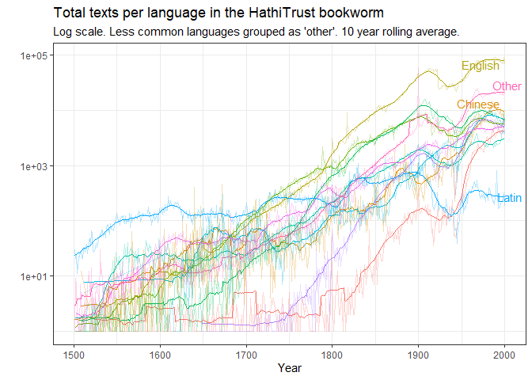

<!-- README.md is generated from README.Rmd. Please edit that file -->

# hathiTools

<!-- badges: start -->

[](https://github.com/xmarquez/hathiTools/actions)
<!-- badges: end -->

This package allows you to interact with various free data resources
made available by the Hathi Trust digital library, including the Hathi
Trust [Bookworm](https://bookworm.htrc.illinois.edu/develop/), a tool
similar to the [Google ngram viewer](https://books.google.com/ngrams)
and the Hathi Trust [Workset Builder
2.0](https://solr2.htrc.illinois.edu/solr-ef/). It also allows you to
download and process the [Hathi Trust Extracted Features
files](https://analytics.hathitrust.org/datasets), which contain
per-page word counts and part-of-speech information for over 17 million
digitised volumes, including many of those originally digitised by
Google for its Google Books project.

## Installation

This package is not on CRAN. Install from GitHub as follows:

``` r
if(!require(remotes)) { 
  install.packages("remotes") 
}
remotes::install_github("xmarquez/hathiTools")
```

## Downloading word frequencies from the Hathi Trust Bookworm

The simplest task to use the package for is to download word frequencies
from the Hathi Trust
[Bookworm](https://bookworm.htrc.illinois.edu/develop/):

``` r
library(hathiTools)
#> Available fields for bookworm queries in the Bookworm2021 db:
#> lc_classes, lc_subclass, fiction_nonfiction, genres, languages, htsource, digitization_agent_code, mainauthor, publisher, format, is_gov_doc, page_count_bin, word_count_bin, publication_country, publication_state, publication_place, date_year
#> Retrieve options via getOption("hathiTools.bookworm.fields")
#> Currently caching Hathi Trust Extracted Features files to ./hathi-ef
#> Change default caching directory by setting options(hathiTools.ef.dir = $DIR)
#> Default cache format csv.gz
#> Change default cache format by setting options(hathiTools.cacheformat = 'new_cache_format')
library(tidyverse)
#> Warning: package 'tidyverse' was built under R version 4.2.1
#> ── Attaching packages
#> ───────────────────────────────────────
#> tidyverse 1.3.2 ──
#> ✔ ggplot2 3.3.6     ✔ purrr   0.3.4
#> ✔ tibble  3.1.8     ✔ dplyr   1.0.9
#> ✔ tidyr   1.2.0     ✔ stringr 1.4.0
#> ✔ readr   2.1.2     ✔ forcats 0.5.1
#> Warning: package 'ggplot2' was built under R version 4.2.1
#> Warning: package 'tibble' was built under R version 4.2.1
#> Warning: package 'tidyr' was built under R version 4.2.1
#> Warning: package 'readr' was built under R version 4.2.1
#> Warning: package 'purrr' was built under R version 4.2.1
#> Warning: package 'dplyr' was built under R version 4.2.1
#> Warning: package 'stringr' was built under R version 4.2.1
#> Warning: package 'forcats' was built under R version 4.2.1
#> ── Conflicts ────────────────────────────────────────── tidyverse_conflicts() ──
#> ✖ dplyr::filter() masks stats::filter()
#> ✖ dplyr::lag()    masks stats::lag()
library(slider) ## For rolling averages
#> Warning: package 'slider' was built under R version 4.2.1

result <- query_bookworm(word = c("democracy", "monarchy"), lims = c(1760, 2000), counttype = c("WordsPerMillion"))

result
#> # A tibble: 482 × 4
#>    word      date_year value counttype      
#>    <chr>         <int> <dbl> <chr>          
#>  1 democracy      1760 0.382 WordsPerMillion
#>  2 democracy      1761 0.253 WordsPerMillion
#>  3 democracy      1762 0.332 WordsPerMillion
#>  4 democracy      1763 0.455 WordsPerMillion
#>  5 democracy      1764 0.593 WordsPerMillion
#>  6 democracy      1765 0.279 WordsPerMillion
#>  7 democracy      1766 0.406 WordsPerMillion
#>  8 democracy      1767 0.809 WordsPerMillion
#>  9 democracy      1768 0.439 WordsPerMillion
#> 10 democracy      1769 0.579 WordsPerMillion
#> # … with 472 more rows
#> # ℹ Use `print(n = ...)` to see more rows

result %>%
  group_by(word, counttype) %>%
  mutate(rolling_avg = slide_dbl(value, mean, .before = 10, .after = 10)) %>%
  ggplot(aes(x = date_year, color = word)) +
  geom_line(aes(y = value), alpha = 0.3) +
  geom_line(aes(x = date_year, y = rolling_avg)) +
  facet_wrap(~counttype) +
  labs(x = "Year", y = "", subtitle = "10 year rolling average, books published between 1760-2000",
       title = "Frequency of 'democracy' and 'monarchy' in the HathiTrust corpus") +
  theme_bw()
```


There are more than 18 million texts in the latest version of the
Bookworm database.

``` r
total_texts <- query_bookworm(counttype = c("TotalTexts"), groups = c("date_year", "languages"),
                          lims = c(0,2022))

total_texts %>%
  summarise(value = sum(value))
#> # A tibble: 1 × 1
#>      value
#>      <int>
#> 1 18807270

library(ggrepel)

total_texts %>%
  filter(date_year > 1500, date_year < 2011) %>%
  mutate(languages = fct_lump_n(languages, 10, w = value)) %>%
  group_by(date_year, languages) %>%
  summarise(value = sum(value)) %>%
  group_by(languages) %>%
  mutate(label = ifelse(date_year == max(date_year), as.character(languages), NA_character_),
         rolling_avg = slider::slide_dbl(value, mean, .before = 10, .after = 10)) %>%
  ggplot() +
  geom_line(aes(x = date_year, y = rolling_avg, color = languages), show.legend = FALSE) +
  geom_line(aes(x = date_year, y = value, color = languages), show.legend = FALSE, alpha = 0.3) +
  geom_text_repel(aes(x = date_year, y = value, label = label, color = languages), show.legend = FALSE) +
  scale_y_log10() +
  theme_bw() +
  labs(title = "Total texts per language in the HathiTrust bookworm", 
       subtitle = "Log scale. Less common languages grouped as 'other'. 10 year rolling average.", 
       x = "Year", y = "")
#> `summarise()` has grouped output by 'date_year'. You can override using the
#> `.groups` argument.
```



See the article “[Using the Hathi
Bookworm](articles/using_the_hathi_bookworm.html)” for more on how to
query the bookworm to get word frequencies grouped by particular fields
and/or limited to specific categories.

## Creating Worksets of Hathi Trust IDs

We can also create worksets of Hathi Trust IDs for volumes in the
digital library that meet specific criteria, such as all volumes that
mention “liberal” and “democracy” in the same page, or all volumes with
by Alexis de Tocqueville in the “author” field.

``` r
result2 <- workset_builder("liberal democracy", volumes_only = FALSE)

result2
#> # A tibble: 6,341 × 2
#>    htid                     id                                  
#>    <chr>                    <chr>                               
#>  1 aeu.ark:/13960/t05x3k82c aeu.ark:/13960/t05x3k82c.page-000075
#>  2 aeu.ark:/13960/t6pz5zs5h aeu.ark:/13960/t6pz5zs5h.page-000251
#>  3 aeu.ark:/13960/t8qc19m2f aeu.ark:/13960/t8qc19m2f.page-000222
#>  4 chi.096292271            chi.096292271.page-000364           
#>  5 chi.096292336            chi.096292336.page-000368           
#>  6 chi.101607416            chi.101607416.page-001182           
#>  7 chi.63733675             chi.63733675.page-000012            
#>  8 chi.65548487             chi.65548487.page-000438            
#>  9 chi.78011095             chi.78011095.page-000870            
#> 10 chi.78020645             chi.78020645.page-000400            
#> # … with 6,331 more rows
#> # ℹ Use `print(n = ...)` to see more rows
```

``` r
result3 <- workset_builder(name = "Alexis de Tocqueville")
result3
#> # A tibble: 464 × 2
#>    htid                   n
#>    <chr>              <int>
#>  1 mdp.39015079304757  1358
#>  2 mdp.39015008706338  1213
#>  3 mdp.39015058109706   945
#>  4 nyp.33433081795357   910
#>  5 uva.x000469924       909
#>  6 hvd.32044051720316   906
#>  7 coo.31924030454809   904
#>  8 nyp.33433081795266   903
#>  9 ien.35556041207515   901
#> 10 nyp.33433081795381   901
#> # … with 454 more rows
#> # ℹ Use `print(n = ...)` to see more rows
```

We can browse these volumes interactively in the Hathi Trust website:

``` r
browse_htids(result2)
```

See the article “[Topic Models Using Hathi Extracted
Features](articles/topic_models_using_hathi_ef.html)” for more on
creating and using worksets for specific analysis purposes.

## Downloading extracted feature files for specific Hathi Trust volumes and caching them to specific formats

We can download the Extracted Features file associated with any of these
HathiTrust IDs:

``` r
tmp <- tempdir() 

extracted_features <- get_hathi_counts(result3$htid[2], dir = tmp)
#> Now caching EF file for mdp.39015008706338

extracted_features
#> # A tibble: 222,275 × 6
#>    htid               token POS   count section  page
#>    <chr>              <chr> <chr> <int> <chr>   <int>
#>  1 mdp.39015008706338 E     UNK       3 body        2
#>  2 mdp.39015008706338 s     UNK       1 body        2
#>  3 mdp.39015008706338 .     UNK       1 body        2
#>  4 mdp.39015008706338 N     UNK       2 body        2
#>  5 mdp.39015008706338 IllE  UNK       1 body        2
#>  6 mdp.39015008706338 ::    UNK       1 body        2
#>  7 mdp.39015008706338 |     UNK       3 body        2
#>  8 mdp.39015008706338 -'    UNK       1 body        2
#>  9 mdp.39015008706338 -     UNK       6 body        2
#> 10 mdp.39015008706338 #     UNK       1 body        2
#> # … with 222,265 more rows
#> # ℹ Use `print(n = ...)` to see more rows
```

And we can extract the metadata for any of them as well:

``` r
meta <- get_hathi_meta(result3$htid[2], dir = tmp)

meta
#> # A tibble: 1 × 20
#>   htid         schem…¹ id    type  dateC…² title contr…³ pubDate publi…⁴ pubPl…⁵
#>   <chr>        <chr>   <chr> <chr>   <int> <chr> <chr>     <int> <chr>   <chr>  
#> 1 mdp.3901500… https:… http… "[[\…  2.02e7 De l… "{\"id…    1836 "{\"id… "{\"id…
#> # … with 10 more variables: language <chr>, accessRights <chr>,
#> #   accessProfile <chr>, sourceInstitution <chr>, mainEntityOfPage <chr>,
#> #   oclc <chr>, genre <chr>, enumerationChronology <chr>, typeOfResource <chr>,
#> #   lastRightsUpdateDate <int>, and abbreviated variable names ¹​schemaVersion,
#> #   ²​dateCreated, ³​contributor, ⁴​publisher, ⁵​pubPlace
#> # ℹ Use `colnames()` to see all variable names
```

Including the page-level metadata for any volume:

``` r
page_meta <- get_hathi_page_meta(result3$htid[2], dir = tmp)

page_meta
#> # A tibble: 2,608 × 17
#>    htid       page seq   version token…¹ lineC…² empty…³ sente…⁴ calcu…⁵ secti…⁶
#>    <chr>     <int> <chr> <chr>     <int>   <int>   <int>   <int> <chr>     <int>
#>  1 mdp.3901…     2 0000… 6c4865…      23       9       1      NA <NA>         23
#>  2 mdp.3901…     4 0000… eeacf0…       7       9       4      NA <NA>          7
#>  3 mdp.3901…     5 0000… 43839d…       7       4       1      NA <NA>          7
#>  4 mdp.3901…     7 0000… 4f96d5…       1       2       1      NA <NA>          1
#>  5 mdp.3901…     9 0000… fe4c49…     420      38       1       4 zh          420
#>  6 mdp.3901…    10 0000… 2384c7…      20      11       1       2 en           20
#>  7 mdp.3901…    11 0000… 352c92…      79      28       6      NA br           79
#>  8 mdp.3901…    12 0000… e62077…      26      15       1       1 zh           26
#>  9 mdp.3901…    13 0000… aa0fbc…       8       5       1      NA so            8
#> 10 mdp.3901…    14 0000… 275644…      19       2       0      NA <NA>         19
#> # … with 2,598 more rows, 7 more variables: sectionLineCount <int>,
#> #   sectionEmptyLineCount <int>, sectionSentenceCount <int>,
#> #   sectionCapAlphaSeq <int>, sectionBeginCharCount <chr>,
#> #   sectionEndCharCount <chr>, section <chr>, and abbreviated variable names
#> #   ¹​tokenCount, ²​lineCount, ³​emptyLineCount, ⁴​sentenceCount,
#> #   ⁵​calculatedLanguage, ⁶​sectionTokenCount
#> # ℹ Use `print(n = ...)` to see more rows, and `colnames()` to see all variable names
```

We can also get the metadata for many or all of these books at the same
time:

``` r
meta <- get_workset_meta(result3[1:5, ], metadata_dir = tmp)
#> Getting download key...
#> Downloading metadata for 5 volumes. This might take some time.

meta
#> # A tibble: 5 × 16
#>   htid       acces…¹ acces…² url   title dateC…³ lastR…⁴ pubDate schem…⁵ typeO…⁶
#>   <chr>      <chr>   <chr>   <chr> <chr>   <dbl>   <dbl>   <dbl> <chr>   <chr>  
#> 1 mdp.39015… google  ic      http… Oeuv…  2.02e7  2.02e7    1991 https:… http:/…
#> 2 mdp.39015… google  pd      http… De l…  2.02e7  2.02e7    1836 https:… http:/…
#> 3 mdp.39015… google  ic      http… Demo…  2.02e7  2.02e7    2004 https:… http:/…
#> 4 nyp.33433… google  pd      http… Demo…  2.02e7  2.02e7    1847 https:… http:/…
#> 5 uva.x0004… google  pd      http… The …  2.02e7  2.02e7    1849 https:… http:/…
#> # … with 6 more variables: language <chr>, oclc <dbl>, genre <chr>,
#> #   contributor <chr>, publisher <chr>, pubPlace <chr>, and abbreviated
#> #   variable names ¹​accessProfile, ²​accessRights, ³​dateCreated,
#> #   ⁴​lastRightsUpdateDate, ⁵​schemaVersion, ⁶​typeOfResource
#> # ℹ Use `colnames()` to see all variable names
```

One can also turn a workset into a list of htids for downloading their
extracted features via rsync:

``` r
tmp <- tempfile()

htid_to_rsync(result3$htid[1:5], file = tmp)
#> Use rsync -av --files-from C:\Users\marquexa\AppData\Local\Temp\Rtmpeuc7FS\file367c50b12eda data.analytics.hathitrust.org::features-2020.03/ hathi-ef/ to download EF files to hathi-ef directory
```

There’s a convenience function that will attempt to do this for you in
one command, if you have rsync installed.

``` r
tmpdir <- tempdir()
rsync_from_hathi(result3[1:5, ], dir = tmpdir)
#> 0
#> [1] 0
```

And you can cache these files to csv or some other fast-loading format
also in one command:

``` r
cache_htids(result3[1:5, ], dir = tmpdir)
#> 3 HTIDs have already been cached to csv.gz format.
#> Preparing to cache 4 EF files to C:/Users/marquexa/AppData/Local/Temp/Rtmpeuc7FS (../../../AppData/Local/Temp/Rtmpeuc7FS)
#> Now caching EF file for mdp.39015058109706
#> Now caching volume-level metadata for mdp.39015058109706
#> Now caching page-level metadata for mdp.39015058109706
#> Now caching EF file for mdp.39015079304757
#> Now caching volume-level metadata for mdp.39015079304757
#> Now caching page-level metadata for mdp.39015079304757
#> Now caching EF file for nyp.33433081795357
#> Now caching volume-level metadata for nyp.33433081795357
#> Now caching page-level metadata for nyp.33433081795357
#> Now caching EF file for uva.x000469924
#> Now caching volume-level metadata for uva.x000469924
#> Now caching page-level metadata for uva.x000469924
#> # A tibble: 15 × 5
#>    htid               local_loc                           cache…¹ cache…² exists
#>    <chr>              <glue>                              <chr>   <chr>   <lgl> 
#>  1 mdp.39015079304757 C:\Users\marquexa\AppData\Local\Te… csv.gz  ef      TRUE  
#>  2 mdp.39015008706338 C:\Users\marquexa\AppData\Local\Te… csv.gz  ef      TRUE  
#>  3 mdp.39015058109706 C:\Users\marquexa\AppData\Local\Te… csv.gz  ef      TRUE  
#>  4 nyp.33433081795357 C:\Users\marquexa\AppData\Local\Te… csv.gz  ef      TRUE  
#>  5 uva.x000469924     C:\Users\marquexa\AppData\Local\Te… csv.gz  ef      TRUE  
#>  6 mdp.39015079304757 C:\Users\marquexa\AppData\Local\Te… csv.gz  meta    TRUE  
#>  7 mdp.39015008706338 C:\Users\marquexa\AppData\Local\Te… csv.gz  meta    TRUE  
#>  8 mdp.39015058109706 C:\Users\marquexa\AppData\Local\Te… csv.gz  meta    TRUE  
#>  9 nyp.33433081795357 C:\Users\marquexa\AppData\Local\Te… csv.gz  meta    TRUE  
#> 10 uva.x000469924     C:\Users\marquexa\AppData\Local\Te… csv.gz  meta    TRUE  
#> 11 mdp.39015079304757 C:\Users\marquexa\AppData\Local\Te… csv.gz  pageme… TRUE  
#> 12 mdp.39015008706338 C:\Users\marquexa\AppData\Local\Te… csv.gz  pageme… TRUE  
#> 13 mdp.39015058109706 C:\Users\marquexa\AppData\Local\Te… csv.gz  pageme… TRUE  
#> 14 nyp.33433081795357 C:\Users\marquexa\AppData\Local\Te… csv.gz  pageme… TRUE  
#> 15 uva.x000469924     C:\Users\marquexa\AppData\Local\Te… csv.gz  pageme… TRUE  
#> # … with abbreviated variable names ¹​cache_format, ²​cache_type
```

And read them all into memory in one go:

``` r
tocqueville_ef <- read_cached_htids(result3[1:5, ], dir = tmpdir)
tocqueville_ef
#> # A tibble: 1,191,761 × 43
#>    htid        token POS   count section  page schem…¹ id    type  dateC…² title
#>    <chr>       <chr> <chr> <int> <chr>   <int> <chr>   <chr> <chr>   <int> <chr>
#>  1 mdp.390150… PLÉI… UNK       1 body        7 https:… http… "[[\…  2.02e7 Oeuv…
#>  2 mdp.390150… BIBL… UNK       1 body        7 https:… http… "[[\…  2.02e7 Oeuv…
#>  3 mdp.390150… LA    UNK       1 body        7 https:… http… "[[\…  2.02e7 Oeuv…
#>  4 mdp.390150… DE    UNK       1 body        7 https:… http… "[[\…  2.02e7 Oeuv…
#>  5 mdp.390150… MÉLO… UNK       1 body        9 https:… http… "[[\…  2.02e7 Oeuv…
#>  6 mdp.390150… FRAN… UNK       3 body        9 https:… http… "[[\…  2.02e7 Oeuv…
#>  7 mdp.390150… FRAN… UNK       2 body        9 https:… http… "[[\…  2.02e7 Oeuv…
#>  8 mdp.390150… PRÉS… UNK       1 body        9 https:… http… "[[\…  2.02e7 Oeuv…
#>  9 mdp.390150… PAR   UNK       3 body        9 https:… http… "[[\…  2.02e7 Oeuv…
#> 10 mdp.390150… INTR… UNK       1 body        9 https:… http… "[[\…  2.02e7 Oeuv…
#> # … with 1,191,751 more rows, 32 more variables: contributor <chr>,
#> #   pubDate <int>, publisher <chr>, pubPlace <chr>, language <chr>,
#> #   accessRights <chr>, accessProfile <chr>, sourceInstitution <chr>,
#> #   mainEntityOfPage <chr>, oclc <chr>, isbn <chr>, genre <chr>,
#> #   enumerationChronology <chr>, typeOfResource <chr>,
#> #   lastRightsUpdateDate <int>, lcc <chr>, lccn <chr>, category <chr>,
#> #   seq <chr>, version <chr>, tokenCount <int>, lineCount <int>, …
#> # ℹ Use `print(n = ...)` to see more rows, and `colnames()` to see all variable names
```

See the articles “[Topic Models Using Hathi Extracted
Features](articles/topic_models_using_hathi_ef.html)” and “[An Example
Workflow](articles/example_workflow.html)” for more on rsyncing large
numbers of Hathi Trust JSON extracted features files and caching them to
other formats for analysis.

It is also possible to download the big
“[hathifile](https://www.hathitrust.org/hathifiles)” to get basic
metadata for ALL of the texts in the Hathi Trust digital library; this
is useful for selecting random samples.

## Credits

This package includes some code from the
[hathidy](https://github.com/HumanitiesDataAnalysis/hathidy) and
[edinburgh](https://github.com/bmschmidt/edinburgh/) repos by
@bmschmidt.
