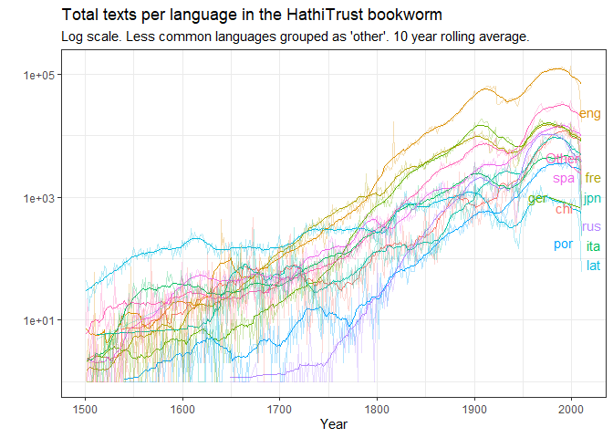

<!-- README.md is generated from README.Rmd. Please edit that file -->

# hathiTools

<!-- badges: start -->

[](https://github.com/xmarquez/hathiTools/actions)
<!-- badges: end -->

This package allows you to interact with various free data resources
made available by the Hathi Trust digital library, including the Hathi
Trust [Bookworm](https://bookworm.htrc.illinois.edu/develop/), a tool
similar to the [Google ngram viewer](https://books.google.com/ngrams)
and the Hathi Trust [Workset Builder
2.0](https://solr2.htrc.illinois.edu/solr-ef/). It also allows you to
download and process the [Hathi Trust Extracted Features
files](https://analytics.hathitrust.org/datasets), which contain
per-page word counts and part-of-speech information for over 15 million
digitised volumes, including many of those originally digitised by
Google for its Google Books project.

## Installation

This package is not yet on CRAN. Install from GitHub as follows:

``` r
remotes::install("xmarquez/hathiTools")
```

## Downloading word frequencies

The simplest task to use the package for is to download word frequencies
from the Hathi Trust
[Bookworm](https://bookworm.htrc.illinois.edu/develop/):

``` r
library(hathiTools)
library(tidyverse)
#> -- Attaching packages --------------------------------------- tidyverse 1.3.1 --
#> v ggplot2 3.3.5     v purrr   0.3.4
#> v tibble  3.1.4     v dplyr   1.0.7
#> v tidyr   1.1.3     v stringr 1.4.0
#> v readr   2.0.1     v forcats 0.5.1
#> -- Conflicts ------------------------------------------ tidyverse_conflicts() --
#> x dplyr::filter() masks stats::filter()
#> x dplyr::lag()    masks stats::lag()

result <- query_bookworm(word = c("democracy", "monarchy"), lims = c(1760, 2000), counttype = c("WordsPerMillion", "TextPercent"))

result
#> # A tibble: 964 x 4
#>    word      date_year value counttype      
#>    <chr>         <int> <dbl> <chr>          
#>  1 democracy      1760 0.382 WordsPerMillion
#>  2 democracy      1760 2.50  TextPercent    
#>  3 democracy      1761 0.300 WordsPerMillion
#>  4 democracy      1761 2.13  TextPercent    
#>  5 democracy      1762 0.352 WordsPerMillion
#>  6 democracy      1762 2.00  TextPercent    
#>  7 democracy      1763 0.488 WordsPerMillion
#>  8 democracy      1763 1.94  TextPercent    
#>  9 democracy      1764 0.663 WordsPerMillion
#> 10 democracy      1764 2.37  TextPercent    
#> # ... with 954 more rows

result %>%
  group_by(word, counttype) %>%
  mutate(rolling_avg = slider::slide_dbl(value, mean, .before = 10, .after = 10)) %>%
  ggplot(aes(x = date_year, color = word)) +
  geom_line(aes(y = value), alpha = 0.3) +
  geom_line(aes(x = date_year, y = rolling_avg)) +
  facet_wrap(~counttype) +
  labs(x = "Year", y = "", subtitle = "10 year rolling average, books published between 1760-2000",
       title = "Frequency of 'democracy' and 'monarchy' in the HathiTrust corpus") +
  theme_bw()
```


There are more than 13 million texts in the bookworm database.

``` r
total_texts <- query_bookworm(counttype = c("TotalTexts"), groups = c("date_year", "language"),
                          lims = c(0,2020))

total_texts %>%
  summarise(value = sum(value))
#> # A tibble: 1 x 1
#>      value
#>      <int>
#> 1 13786170

library(ggrepel)

total_texts %>%
  filter(date_year > 1500, date_year < 2001) %>%
  mutate(language = fct_lump_n(language, 10, w = value)) %>%
  group_by(date_year, language) %>%
  summarise(value = sum(value)) %>%
  group_by(language) %>%
  mutate(label = ifelse(date_year == max(date_year), as.character(language), NA_character_)) %>%
  group_by(language) %>%
  mutate(rolling_avg = slider::slide_dbl(value, mean, .before = 10, .after = 10)) %>%
  ggplot() +
  geom_line(aes(x = date_year, y = rolling_avg, color = language), show.legend = FALSE) +
  geom_line(aes(x = date_year, y = value, color = language), show.legend = FALSE, alpha = 0.3) +
  geom_text_repel(aes(x = date_year, y = value, label = label, color = language), show.legend = FALSE) +
  scale_y_log10() +
  theme_bw() +
  labs(title = "Total texts per language in the HathiTrust bookworm", 
       subtitle = "Log scale. Less common languages grouped as 'other'. 10 year rolling average.", 
       x = "Year", y = "")
#> `summarise()` has grouped output by 'date_year'. You can override using the `.groups` argument.
```



See the article “[Using the Hathi
Bookworm](articles/using_the_hathi_bookworm)” for more on how to query
the bookworm to get word frequencies grouped by particular fields and/or
limited to specific categories.

## Creating Worksets of Hathi Trust IDs

We can also create worksets of Hathi Trust IDs for volumes in the
digital library that meet specific criteria, such as all volumes that
mention “liberal” and “democracy” in the same page, or all volumes with
by Alexis de Tocqueville in the “author” field.

``` r
result2 <- workset_builder("liberal democracy", volumes_only = FALSE)

result2
#> # A tibble: 6,193 x 2
#>    htid                     id                                  
#>    <chr>                    <chr>                               
#>  1 aeu.ark:/13960/t05x3k82c aeu.ark:/13960/t05x3k82c.page-000075
#>  2 aeu.ark:/13960/t6pz5zs5h aeu.ark:/13960/t6pz5zs5h.page-000251
#>  3 aeu.ark:/13960/t7pn9qp4g aeu.ark:/13960/t7pn9qp4g.page-000394
#>  4 aeu.ark:/13960/t8qc19m2f aeu.ark:/13960/t8qc19m2f.page-000222
#>  5 chi.090309143            chi.090309143.page-000227           
#>  6 chi.096292271            chi.096292271.page-000333           
#>  7 chi.096292271            chi.096292271.page-000364           
#>  8 chi.096292336            chi.096292336.page-000337           
#>  9 chi.096292336            chi.096292336.page-000368           
#> 10 chi.101607416            chi.101607416.page-001182           
#> # ... with 6,183 more rows
```

``` r
result3 <- workset_builder(name = "Alexis de Tocqueville")
result3
#> # A tibble: 417 x 2
#>    htid                         n
#>    <chr>                    <int>
#>  1 aeu.ark:/13960/t00z8277t   506
#>  2 aeu.ark:/13960/t0ms4jd0t   419
#>  3 aeu.ark:/13960/t0wq0sh3s   455
#>  4 aeu.ark:/13960/t0wq0sh9p   445
#>  5 aeu.ark:/13960/t18k8252g   386
#>  6 aeu.ark:/13960/t23b7448p   649
#>  7 aeu.ark:/13960/t2h717j0v   607
#>  8 aeu.ark:/13960/t2k65c727   543
#>  9 aeu.ark:/13960/t3qv43c3w   516
#> 10 aeu.ark:/13960/t6252fd09   382
#> # ... with 407 more rows
```

We can browse these volumes interactively in the Hathi Trust website:

``` r
browse_htids(result2)
```

See the article “[Topic Models Using Hathi Extracted
Features](articles/topic_models_using_hathi_ef)” for more on creating
and using worksets for specific analysis purposes.

## Downloading extracted feature files for specific Hathi Trust volumes

We can download the Extracted Features file associated with any of these
HathiTrust IDs:

``` r
tmp <- tempdir() 

extracted_features <- get_hathi_counts(result3$htid[2], dir = tmp)

extracted_features
#> # A tibble: 71,102 x 6
#>    htid                     token POS   count section  page
#>    <chr>                    <chr> <chr> <dbl> <chr>   <dbl>
#>  1 aeu.ark:/13960/t0ms4jd0t II    NNP       1 body        1
#>  2 aeu.ark:/13960/t0ms4jd0t ``    ``        2 body        1
#>  3 aeu.ark:/13960/t0ms4jd0t *     SYM       2 body        1
#>  4 aeu.ark:/13960/t0ms4jd0t 23    CD        1 body        1
#>  5 aeu.ark:/13960/t0ms4jd0t %     NN        4 body        1
#>  6 aeu.ark:/13960/t0ms4jd0t n     NN        1 body        1
#>  7 aeu.ark:/13960/t0ms4jd0t .     .         2 body        1
#>  8 aeu.ark:/13960/t0ms4jd0t 9     CD        1 body        1
#>  9 aeu.ark:/13960/t0ms4jd0t <     JJR       1 body        1
#> 10 aeu.ark:/13960/t0ms4jd0t U     NNP       1 body        1
#> # ... with 71,092 more rows
```

And we can extract the metadata for any of them as well:

``` r
meta <- get_hathi_meta(result3$htid[2], dir = tmp)

meta
#> # A tibble: 30 x 3
#>    field         value                                         htid             
#>    <chr>         <chr>                                         <chr>            
#>  1 schemaVersion https://schemas.hathitrust.org/EF_Schema_Met~ aeu.ark:/13960/t~
#>  2 id            http://hdl.handle.net/2027/aeu.ark:/13960/t0~ aeu.ark:/13960/t~
#>  3 type          DataFeedItem                                  aeu.ark:/13960/t~
#>  4 type          Book                                          aeu.ark:/13960/t~
#>  5 dateCreated   20200209                                      aeu.ark:/13960/t~
#>  6 title         De la démocratie en Amérique                  aeu.ark:/13960/t~
#>  7 contributor   http://www.viaf.org/viaf/66474207             aeu.ark:/13960/t~
#>  8 contributor   http://id.loc.gov/ontologies/bibframe/Person  aeu.ark:/13960/t~
#>  9 contributor   Tocqueville, Alexis de, 1805-1859.            aeu.ark:/13960/t~
#> 10 pubDate       1848                                          aeu.ark:/13960/t~
#> # ... with 20 more rows
```

We can also get the metadata for many or all of these books at the same
time:

``` r
meta <- get_workset_meta(result3[1:10, ], metadata_dir = tmp)
#> Getting download key...
#> Downloading metadata for 10 volumes. This might take some time.
#> Rows: 10 Columns: 36
#> -- Column specification --------------------------------------------------------
#> Delimiter: ","
#> chr  (20): htBibUrl, volumeIdentifier, rightsAttributes, title, genre, pubPl...
#> dbl   (3): schemaVersion, pubDate, hathitrustRecordNumber
#> lgl  (11): sourceInstitutionRecordNumber, enumerationChronology, governmentD...
#> dttm  (2): dateCreated, lastUpdateDate
#> 
#> i Use `spec()` to retrieve the full column specification for this data.
#> i Specify the column types or set `show_col_types = FALSE` to quiet this message.

meta
#> # A tibble: 10 x 36
#>    htBibUrl  schemaVersion volumeIdentifier rightsAttributes title genre pubDate
#>    <chr>             <dbl> <chr>            <chr>            <chr> <chr>   <dbl>
#>  1 http://c~           1.3 aeu.ark:/13960/~ pd               De l~ "[\"~    1850
#>  2 http://c~           1.3 aeu.ark:/13960/~ pd               De l~ "[\"~    1848
#>  3 http://c~           1.3 aeu.ark:/13960/~ pd               Demo~ "[\"~    1899
#>  4 http://c~           1.3 aeu.ark:/13960/~ pd               De l~ "[\"~    1848
#>  5 http://c~           1.3 aeu.ark:/13960/~ pdus             Demo~ "[\"~    1889
#>  6 http://c~           1.3 aeu.ark:/13960/~ pd               Demo~ "[\"~    1898
#>  7 http://c~           1.3 aeu.ark:/13960/~ pd               Demo~ "[\"~    1863
#>  8 http://c~           1.3 aeu.ark:/13960/~ pd               De l~ "[\"~    1850
#>  9 http://c~           1.3 aeu.ark:/13960/~ pd               Demo~ "[\"~    1838
#> 10 http://c~           1.3 aeu.ark:/13960/~ pd               De l~ "[\"~    1848
#> # ... with 29 more variables: pubPlace <chr>, typeOfResource <chr>,
#> #   bibliographicFormat <chr>, language <chr>, dateCreated <dttm>,
#> #   lastUpdateDate <dttm>, imprint <chr>, isbn <chr>, issn <chr>, oclc <chr>,
#> #   lccn <chr>, classification <chr>, handleUrl <chr>,
#> #   hathitrustRecordNumber <dbl>, sourceInstitutionRecordNumber <lgl>,
#> #   sourceInstitution <chr>, accessProfile <chr>, enumerationChronology <lgl>,
#> #   governmentDocument <lgl>, names <chr>, issuance <chr>, ...
```

One can also turn a workset into a list of htids for downloading their
extracted features via rsync:

``` r
tmp <- tempfile()

htid_to_rsync(result3$htid[1:10], tmp)
#> Use rsync -av --files-from C:\Users\marquexa\AppData\Local\Temp\Rtmp6vxdYj\file81547b30298b data.analytics.hathitrust.org::features-2020.03/ hathi-ef/ to download EF files to hathi-ef directory
```

There’s a convenience function that will attempt to do this for you in
one command.

``` r
rsync_from_hathi(head(result3))
```

This requires having rsync installed; see the article “[Topic Models
Using Hathi Extracted Features](articles/topic_models_using_hathi_ef)”
for more on rsyncing large numbers of Hathi Trust JSON extracted
features files and caching them to other formats for analysis.

It is also possible to download the big
“[hathifile](https://www.hathitrust.org/hathifiles)” to get basic
metadata for ALL of the texts in the Hathi Trust digital library; this
is useful for selecting random samples.

## Credits

This package includes some code from the
[hathidy](https://github.com/HumanitiesDataAnalysis/hathidy) and
[edinburgh](https://github.com/bmschmidt/edinburgh/) repos by
@bmschmidt.
