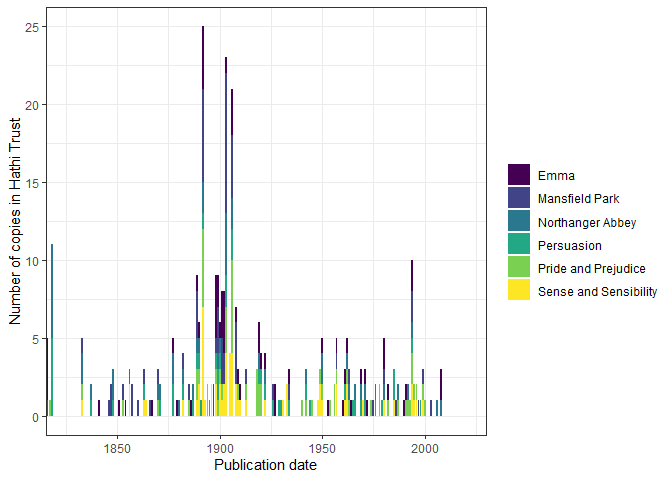

# An Example Workflow

A typical workflow using this package involves selecting a sample of
Hathi Trust IDs to work with using the function `workset_builder()`;
downloading and caching their extracted features files; reading some
selection of these files into memory, based on their metadata or some
other characteristics; and using the in-memory data to create
document-term or term-co-occurrence matrices that can be used for
further analysis.

The main feature of this package is the extensive use of caching: sync
once with Hathi Trust, cache all files to appropriate formats, and read
them in bulk (including their metadata).

This vignette gives an example of this workflow using texts from Jane
Austen.

## Selecting a sample

We first load the package and create a workset with all the texts that
list “Jane Austen” as an author/contributor.

``` r
library(tidyverse)
library(hathiTools)

workset <- workset_builder(name = "Jane Austen")
workset
#> # A tibble: 881 × 2
#>    htid                          n
#>    <chr>                     <int>
#>  1 pst.000023140158           1535
#>  2 inu.30000011371634         1425
#>  3 uc2.ark:/13960/t7mp4ws0s   1364
#>  4 mdp.39015066040364         1361
#>  5 mdp.39015004788835         1360
#>  6 dul1.ark:/13960/t5q82jx98  1258
#>  7 pst.000051409333           1109
#>  8 pst.000031098625           1108
#>  9 dul1.ark:/13960/t8x93fx03  1052
#> 10 dul1.ark:/13960/t4th9rm8z  1023
#> # … with 871 more rows
#> # ℹ Use `print(n = ...)` to see more rows
```

Let’s look at the metadata of the first 10:

``` r

meta <- get_workset_meta(workset[1:10,])

meta %>%
  select(htid, title, contributor, pubDate)
#> # A tibble: 10 × 4
#>    htid                      title                               contr…¹ pubDate
#>    <chr>                     <chr>                               <chr>     <dbl>
#>  1 pst.000023140158          The complete novels /               "{\"na…    1994
#>  2 inu.30000011371634        Complete novels /                   "{\"na…    1928
#>  3 uc2.ark:/13960/t7mp4ws0s  The complete novels of Jane Austen. "{\"na…    1933
#>  4 mdp.39015066040364        The complete novels of Jane Austen. "{\"na…    1979
#>  5 mdp.39015004788835        The complete novels of Jane Austen. "{\"na…    1933
#>  6 dul1.ark:/13960/t5q82jx98 Northanger Abbey : and Persuasion / "[{\"n…    1818
#>  7 pst.000051409333          The Complete novels /               "{\"na…    1981
#>  8 pst.000031098625          The complete novels /               "{\"na…    1981
#>  9 dul1.ark:/13960/t8x93fx03 Emma : a novel : in three volumes / "{\"na…    1816
#> 10 dul1.ark:/13960/t4th9rm8z Mansfield Park : a novel : in thre… "{\"na…    1816
#> # … with abbreviated variable name ¹​contributor
```

We can create six worksets for each of the main titles, and download
their metadata:

``` r

emma <- workset_builder(name = "Jane Austen", title = "Emma")
mansfield_park <- workset_builder(name = "Jane Austen", title = "Mansfield Park")
northanger_abbey <- workset_builder(name = "Jane Austen", title = "Northanger Abbey")
sense_and_sensibility <- workset_builder(name = "Jane Austen", title = "Sense and Sensibility")
pride_and_prejudice <- workset_builder(name = "Jane Austen", title = "Pride and Prejudice")
persuasion <- workset_builder(name = "Jane Austen", title = "Persuasion")


austen_novels <- bind_rows(list("Emma" = emma, 
                           "Mansfield Park" = mansfield_park, 
                           "Northanger Abbey" = northanger_abbey,
                           "Sense and Sensibility" = sense_and_sensibility,
                           "Pride and Prejudice" = pride_and_prejudice,
                           "Persuasion" = persuasion), 
                           .id = "Novel")

meta <- get_workset_meta(austen_novels)
```

The workset metadata is by default cached in `"./metadata"`, so the
function will not attempt to download it from Hathi a second time.
Downloading metadata this way is quite slow, and likely to fail for more
than about 1,000 volumes; a better way of gathering metadata for many
volumes is to rsync the EF files (using `rsync_from_hathi()`), and then
use `cache_htids()` to cache them (including the volume- and page-level
metadata).

We can visualize this metadata:

``` r
meta %>%
  left_join(austen_novels) %>%
  count(pubDate, Novel) %>%
  ggplot(aes(x = pubDate, y = n, fill = Novel)) +
  geom_col() +
  theme_bw() + 
  coord_cartesian(xlim = c(1825, 2020)) +
  scale_fill_viridis_d() +
  labs(x = "Publication date", y = "Number of copies in Hathi Trust",
       fill = "")
```



Note that actual titles are quite various, including adaptations of
Austen’s work:

``` r
meta %>%
  left_join(austen_novels) %>%
  count(Novel, title) %>%
  knitr::kable()
```

| Novel                 | title                                                                                               |   n |
|:----------------------|:----------------------------------------------------------------------------------------------------|----:|
| Emma                  | Emma                                                                                                |   3 |
| Emma                  | Emma /                                                                                              |  26 |
| Emma                  | Emma / Jane Austen edited by Mary Lascelles ; new introduction by Peter Conrad.                     |   1 |
| Emma                  | Emma : a novel /                                                                                    |   7 |
| Emma                  | Emma : a novel : in three volumes /                                                                 |   1 |
| Emma                  | Emma : a novel.                                                                                     |   3 |
| Emma                  | Emma : a novel. /                                                                                   |   1 |
| Emma                  | Emma : Lady Susan /                                                                                 |   1 |
| Emma                  | Emma : With illus. of the author and her environment and pictures from early editions of the book / |   1 |
| Emma                  | Emma,                                                                                               |   4 |
| Emma                  | Emma.                                                                                               |  10 |
| Emma                  | Emma: a novel.                                                                                      |   1 |
| Emma                  | Emma;                                                                                               |   3 |
| Emma                  | Emma; an authoritative text, backgrounds, reviews, and criticism.                                   |   1 |
| Emma                  | Sense and sensibility ; Emma ; and Persuasion.                                                      |   1 |
| Mansfield Park        | Mansfield Park                                                                                      |   2 |
| Mansfield Park        | Mansfield park /                                                                                    |   3 |
| Mansfield Park        | Mansfield Park /                                                                                    |  31 |
| Mansfield Park        | Mansfield Park : a novel /                                                                          |   8 |
| Mansfield Park        | Mansfield Park : a novel : in three volumes /                                                       |   1 |
| Mansfield Park        | Mansfield Park : a novel.                                                                           |   3 |
| Mansfield Park        | Mansfield park,                                                                                     |   3 |
| Mansfield Park        | Mansfield Park,                                                                                     |   2 |
| Mansfield Park        | Mansfield park.                                                                                     |   1 |
| Mansfield Park        | Mansfield Park.                                                                                     |   6 |
| Mansfield Park        | Mansfield Park: a novel.                                                                            |   6 |
| Mansfield Park        | Pride and prejudice ; Mansfield park ; and Northanger Abbey /                                       |   1 |
| Northanger Abbey      | Northanger Abbey                                                                                    |   1 |
| Northanger Abbey      | Northanger Abbey & Persuasion                                                                       |   1 |
| Northanger Abbey      | Northanger abbey /                                                                                  |   6 |
| Northanger Abbey      | Northanger Abbey /                                                                                  |   7 |
| Northanger Abbey      | Northanger Abbey : \[And Persuasion.\]                                                              |   1 |
| Northanger Abbey      | Northanger Abbey : a novel /                                                                        |   1 |
| Northanger Abbey      | Northanger Abbey : A novel /                                                                        |   1 |
| Northanger Abbey      | Northanger Abbey : a novel ; Persuasion /                                                           |   1 |
| Northanger Abbey      | Northanger Abbey : a novel.                                                                         |   1 |
| Northanger Abbey      | Northanger Abbey : and Persuasion /                                                                 |   8 |
| Northanger Abbey      | Northanger abbey : and, Persuasion /                                                                |   1 |
| Northanger Abbey      | Northanger Abbey ; and Persuasion.                                                                  |   1 |
| Northanger Abbey      | Northanger Abbey ; and, Persuasion /                                                                |   1 |
| Northanger Abbey      | Northanger Abbey ; Lady Susan ; The Watsons ; and, Sanditon /                                       |   1 |
| Northanger Abbey      | Northanger Abbey ; Persuasion /                                                                     |   1 |
| Northanger Abbey      | Northanger abbey \[&\] Persuasion /                                                                 |   1 |
| Northanger Abbey      | Northanger Abbey \[with her “Persuasion”.\]                                                         |   1 |
| Northanger Abbey      | Northanger Abbey and persuasion /                                                                   |   1 |
| Northanger Abbey      | Northanger abbey and Persuasion.                                                                    |   1 |
| Northanger Abbey      | Northanger Abbey and Persuasion.                                                                    |   1 |
| Northanger Abbey      | Northanger abbey, a novel and Persuasion.                                                           |   1 |
| Northanger Abbey      | Northanger Abbey, and Persuasion /                                                                  |   1 |
| Northanger Abbey      | Northanger abbey, Persuasion,                                                                       |   1 |
| Northanger Abbey      | Northanger Abbey.                                                                                   |   2 |
| Northanger Abbey      | Northanger abbey. A novel.                                                                          |   1 |
| Northanger Abbey      | Northanger Abbey; and, Persuasion;                                                                  |   1 |
| Northanger Abbey      | Pride & prejudice : Northanger Abbey /                                                              |   1 |
| Northanger Abbey      | Pride and prejudice : and Northanger Abbey /                                                        |   1 |
| Northanger Abbey      | Pride and prejudice ; Mansfield park ; and Northanger Abbey /                                       |   1 |
| Persuasion            | Northanger Abbey & Persuasion                                                                       |   1 |
| Persuasion            | Northanger Abbey : \[And Persuasion.\]                                                              |   1 |
| Persuasion            | Northanger Abbey : a novel ; Persuasion /                                                           |   1 |
| Persuasion            | Northanger Abbey : and Persuasion /                                                                 |   8 |
| Persuasion            | Northanger abbey : and, Persuasion /                                                                |   1 |
| Persuasion            | Northanger Abbey ; and Persuasion.                                                                  |   1 |
| Persuasion            | Northanger Abbey ; and, Persuasion /                                                                |   1 |
| Persuasion            | Northanger Abbey ; Persuasion /                                                                     |   1 |
| Persuasion            | Northanger abbey \[&\] Persuasion /                                                                 |   1 |
| Persuasion            | Northanger Abbey \[with her “Persuasion”.\]                                                         |   1 |
| Persuasion            | Northanger Abbey and persuasion /                                                                   |   1 |
| Persuasion            | Northanger abbey and Persuasion.                                                                    |   1 |
| Persuasion            | Northanger Abbey and Persuasion.                                                                    |   1 |
| Persuasion            | Northanger abbey, a novel and Persuasion.                                                           |   1 |
| Persuasion            | Northanger Abbey, and Persuasion /                                                                  |   1 |
| Persuasion            | Northanger abbey, Persuasion,                                                                       |   1 |
| Persuasion            | Northanger Abbey; and, Persuasion;                                                                  |   1 |
| Persuasion            | Persuasion /                                                                                        |   7 |
| Persuasion            | Persuasion and Lady Susan /                                                                         |   1 |
| Persuasion            | Persuasion,                                                                                         |   2 |
| Persuasion            | Persuasion.                                                                                         |   7 |
| Persuasion            | Sense and sensibility ; and Persuasion …                                                            |   1 |
| Persuasion            | Sense and sensibility ; Emma ; and Persuasion.                                                      |   1 |
| Persuasion            | The manuscript chapters of Persuasion /                                                             |   2 |
| Persuasion            | Two chapters of Persuasion printed from Jane Austen’s autograph.                                    |   1 |
| Pride and Prejudice   | Pride and prejudice /                                                                               |  35 |
| Pride and Prejudice   | Pride and prejudice : a novel /                                                                     |   3 |
| Pride and Prejudice   | Pride and prejudice : a novel : in two volumes /                                                    |   1 |
| Pride and Prejudice   | Pride and prejudice : a novel.                                                                      |   3 |
| Pride and Prejudice   | Pride and prejudice : and Northanger Abbey /                                                        |   1 |
| Pride and Prejudice   | Pride and prejudice ; Mansfield park ; and Northanger Abbey /                                       |   1 |
| Pride and Prejudice   | Pride and prejudice \[and\] Sense and sensibility.                                                  |   1 |
| Pride and Prejudice   | Pride and prejudice a novel /                                                                       |   2 |
| Pride and Prejudice   | Pride and prejudice,                                                                                |   6 |
| Pride and Prejudice   | Pride and prejudice.                                                                                |   9 |
| Pride and Prejudice   | Pride and prejudice. Sense and sensibility.                                                         |   1 |
| Pride and Prejudice   | Pride and prejudice: text, backgrounds, criticism.                                                  |   1 |
| Sense and Sensibility | Pride and prejudice \[and\] Sense and sensibility.                                                  |   1 |
| Sense and Sensibility | Pride and prejudice. Sense and sensibility.                                                         |   1 |
| Sense and Sensibility | Sense and sensibility                                                                               |   1 |
| Sense and Sensibility | Sense and sensibility /                                                                             |  39 |
| Sense and Sensibility | Sense and sensibility : /                                                                           |   1 |
| Sense and Sensibility | Sense and sensibility : a novel /                                                                   |   4 |
| Sense and Sensibility | Sense and sensibility ; and Persuasion …                                                            |   1 |
| Sense and Sensibility | Sense and sensibility ; Emma ; and Persuasion.                                                      |   1 |
| Sense and Sensibility | Sense and sensibility,                                                                              |   2 |
| Sense and Sensibility | Sense and sensibility.                                                                              |  11 |
| Sense and Sensibility | Sense and sensibility. by Ian Watt.                                                                 |   1 |
| Sense and Sensibility | Sense and sensibility: a novel. v. 1                                                                |   4 |
| Sense and Sensibility | Sense and sensibility;                                                                              |   1 |

Let’s select a subset of these works to model more fully:

``` r
set.seed(14)
austen_sample <- austen_novels %>%
  group_by(Novel) %>%
  slice_sample(n = 3)
```

## Syncing and Caching Extracted Features

We now rsync the JSON files of the volumes in this sample from Hathi
Trust and cache them locally in fast-loading formats.

This package has opinionated defaults: if you don’t do anything, it will
assume you want to rsync and cache all your extracted features files to
`getOption("hathiTools.ef.dir")`, which is just ./hathi-ef.You can,
however, set your options differently, either by specifying `dir`
explicitly in `rsync_from_hathi()`, `cache_htids()`,
`find_cached_htids()`, and `read_cached_htids()`, or by setting the
`hathiTools.ef.dir` option directly (i.e., calling
`options(hathiTools.ef.dir = "your_preferred_dir")`).

We’ll use a temporary directory here:

``` r
options(hathiTools.ef.dir = tempdir())
```

``` r
rsync_from_hathi(austen_sample)
#> 0
#> [1] 0
```

Then we cache them to **csv** and **parquet** formats simultaneously
(just because we can: you can also just cache them to one of these
formats):

``` r
cache_htids(austen_sample, cache_format = c("csv", "parquet"))
#> # A tibble: 108 × 5
#>    htid                      local_loc                    cache…¹ cache…² exists
#>    <chr>                     <glue>                       <chr>   <chr>   <lgl> 
#>  1 pst.000066449096          C:\Users\marquexa\AppData\L… csv.gz  ef      TRUE  
#>  2 mdp.39015041924641        C:\Users\marquexa\AppData\L… csv.gz  ef      TRUE  
#>  3 mdp.39015005734879        C:\Users\marquexa\AppData\L… csv.gz  ef      TRUE  
#>  4 uiuo.ark:/13960/t4rj54s3j C:\Users\marquexa\AppData\L… csv.gz  ef      TRUE  
#>  5 hvd.32044050792100        C:\Users\marquexa\AppData\L… csv.gz  ef      TRUE  
#>  6 hvd.hwiwg8                C:\Users\marquexa\AppData\L… csv.gz  ef      TRUE  
#>  7 mdp.39015091627573        C:\Users\marquexa\AppData\L… csv.gz  ef      TRUE  
#>  8 uc1.31158008377706        C:\Users\marquexa\AppData\L… csv.gz  ef      TRUE  
#>  9 hvd.32044004573549        C:\Users\marquexa\AppData\L… csv.gz  ef      TRUE  
#> 10 mdp.39015007028700        C:\Users\marquexa\AppData\L… csv.gz  ef      TRUE  
#> # … with 98 more rows, and abbreviated variable names ¹​cache_format,
#> #   ²​cache_type
#> # ℹ Use `print(n = ...)` to see more rows
```

By default, `cache_htids()` caches EF files and associated volume-level
and page-level metadata, though you can also just cache metadata or EF
files separately:

``` r
find_cached_htids(austen_sample, cache_format = c("csv", "parquet", "none")) %>%
  count(cache_type, cache_format)
#> # A tibble: 7 × 3
#>   cache_type cache_format     n
#>   <chr>      <chr>        <int>
#> 1 ef         csv.gz          18
#> 2 ef         parquet         18
#> 3 meta       csv.gz          18
#> 4 meta       parquet         18
#> 5 none       json.bz2        18
#> 6 pagemeta   csv.gz          18
#> 7 pagemeta   parquet         18
```

The function `find_cached_htids()` finds the physical location of files
in the sample, in case you prefer to manipulate these directly:

``` r
find_cached_htids(austen_sample, cache_format = "none")
#> # A tibble: 18 × 5
#>    htid                      local_loc                    cache…¹ cache…² exists
#>    <chr>                     <glue>                       <chr>   <chr>   <lgl> 
#>  1 pst.000066449096          C:\Users\marquexa\AppData\L… json.b… none    TRUE  
#>  2 mdp.39015041924641        C:\Users\marquexa\AppData\L… json.b… none    TRUE  
#>  3 mdp.39015005734879        C:\Users\marquexa\AppData\L… json.b… none    TRUE  
#>  4 uiuo.ark:/13960/t4rj54s3j C:\Users\marquexa\AppData\L… json.b… none    TRUE  
#>  5 hvd.32044050792100        C:\Users\marquexa\AppData\L… json.b… none    TRUE  
#>  6 hvd.hwiwg8                C:\Users\marquexa\AppData\L… json.b… none    TRUE  
#>  7 mdp.39015091627573        C:\Users\marquexa\AppData\L… json.b… none    TRUE  
#>  8 uc1.31158008377706        C:\Users\marquexa\AppData\L… json.b… none    TRUE  
#>  9 hvd.32044004573549        C:\Users\marquexa\AppData\L… json.b… none    TRUE  
#> 10 mdp.39015007028700        C:\Users\marquexa\AppData\L… json.b… none    TRUE  
#> 11 mdp.39015009048458        C:\Users\marquexa\AppData\L… json.b… none    TRUE  
#> 12 uiuo.ark:/13960/t09w14g77 C:\Users\marquexa\AppData\L… json.b… none    TRUE  
#> 13 pst.000025735086          C:\Users\marquexa\AppData\L… json.b… none    TRUE  
#> 14 mdp.39015004997253        C:\Users\marquexa\AppData\L… json.b… none    TRUE  
#> 15 hvd.hn6m7q                C:\Users\marquexa\AppData\L… json.b… none    TRUE  
#> 16 uiuo.ark:/13960/t3fx7zt1f C:\Users\marquexa\AppData\L… json.b… none    TRUE  
#> 17 hvd.hwhs4m                C:\Users\marquexa\AppData\L… json.b… none    TRUE  
#> 18 nyp.33433074920525        C:\Users\marquexa\AppData\L… json.b… none    TRUE  
#> # … with abbreviated variable names ¹​cache_format, ²​cache_type
find_cached_htids(austen_sample, cache_type = "ef", cache_format = "csv")
#> # A tibble: 18 × 5
#>    htid                      local_loc                    cache…¹ cache…² exists
#>    <chr>                     <glue>                       <chr>   <chr>   <lgl> 
#>  1 pst.000066449096          C:\Users\marquexa\AppData\L… csv.gz  ef      TRUE  
#>  2 mdp.39015041924641        C:\Users\marquexa\AppData\L… csv.gz  ef      TRUE  
#>  3 mdp.39015005734879        C:\Users\marquexa\AppData\L… csv.gz  ef      TRUE  
#>  4 uiuo.ark:/13960/t4rj54s3j C:\Users\marquexa\AppData\L… csv.gz  ef      TRUE  
#>  5 hvd.32044050792100        C:\Users\marquexa\AppData\L… csv.gz  ef      TRUE  
#>  6 hvd.hwiwg8                C:\Users\marquexa\AppData\L… csv.gz  ef      TRUE  
#>  7 mdp.39015091627573        C:\Users\marquexa\AppData\L… csv.gz  ef      TRUE  
#>  8 uc1.31158008377706        C:\Users\marquexa\AppData\L… csv.gz  ef      TRUE  
#>  9 hvd.32044004573549        C:\Users\marquexa\AppData\L… csv.gz  ef      TRUE  
#> 10 mdp.39015007028700        C:\Users\marquexa\AppData\L… csv.gz  ef      TRUE  
#> 11 mdp.39015009048458        C:\Users\marquexa\AppData\L… csv.gz  ef      TRUE  
#> 12 uiuo.ark:/13960/t09w14g77 C:\Users\marquexa\AppData\L… csv.gz  ef      TRUE  
#> 13 pst.000025735086          C:\Users\marquexa\AppData\L… csv.gz  ef      TRUE  
#> 14 mdp.39015004997253        C:\Users\marquexa\AppData\L… csv.gz  ef      TRUE  
#> 15 hvd.hn6m7q                C:\Users\marquexa\AppData\L… csv.gz  ef      TRUE  
#> 16 uiuo.ark:/13960/t3fx7zt1f C:\Users\marquexa\AppData\L… csv.gz  ef      TRUE  
#> 17 hvd.hwhs4m                C:\Users\marquexa\AppData\L… csv.gz  ef      TRUE  
#> 18 nyp.33433074920525        C:\Users\marquexa\AppData\L… csv.gz  ef      TRUE  
#> # … with abbreviated variable names ¹​cache_format, ²​cache_type
find_cached_htids(austen_sample, cache_type = "meta", cache_format = "csv")
#> # A tibble: 18 × 5
#>    htid                      local_loc                    cache…¹ cache…² exists
#>    <chr>                     <glue>                       <chr>   <chr>   <lgl> 
#>  1 pst.000066449096          C:\Users\marquexa\AppData\L… csv.gz  meta    TRUE  
#>  2 mdp.39015041924641        C:\Users\marquexa\AppData\L… csv.gz  meta    TRUE  
#>  3 mdp.39015005734879        C:\Users\marquexa\AppData\L… csv.gz  meta    TRUE  
#>  4 uiuo.ark:/13960/t4rj54s3j C:\Users\marquexa\AppData\L… csv.gz  meta    TRUE  
#>  5 hvd.32044050792100        C:\Users\marquexa\AppData\L… csv.gz  meta    TRUE  
#>  6 hvd.hwiwg8                C:\Users\marquexa\AppData\L… csv.gz  meta    TRUE  
#>  7 mdp.39015091627573        C:\Users\marquexa\AppData\L… csv.gz  meta    TRUE  
#>  8 uc1.31158008377706        C:\Users\marquexa\AppData\L… csv.gz  meta    TRUE  
#>  9 hvd.32044004573549        C:\Users\marquexa\AppData\L… csv.gz  meta    TRUE  
#> 10 mdp.39015007028700        C:\Users\marquexa\AppData\L… csv.gz  meta    TRUE  
#> 11 mdp.39015009048458        C:\Users\marquexa\AppData\L… csv.gz  meta    TRUE  
#> 12 uiuo.ark:/13960/t09w14g77 C:\Users\marquexa\AppData\L… csv.gz  meta    TRUE  
#> 13 pst.000025735086          C:\Users\marquexa\AppData\L… csv.gz  meta    TRUE  
#> 14 mdp.39015004997253        C:\Users\marquexa\AppData\L… csv.gz  meta    TRUE  
#> 15 hvd.hn6m7q                C:\Users\marquexa\AppData\L… csv.gz  meta    TRUE  
#> 16 uiuo.ark:/13960/t3fx7zt1f C:\Users\marquexa\AppData\L… csv.gz  meta    TRUE  
#> 17 hvd.hwhs4m                C:\Users\marquexa\AppData\L… csv.gz  meta    TRUE  
#> 18 nyp.33433074920525        C:\Users\marquexa\AppData\L… csv.gz  meta    TRUE  
#> # … with abbreviated variable names ¹​cache_format, ²​cache_type
```

Once cached, we can read this whole corpus into memory very quickly,
including all the volume-level and page-level metadata. Here we load
from the default cache format, which is given by
`getOption("hathiTools.cacheformat")` and is csv.gz unless explicitly
changed:

``` r

full_corpus <- read_cached_htids(austen_sample)
full_corpus
#> # A tibble: 1,361,736 × 44
#>    htid        token POS   count section  page schem…¹ id    type  dateC…² title
#>    <chr>       <chr> <chr> <int> <chr>   <int> <chr>   <chr> <chr>   <int> <chr>
#>  1 pst.000066… Clas… NNS       1 body        5 https:… http… "[[\…  2.02e7 Emma…
#>  2 pst.000066… .     .         1 body        5 https:… http… "[[\…  2.02e7 Emma…
#>  3 pst.000066… BORD… NNS       1 body        5 https:… http… "[[\…  2.02e7 Emma…
#>  4 pst.000066… Plea… UH        1 body        8 https:… http… "[[\…  2.02e7 Emma…
#>  5 pst.000066… writ… VBG       1 body        8 https:… http… "[[\…  2.02e7 Emma…
#>  6 pst.000066… Brot… NNPS      1 body        8 https:… http… "[[\…  2.02e7 Emma…
#>  7 pst.000066… rese… VBN       1 body        8 https:… http… "[[\…  2.02e7 Emma…
#>  8 pst.000066… any   DT        3 body        8 https:… http… "[[\…  2.02e7 Emma…
#>  9 pst.000066… LLC   NNP       1 body        8 https:… http… "[[\…  2.02e7 Emma…
#> 10 pst.000066… this  DT        1 body        8 https:… http… "[[\…  2.02e7 Emma…
#> # … with 1,361,726 more rows, 33 more variables: alternateTitle <chr>,
#> #   contributor <chr>, pubDate <int>, publisher <chr>, pubPlace <chr>,
#> #   language <chr>, accessRights <chr>, accessProfile <chr>,
#> #   sourceInstitution <chr>, mainEntityOfPage <chr>, oclc <chr>, isbn <chr>,
#> #   genre <chr>, typeOfResource <chr>, lastRightsUpdateDate <int>,
#> #   enumerationChronology <chr>, lcc <chr>, lccn <chr>, category <chr>,
#> #   seq <chr>, version <chr>, tokenCount <int>, lineCount <int>, …
#> # ℹ Use `print(n = ...)` to see more rows, and `colnames()` to see all variable names
```

You can also load only particular bits of the data. For example, if you
only want to load the extracted features files, volume-level metadata,
and page-level metadata, you can do this:

``` r
read_cached_htids(austen_sample, cache_type = "ef")
#> # A tibble: 1,361,736 × 6
#>    htid             token    POS   count section  page
#>    <chr>            <chr>    <chr> <int> <chr>   <int>
#>  1 pst.000066449096 Classics NNS       1 body        5
#>  2 pst.000066449096 .        .         1 body        5
#>  3 pst.000066449096 BORDERS  NNS       1 body        5
#>  4 pst.000066449096 Please   UH        1 body        8
#>  5 pst.000066449096 writing  VBG       1 body        8
#>  6 pst.000066449096 Brothers NNPS      1 body        8
#>  7 pst.000066449096 reserved VBN       1 body        8
#>  8 pst.000066449096 any      DT        3 body        8
#>  9 pst.000066449096 LLC      NNP       1 body        8
#> 10 pst.000066449096 this     DT        1 body        8
#> # … with 1,361,726 more rows
#> # ℹ Use `print(n = ...)` to see more rows

read_cached_htids(austen_sample, cache_type = "meta")
#> # A tibble: 18 × 25
#>    htid        schem…¹ id    type  dateC…² title alter…³ contr…⁴ pubDate publi…⁵
#>    <chr>       <chr>   <chr> <chr>   <int> <chr> <chr>   <chr>     <int> <chr>  
#>  1 pst.000066… https:… http… "[[\…  2.02e7 Emma… "[[\"L… "[{\"i…    2008 "{\"id…
#>  2 mdp.390150… https:… http… "[[\…  2.02e7 Emma…  <NA>   "{\"id…    1982 "{\"id…
#>  3 mdp.390150… https:… http… "[[\…  2.02e7 Emma…  <NA>   "[{\"i…    1898 "{\"id…
#>  4 uiuo.ark:/… https:… http… "[[\…  2.02e7 Mans…  <NA>   "{\"id…    1814 "{\"id…
#>  5 hvd.320440… https:… http… "[[\…  2.02e7 Mans…  <NA>   "{\"id…    1892 "{\"id…
#>  6 hvd.hwiwg8  https:… http… "[[\…  2.02e7 Mans…  <NA>   "{\"id…    1903 "{\"id…
#>  7 mdp.390150… https:… http… "[[\…  2.02e7 Nort… "[[\"N… "[{\"i…    1877 "{\"id…
#>  8 uc1.311580… https:… http… "[[\…  2.02e7 Nort…  <NA>   "[{\"i…    1922 "[{\"i…
#>  9 hvd.320440… https:… http… "[[\…  2.02e7 Nort…  <NA>   "{\"id…    1903 "{\"id…
#> 10 mdp.390150… https:… http… "[[\…  2.02e7 Pers…  <NA>   "{\"id…    1922 "[{\"i…
#> 11 mdp.390150… https:… http… "[[\…  2.02e7 Nort…  <NA>   "{\"id…    1892 "{\"id…
#> 12 uiuo.ark:/… https:… http… "[[\…  2.02e7 Nort…  <NA>   "[{\"i…    1818 "[{\"i…
#> 13 pst.000025… https:… http… "[[\…  2.02e7 Prid…  <NA>   "{\"id…      NA "{\"id…
#> 14 mdp.390150… https:… http… "[[\…  2.02e7 Prid…  <NA>   "{\"id…    1913 "[{\"i…
#> 15 hvd.hn6m7q  https:… http… "[[\…  2.02e7 Prid… "[[\"N… "{\"id…    1906 "{\"id…
#> 16 uiuo.ark:/… https:… http… "[[\…  2.02e7 Sens…  <NA>   "{\"id…    1811 "{\"id…
#> 17 hvd.hwhs4m  https:… http… "[[\…  2.02e7 Sens…  <NA>   "{\"id…    1892 "{\"id…
#> 18 nyp.334330… https:… http… "[[\…  2.02e7 Sens…  <NA>   "{\"id…    1892 "{\"id…
#> # … with 15 more variables: pubPlace <chr>, language <chr>, accessRights <chr>,
#> #   accessProfile <chr>, sourceInstitution <chr>, mainEntityOfPage <chr>,
#> #   oclc <chr>, isbn <chr>, genre <chr>, typeOfResource <chr>,
#> #   lastRightsUpdateDate <int>, enumerationChronology <chr>, lcc <chr>,
#> #   lccn <chr>, category <chr>, and abbreviated variable names ¹​schemaVersion,
#> #   ²​dateCreated, ³​alternateTitle, ⁴​contributor, ⁵​publisher
#> # ℹ Use `colnames()` to see all variable names

read_cached_htids(austen_sample, cache_type = "pagemeta")
#> # A tibble: 13,322 × 17
#>    htid       page seq   version token…¹ lineC…² empty…³ sente…⁴ calcu…⁵ secti…⁶
#>    <chr>     <int> <chr> <chr>     <int>   <int>   <int>   <int> <chr>     <int>
#>  1 pst.0000…     5 0000… 542549…       3       2       0       2 en            3
#>  2 pst.0000…     8 0000… 116e6b…     128      19       0       5 en          128
#>  3 pst.0000…     9 0000… 281ad5…       3       2       0      NA so            3
#>  4 pst.0000…    11 0000… 9e6f16…       1       1       0      NA <NA>          1
#>  5 pst.0000…    13 0000… 97a337…     236      21       1       7 en          235
#>  6 pst.0000…    13 0000… 97a337…     236      21       1       7 en            1
#>  7 pst.0000…    14 0000… eecf06…     490      37       0      19 en            4
#>  8 pst.0000…    14 0000… eecf06…     490      37       0      19 en          485
#>  9 pst.0000…    14 0000… eecf06…     490      37       0      19 en            1
#> 10 pst.0000…    15 0000… 49951b…     494      37       0      14 en          493
#> # … with 13,312 more rows, 7 more variables: sectionLineCount <int>,
#> #   sectionEmptyLineCount <int>, sectionSentenceCount <int>,
#> #   sectionCapAlphaSeq <int>, sectionBeginCharCount <chr>,
#> #   sectionEndCharCount <chr>, section <chr>, and abbreviated variable names
#> #   ¹​tokenCount, ²​lineCount, ³​emptyLineCount, ⁴​sentenceCount,
#> #   ⁵​calculatedLanguage, ⁶​sectionTokenCount
#> # ℹ Use `print(n = ...)` to see more rows, and `colnames()` to see all variable names
```

For large corpora, we can also cache files to the feather or parquet
format, and manipulate them with the {arrow} package:

``` r
library(arrow)
# cache_htids(austen_sample, cache_format = "parquet") Not needed - we already cached files to the right format

austen_dataset <- read_cached_htids(austen_sample, cache_format = "parquet")

austen_dataset 
#> FileSystemDataset (query)
#> htid: string
#> token: string
#> POS: string
#> count: int32
#> section: string
#> page: int32
#> schemaVersion: string
#> id: string
#> type: string
#> dateCreated: int32
#> title: string
#> alternateTitle: string
#> contributor: string
#> pubDate: int32
#> publisher: string
#> pubPlace: string
#> language: string
#> accessRights: string
#> accessProfile: string
#> sourceInstitution: string
#> mainEntityOfPage: string
#> oclc: string
#> isbn: string
#> genre: string
#> typeOfResource: string
#> lastRightsUpdateDate: int32
#> seq: string
#> version: string
#> tokenCount: int32
#> lineCount: int32
#> emptyLineCount: int32
#> sentenceCount: int32
#> calculatedLanguage: string
#> sectionTokenCount: int32
#> sectionLineCount: int32
#> sectionEmptyLineCount: int32
#> sectionSentenceCount: int32
#> sectionCapAlphaSeq: int32
#> sectionBeginCharCount: string
#> sectionEndCharCount: string
#> 
#> See $.data for the source Arrow object
```

This enables some very fast aggregations without having to load all the
data in memory. For a small corpus like this this does not make a
difference (we can put the entire corpus in memory), but in principle
one can do operations like this with thousands of files:

``` r
austen_dataset %>%
  count(token, wt=count, sort = TRUE) %>%
  collect()
#> # A tibble: 28,833 × 2
#>    token      n
#>    <chr>  <int>
#>  1 ,     167916
#>  2 .      90404
#>  3 the    73470
#>  4 to     68624
#>  5 and    63718
#>  6 of     63020
#>  7 a      38757
#>  8 her    37051
#>  9 I      36750
#> 10 was    32556
#> # … with 28,823 more rows
#> # ℹ Use `print(n = ...)` to see more rows
```

Suppose we only want pages where the language is English, there are at
least two sentences in the body of the text, and in those pages we only
want the nouns that start with a capital letter. This is very fast and
uses little memory:

``` r
nouns_only_starts_with_cap <- austen_dataset %>%
  filter(calculatedLanguage == "en", 
         section == "body",
         sectionSentenceCount > 2,
         str_detect(POS, "^NN"),
         str_detect(token, "^[A-Z][a-z]")) %>%
  collect()
```

Finally, we can also clear the cache to get rid of files we don’t want:

``` r
clear_cache(austen_sample, cache_format = "csv")
```

We can now use the parquet dataset to create a `{quanteda}`
document-feature or term-cooccurrence matrix for further analysis using
{tidytext} and other packages.

``` r
library(quanteda)
library(tidytext)

dfm <- nouns_only_starts_with_cap %>%
  left_join(austen_sample) %>%
  mutate(text_id = paste(htid, page, sep = "_"),
         token = paste(token, Novel, sep = "_")) %>%
  cast_dfm(text_id, token, count)

dfm
#> Document-feature matrix of: 6,964 documents, 4,726 features (99.81% sparse) and 0 docvars.
#>                        features
#> docs                    Books_Emma Box_Emma Number_Emma Buccaneer_Emma
#>   mdp.39015041924641_10          1        1           1              1
#>   mdp.39015041924641_13          0        0           0              0
#>   mdp.39015041924641_14          0        0           0              0
#>   mdp.39015041924641_15          0        0           0              0
#>   mdp.39015041924641_16          0        0           0              0
#>   mdp.39015041924641_17          0        0           0              0
#>                        features
#> docs                    Standard_Emma International_Emma Inc._Emma
#>   mdp.39015041924641_10             1                  1         2
#>   mdp.39015041924641_13             0                  0         0
#>   mdp.39015041924641_14             0                  0         0
#>   mdp.39015041924641_15             0                  0         0
#>   mdp.39015041924641_16             0                  0         0
#>   mdp.39015041924641_17             0                  0         0
#>                        features
#> docs                    Copyright_Emma Book_Emma Cutchogue_Emma
#>   mdp.39015041924641_10              1         1              1
#>   mdp.39015041924641_13              0         0              0
#>   mdp.39015041924641_14              0         0              0
#>   mdp.39015041924641_15              0         0              0
#>   mdp.39015041924641_16              0         0              0
#>   mdp.39015041924641_17              0         0              0
#> [ reached max_ndoc ... 6,958 more documents, reached max_nfeat ... 4,716 more features ]


docvars(dfm) <- nouns_only_starts_with_cap %>%
  select(-token:-section) %>%
  distinct()
```

For example, we might want to see with character names co-occur on the
page (a bit of network analysis):

``` r
library(wordVectors) # from remotes::install_github("bmschmidt/wordVectors")
fcm <- fcm(dfm %>% 
             dfm_trim(min_termfreq = 20) %>% 
             dfm_tfidf() %>%
             dfm_compress())

fcm %>% as.matrix() %>% as.VectorSpaceModel() %>% closest_to("Emma_Emma") 
#>              word similarity to "Emma_Emma"
#> 1       Emma_Emma                 1.0000000
#> 2       Miss_Emma                 0.9242459
#> 3        Mr._Emma                 0.9021827
#> 4        Box_Emma                 0.7488139
#> 5     Weston_Emma                 0.7308751
#> 6  Woodhouse_Emma                 0.7302285
#> 7    Chapter_Emma                 0.7098783
#> 8   Highbury_Emma                 0.6878682
#> 9       Mrs._Emma                 0.6569877
#> 10    London_Emma                 0.6242129
fcm %>% as.matrix() %>% as.VectorSpaceModel() %>% closest_to("Frank_Emma")
#>              word similarity to "Frank_Emma"
#> 1      Frank_Emma                  1.0000000
#> 2  Churchill_Emma                  0.8608211
#> 3      Bates_Emma                  0.7746964
#> 4      Elton_Emma                  0.7613324
#> 5     Nobody_Emma                  0.7432131
#> 6  Knightley_Emma                  0.7213641
#> 7   Randalls_Emma                  0.7006529
#> 8  Everybody_Emma                  0.6899662
#> 9       Mrs._Emma                  0.6574228
#> 10  Enscombe_Emma                  0.6405108
fcm %>% as.matrix() %>% as.VectorSpaceModel() %>% closest_to("Fanny_Mansfield Park")
#>                         word similarity to "Fanny_Mansfield Park"
#> 1       Fanny_Mansfield Park                            1.0000000
#> 2      Norris_Mansfield Park                            0.7229268
#> 3      London_Mansfield Park                            0.6847265
#> 4       Price_Mansfield Park                            0.6730201
#> 5         Mr._Mansfield Park                            0.6548993
#> 6  Portsmouth_Mansfield Park                            0.6468854
#> 7   Mansfield_Mansfield Park                            0.6427882
#> 8    Bertrams_Mansfield Park                            0.6314474
#> 9         Tom_Mansfield Park                            0.6201168
#> 10       Mrs._Mansfield Park                            0.6100312
```

``` r
distances <- text2vec::sim2(fcm) %>% # requires package text2vec
  as.matrix()

library(tidygraph)
library(ggraph)

graph <- tidygraph::as_tbl_graph(distances) %>%
  activate(edges) %>%
  filter(weight > 0.7) %>%
  activate(nodes) %>%
  mutate(connectivity = centrality_degree(weights = weight)) %>%
  filter(connectivity > 4) %>%
  mutate(name_simple = str_remove(name, "_.+"),
         novel = str_remove(name, ".+_"))

austen_sample %>%
  pull(Novel) %>%
  unique() %>%
  map(~graph %>%
         filter(novel == .x) %>%
         ggraph(layout = "stress") +
         geom_edge_link(aes(alpha = weight)) +
         geom_node_label(aes(label = name_simple, color = novel),
                         show.legend = FALSE) +
         theme_void() +
         labs(title = .x) 
  ) 
#> [[1]]
```


    #> 
    #> [[2]]


    #> 
    #> [[3]]


    #> 
    #> [[4]]


    #> 
    #> [[5]]


    #> 
    #> [[6]]


