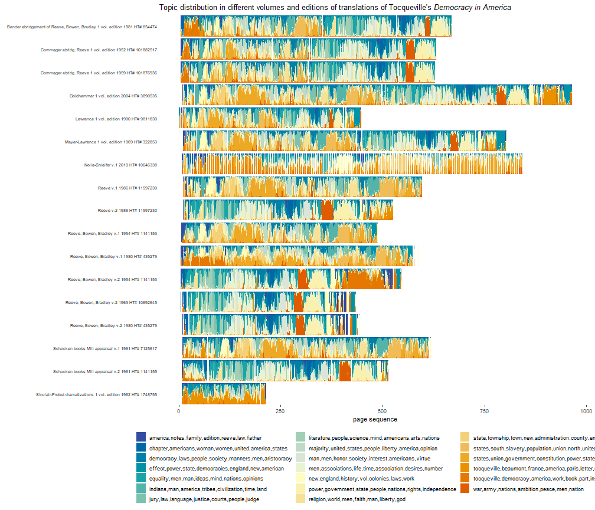

The Hathi Trust digital library makes available "extracted features" files (files with per-page word count and part of speech information) for millions of digitized volumes from large research libraries. One attraction of these files is that even though they do not contain the full text of each page, page-level "bags of words" are more than sufficient for a vast variety of tasks in the Digital Humanities, from topic modeling to basic word vector models to predictive models. This vignette explains how one can use these files to do basic topic modeling of many volumes.

## An example: A Page-level Topic Model of different editions of Tocqueville's "Democracy in America"

Suppose you are interested in creating a topic model of Alexis de Tocqueville's "Democracy in America". There are multiple translations of this text, and a topic model trained on one translation may not look like another one; a topic model of different translations and editions is one way of understanding how these translations and editions vary.

As a starting point, we can download the IDs of all volumes where Alexis the Tocqueville appears as an author in the 15.6 million volumes indexed by the Hathi Trust [Workset Builder](https://solr2.htrc.illinois.edu/solr-ef/):


```r
library(hathiTools)
library(tidyverse)

tocqueville <- workset_builder(name = "Alexis de Tocqueville")
tocqueville
#> # A tibble: 417 x 2
#>    htid                         n
#>    <chr>                    <int>
#>  1 aeu.ark:/13960/t00z8277t   506
#>  2 aeu.ark:/13960/t0ms4jd0t   419
#>  3 aeu.ark:/13960/t0wq0sh3s   455
#>  4 aeu.ark:/13960/t0wq0sh9p   445
#>  5 aeu.ark:/13960/t18k8252g   386
#>  6 aeu.ark:/13960/t23b7448p   649
#>  7 aeu.ark:/13960/t2h717j0v   607
#>  8 aeu.ark:/13960/t2k65c727   543
#>  9 aeu.ark:/13960/t3qv43c3w   516
#> 10 aeu.ark:/13960/t6252fd09   382
#> # ... with 407 more rows
```

There are over 400 volumes which list Tocqueville as an author. Many of these are the same, but digitised from different libraries, or different editions of the same text, and some are in different languages (French and English, for example). We can get a glimpse of the variety by downloading the metadata for a sample of 20 volumes:


```r
set.seed(14)
tocqueville_meta <- get_workset_meta(tocqueville %>%
                                       slice_sample(n = 20))
#> Getting download key...
#> Downloading metadata for 20 volumes. This might take some time.
#> Rows: 20 Columns: 36
#> -- Column specification --------------------------------------------------------------------------------------------------------------------------
#> Delimiter: ","
#> chr  (31): htBibUrl, volumeIdentifier, rightsAttributes, title, genre, pubPlace, typeOfResource, bibliographicFormat, language, imprint, isbn,...
#> dbl   (3): schemaVersion, pubDate, hathitrustRecordNumber
#> dttm  (2): dateCreated, lastUpdateDate
#> 
#> i Use `spec()` to retrieve the full column specification for this data.
#> i Specify the column types or set `show_col_types = FALSE` to quiet this message.
tocqueville_meta %>%
  select(title, pubDate, imprint, names, language) %>%
  mutate(title = iconv(title, from = "UTF-8", to = "ASCII//TRANSLIT") %>%
           str_remove_all("`") %>%
           str_remove_all("\\?")) %>%
  knitr::kable()
```


|title                                                                                                                                                                                               | pubDate|imprint                                               |names                                                                                                                                                                |language |
|:---------------------------------------------------------------------------------------------------------------------------------------------------------------------------------------------------|-------:|:-----------------------------------------------------|:--------------------------------------------------------------------------------------------------------------------------------------------------------------------|:--------|
|Democracy in America / by Alexis de Tocqueville ; translated by Henry Reeve ; with an original preface and notes by John C. Spencer.                                                                |    1841|J. & H.G. Langley, 1841.                              |["Tocqueville, Alexis de 1805-1859 ","Spencer, John C. (John Canfield) 1788-1855 ","Reeve, Henry 1813-1895 "]                                                        |eng      |
|L'Ancien Regime.                                                                                                                                                                                    |    1904|Clarendon Press, [1904]                               |["Tocqueville, Alexis de 1805-1859 ","Headlam, G. W. "]                                                                                                              |fre      |
|Democracy in America / by Alexis de Tocqueville ; translated by Henry Reeve ; with an original preface and notes by John C. Spencer.                                                                |    1845|J & H. G. Langley, 1845.                              |["Tocqueville, Alexis de 1805-1859 ","Spencer, John C. (John Canfield) 1788-1855 ","Reeve, Henry 1813-1895 trl "]                                                    |eng      |
|Oeuvres completes / publiees par Madame de Tocqueville.                                                                                                                                             |    1866|[publisher not identified], 1861-1866.                |["Tocqueville, Alexis de 1805-1859 ","Beaumont, Gustave de 1802-1866 ","Tocqueville, Mary Mottley. "]                                                                |fre      |
|Ouvres completes d'Alexis de Tocqueville / publiees par Madame de Tocqueville.                                                                                                                      |    9999|M. Le´vy fre`res, 1864-                               |["Tocqueville, Alexis de 1805-1859 ","Tocqueville, Marie Motley Cle´rel de. "]                                                                                       |fre      |
|Rapport fait au nom de la Commission chargee d'examiner la proposition de M. de Tracy, relative aux esclaves des colonies / par M. A. de Tocqueville depute de la Manche.                           |    1839|A. Henry, imprimeur de la Chambre des députés, 1839]. |["France Chambre des députés. Commission chargée d'examiner la proposition de M. de Tracy, relative aux esclaves de colonies. ","Tocqueville, Alexis de 1805-1859 "] |fre      |
|De la democratie en Amerique.                                                                                                                                                                       |    1864|M. Lévy, 1864.                                        |["Tocqueville, Alexis de 1805-1859 ","Tocqueville, Mary Mottley ed. "]                                                                                               |fre      |
|Democracy in America, by Alexis de Tocqueville. The Henry Reeve text as rev. by Francis Bowen, now further corr. and edited, with introd., editorial notes, and bibliographies by Phillips Bradley. |    1963|A.A. Knopf, 1963 [c1945]                              |["Tocqueville, Alexis de 1805-1859 ","Reeve, Henry 1813-1895 ","Bradley, Phillips 1894-1982 "]                                                                       |eng      |
|Tocqueville's America, the great quotations / edited by Frederick Kershner, Jr, with an introduction and annotations.                                                                               |    1983|Ohio University Press, c1983.                         |["Tocqueville, Alexis de 1805-1859","Kershner, Frederick."]                                                                                                          |eng      |
|Democracy in America / by Alexis de Tocqueville; translated by  Henry Reeve.                                                                                                                        |    1878|G. Adlard, 1878.                                      |["Tocqueville, Alexis de 1805-1859 ","Reeve, Henry 1813-1895 "]                                                                                                      |eng      |
|Nouvelle correspondance entierement inedite / de Alexis de Tocqueville.                                                                                                                             |    1866|Michel Lèvy Fréres, Libraires éditeurs, 1866.         |["Tocqueville, Alexis de 1805-1859 ","Lèvy, Michel (Hermanos de), (Paris) ed. "]                                                                                     |fre      |
|Ouvres completes. Ed. definitive, publiee sous la direction de J.-P. Mayer.                                                                                                                         |    9999|Gallimard 1952-                                       |["Tocqueville, Alexis de 1805-1859"]                                                                                                                                 |fre      |
|Ouvres completes. Ed. definitive, publiee sous la direction de J.-P. Mayer.                                                                                                                         |    9999|Gallimard 1952-                                       |["Tocqueville, Alexis de 1805-1859"]                                                                                                                                 |fre      |
|De la democratie en Amerique par Alexis de Tocqueville.                                                                                                                                             |    1850|Pagnerre, 1850.                                       |["Tocqueville, Alexis de 1805-1859 "]                                                                                                                                |fre      |
|Ouvres completes. Ed. definitive, publiee sous la direction de J.-P. Mayer.                                                                                                                         |    9999|Gallimard 1952-                                       |["Tocqueville, Alexis de 1805-1859"]                                                                                                                                 |fre      |
|Democracy in America / by Alexis de Tocqueville ; translated by Henry Reeve ; with an original preface and notes by John C. Spencer.                                                                |    1845|J & H. G. Langley, 1845.                              |["Tocqueville, Alexis de 1805-1859 ","Spencer, John C. (John Canfield) 1788-1855 ","Reeve, Henry 1813-1895 trl "]                                                    |eng      |
|The Old Regime and the Revolution / by Alexis de Tocqueville ; tr. by John Bonner.                                                                                                                  |    1856|Harper & Brothers, 1856.                              |["Tocqueville, Alexis de 1805-1859 ","Bonner, John 1828-1899 tr. "]                                                                                                  |eng      |
|De la democratie en Amerique. Par Alexis de Tocqueville, ... Revue avec le plus grand soin et augmentee de la preface mise en tete des ouvres completes. Tome premier-[troisieme]                   |    1888|Calmann Levy, 1888.                                   |["Tocqueville, Alexis de 1805-1859 "]                                                                                                                                |fre      |
|Ouvres completes. Ed. definitive, publiee sous la direction de J.-P. Mayer.                                                                                                                         |    9999|Gallimard 1952-                                       |["Tocqueville, Alexis de 1805-1859"]                                                                                                                                 |fre      |
|Uber die Demokratie in Amerika / Alexis de Tocqueville ; ausgewahlt und herausgeben von J.P. Mayer.                                                                                                 |    1985|Reclam, 1985.                                         |["Tocqueville, Alexis de 1805-1859 "]                                                                                                                                |ger      |

The returned workset above contains a column for the Hathi Trust id and a column for how many times the `token` key is mentioned; since we didn't include any tokens to search for in our query, the `workset_builder()` function just returned the number of pages in the volume. But we could instead search for the volumes where Tocqueville is an author that mention the word "democracy":


```r
tocqueville2 <- workset_builder("democracy", name = "Alexis de Tocqueville")

tocqueville2
#> # A tibble: 222 x 2
#>    htid                         n
#>    <chr>                    <int>
#>  1 aeu.ark:/13960/t0wq0sh3s    84
#>  2 aeu.ark:/13960/t18k8252g    99
#>  3 aeu.ark:/13960/t23b7448p   177
#>  4 aeu.ark:/13960/t2h717j0v   162
#>  5 aeu.ark:/13960/t3qv43c3w    92
#>  6 aeu.ark:/13960/t6349g80j   103
#>  7 aeu.ark:/13960/t6xw5gz6x   154
#>  8 aeu.ark:/13960/t9p27mv8b   154
#>  9 aeu.ark:/13960/t9r21rt6x    95
#> 10 aeu.ark:/13960/t9x06xb4h   167
#> # ... with 212 more rows
```

This is a smaller workset, since it only includes English tokens, and only volumes by Tocqueville that include the word "democracy" (most of them!).

The resulting data frame also includes a column for the number of times the term "democracy" is mentioned, but not exact pages. Yet it's also possible to get the exact page sequence numbers where the term appears:


```r
tocqueville3 <- workset_builder("democracy", name = "Alexis de Tocqueville", volumes_only = FALSE)

tocqueville3
#> # A tibble: 17,051 x 2
#>    htid                     id                                  
#>    <chr>                    <chr>                               
#>  1 aeu.ark:/13960/t0wq0sh3s aeu.ark:/13960/t0wq0sh3s.page-000033
#>  2 aeu.ark:/13960/t0wq0sh3s aeu.ark:/13960/t0wq0sh3s.page-000344
#>  3 aeu.ark:/13960/t0wq0sh3s aeu.ark:/13960/t0wq0sh3s.page-000230
#>  4 aeu.ark:/13960/t0wq0sh3s aeu.ark:/13960/t0wq0sh3s.page-000124
#>  5 aeu.ark:/13960/t0wq0sh3s aeu.ark:/13960/t0wq0sh3s.page-000203
#>  6 aeu.ark:/13960/t0wq0sh3s aeu.ark:/13960/t0wq0sh3s.page-000114
#>  7 aeu.ark:/13960/t0wq0sh3s aeu.ark:/13960/t0wq0sh3s.page-000324
#>  8 aeu.ark:/13960/t0wq0sh3s aeu.ark:/13960/t0wq0sh3s.page-000113
#>  9 aeu.ark:/13960/t0wq0sh3s aeu.ark:/13960/t0wq0sh3s.page-000249
#> 10 aeu.ark:/13960/t0wq0sh3s aeu.ark:/13960/t0wq0sh3s.page-000018
#> # ... with 17,041 more rows
```

We can browse any of these pages interactively on the Hathi Trust website, just to get a sense of what they look like. (Most will be in the public domain).

```r
browse_htids(tocqueville3)

```

For our topic modeling exercise, I will focus on volumes of Tocqueville published since 1950 (better OCR!) with "Democracy in America" in the title:


```r
tocqueville4 <- workset_builder(name = "Alexis de Tocqueville", pub_date = 1950:2020, title = "Democracy in America")
tocqueville4
#> # A tibble: 23 x 2
#>    htid                   n
#>    <chr>              <int>
#>  1 coo.31924062496165   440
#>  2 ien.35556040838641   858
#>  3 mdp.39015000134430   548
#>  4 mdp.39015000134448   546
#>  5 mdp.39015000134471   490
#>  6 mdp.39015000939747   552
#>  7 mdp.39015001419269   548
#>  8 mdp.39015003967810   520
#>  9 mdp.39015004099282   220
#> 10 mdp.39015010933128   486
#> # ... with 13 more rows
```

We can download their full metadata as follows (it's a slow download, so use with care if you have a lot of Hathi Trust ids!):


```r
tocqueville_meta <- get_workset_meta(tocqueville4)
#> Getting download key...
#> Downloading metadata for 23 volumes. This might take some time.
#> Rows: 23 Columns: 36
#> -- Column specification ---------------------------------------------------------------------------------------------------------------------------
#> Delimiter: ","
#> chr  (31): htBibUrl, volumeIdentifier, rightsAttributes, title, genre, pubPlace, typeOfResource, bibliographicFormat, language, imprint, isbn, ...
#> dbl   (3): schemaVersion, pubDate, hathitrustRecordNumber
#> dttm  (2): dateCreated, lastUpdateDate
#> 
#> i Use `spec()` to retrieve the full column specification for this data.
#> i Specify the column types or set `show_col_types = FALSE` to quiet this message.
tocqueville_meta
#> # A tibble: 23 x 36
#>    htBibUrl      schemaVersion volumeIdentifier  rightsAttributes title           genre   pubDate pubPlace typeOfResource bibliographicFo~ language
#>    <chr>                 <dbl> <chr>             <chr>            <chr>           <chr>     <dbl> <chr>    <chr>          <chr>            <chr>   
#>  1 http://catal~           1.3 coo.319240624961~ und              Democracy in A~ "[\"no~    1963 nyu      text           BK               eng     
#>  2 http://catal~           1.3 ien.355560408386~ ic               Democracy in A~ "[\"bi~    2010 inu      text           BK               eng     
#>  3 http://catal~           1.3 mdp.390150001344~ ic               Democracy in A~ "[\"bi~    1954 nyu      text           BK               eng     
#>  4 http://catal~           1.3 mdp.390150001344~ ic               Democracy in A~ "[\"bi~    1954 nyu      text           BK               eng     
#>  5 http://catal~           1.3 mdp.390150001344~ ic               Democracy in A~ "[\"bi~    1954 nyu      text           BK               eng     
#>  6 http://catal~           1.3 mdp.390150009397~ ic               Democracy in A~ "[\"bi~    1954 nyu      text           BK               eng     
#>  7 http://catal~           1.3 mdp.390150014192~ ic               Democracy in A~ "[\"bi~    1954 nyu      text           BK               eng     
#>  8 http://catal~           1.3 mdp.390150039678~ und              Democracy in A~ "[\"no~    1961 nyu      text           BK               eng     
#>  9 http://catal~           1.3 mdp.390150040992~ und              Democracy in A~ "[]"       1962 nyu      text           BK               eng     
#> 10 http://catal~           1.3 mdp.390150109331~ und              Democracy in A~ "[\"bi~    1980 nyu      text           BK               eng     
#> # ... with 13 more rows, and 25 more variables: dateCreated <dttm>, lastUpdateDate <dttm>, imprint <chr>, isbn <chr>, issn <chr>, oclc <chr>,
#> #   lccn <chr>, classification <chr>, handleUrl <chr>, hathitrustRecordNumber <dbl>, sourceInstitutionRecordNumber <chr>, sourceInstitution <chr>,
#> #   accessProfile <chr>, enumerationChronology <chr>, governmentDocument <chr>, names <chr>, issuance <chr>, subjectGenre <chr>,
#> #   subjectTopic <chr>, subjectName <chr>, subjectTitleInfo <chr>, subjectTemporal <chr>, subjectGeographic <chr>, subjectOccupation <chr>,
#> #   subjectCartographics <chr>
```

There are 23 volumes listed here, but many are the same book; sometimes the title has just been entered slightly differently in different cataloguing systems, or republished multiple times, or it's another volume of the same edition. We find 14 distinct bibliographical records with 14 distinct titles which we can investigate:


```r
tocqueville_meta %>%
  summarise(n_records = n_distinct(hathitrustRecordNumber),
            n_titles = n_distinct(title))
#> # A tibble: 1 x 2
#>   n_records n_titles
#>       <int>    <int>
#> 1        14       14
```


We first download the "extracted features" files for these texts via `rsync`. The `rsync_from_hathi()` function attempts to do this automatically (to the `/hathi-ef` directory by default, which will be created if it doesn't exist):


```r
rsync_from_hathi(tocqueville4)
#> 0
#> [1] 0
```

These are JSON files, which are slow to load and parse into data frames. We can cache them to fast-loading CSVs in the "./hathi-ef" directory using the function `cache_htids()`:


```r
cache_htids(tocqueville4)
#> Caching ./hathi-ef/coo/32696/coo.31924062496165.json.bz2 to csv.gz, file 1 of 23...
#> Caching ./hathi-ef/mdp/31034/mdp.39015000939747.json.bz2 to csv.gz, file 6 of 23...
#> Caching ./hathi-ef/mdp/31142/mdp.39015015647921.json.bz2 to csv.gz, file 11 of 23...
#> Caching ./hathi-ef/uc1/35105/uc1.31158011108353.json.bz2 to csv.gz, file 16 of 23...
#> Caching ./hathi-ef/uc1/l747/uc1.l0073944373.json.bz2 to csv.gz, file 21 of 23...
#> # A tibble: 23 x 3
#>    htid               local_loc                                      exists
#>    <chr>              <chr>                                          <lgl> 
#>  1 coo.31924062496165 ./hathi-ef/coo/32696/coo.31924062496165.csv.gz TRUE  
#>  2 ien.35556040838641 ./hathi-ef/ien/35434/ien.35556040838641.csv.gz TRUE  
#>  3 mdp.39015000134430 ./hathi-ef/mdp/31033/mdp.39015000134430.csv.gz TRUE  
#>  4 mdp.39015000134448 ./hathi-ef/mdp/31034/mdp.39015000134448.csv.gz TRUE  
#>  5 mdp.39015000134471 ./hathi-ef/mdp/31037/mdp.39015000134471.csv.gz TRUE  
#>  6 mdp.39015000939747 ./hathi-ef/mdp/31034/mdp.39015000939747.csv.gz TRUE  
#>  7 mdp.39015001419269 ./hathi-ef/mdp/31016/mdp.39015001419269.csv.gz TRUE  
#>  8 mdp.39015003967810 ./hathi-ef/mdp/31061/mdp.39015003967810.csv.gz TRUE  
#>  9 mdp.39015004099282 ./hathi-ef/mdp/31098/mdp.39015004099282.csv.gz TRUE  
#> 10 mdp.39015010933128 ./hathi-ef/mdp/31132/mdp.39015010933128.csv.gz TRUE  
#> # ... with 13 more rows
```

These are available now in your `./hathi-ef` directory. The convenience function `find_cached_htids()`, when called with a vector of Hathi Trust IDs or a workset, returns a data frame with the Hathi Trust id, the local file path, and whether the file exists or not (i.e., whether it was downloaded successfully and cached).


```r
cached_files <- find_cached_htids(tocqueville4)

cached_files
#> # A tibble: 23 x 3
#>    htid               local_loc                                      exists
#>    <chr>              <chr>                                          <lgl> 
#>  1 coo.31924062496165 ./hathi-ef/coo/32696/coo.31924062496165.csv.gz TRUE  
#>  2 ien.35556040838641 ./hathi-ef/ien/35434/ien.35556040838641.csv.gz TRUE  
#>  3 mdp.39015000134430 ./hathi-ef/mdp/31033/mdp.39015000134430.csv.gz TRUE  
#>  4 mdp.39015000134448 ./hathi-ef/mdp/31034/mdp.39015000134448.csv.gz TRUE  
#>  5 mdp.39015000134471 ./hathi-ef/mdp/31037/mdp.39015000134471.csv.gz TRUE  
#>  6 mdp.39015000939747 ./hathi-ef/mdp/31034/mdp.39015000939747.csv.gz TRUE  
#>  7 mdp.39015001419269 ./hathi-ef/mdp/31016/mdp.39015001419269.csv.gz TRUE  
#>  8 mdp.39015003967810 ./hathi-ef/mdp/31061/mdp.39015003967810.csv.gz TRUE  
#>  9 mdp.39015004099282 ./hathi-ef/mdp/31098/mdp.39015004099282.csv.gz TRUE  
#> 10 mdp.39015010933128 ./hathi-ef/mdp/31132/mdp.39015010933128.csv.gz TRUE  
#> # ... with 13 more rows
```

The reason for an `exists` column is that sometimes extracted features files are not downloaded successfully -- they are not available in the Hathi Trust rsync server for whatever reason -- and so need to be excluded from further analysis. In any case these files can now be loaded into R very quickly:


```r
tocqueville_ef <- cached_files %>%
  filter(exists) %>%
  pull(local_loc) %>%
  set_names(cached_files$htid[cached_files$exists]) %>%
  map_df(vroom::vroom, .id = "htid")

tocqueville_ef
#> # A tibble: 2,812,236 x 6
#>    htid               token     POS   count section  page
#>    <chr>              <chr>     <chr> <dbl> <chr>   <dbl>
#>  1 coo.31924062496165 "\\-\\\\" UNK       1 body        1
#>  2 coo.31924062496165 "-~_-"    UNK       1 body        1
#>  3 coo.31924062496165 "-;-_"    UNK       1 body        1
#>  4 coo.31924062496165 "-.-."    UNK       1 body        1
#>  5 coo.31924062496165 "\\~\\.~" UNK       1 body        1
#>  6 coo.31924062496165 "X"       UNK       1 body        1
#>  7 coo.31924062496165 "/\\"     UNK       1 body        1
#>  8 coo.31924062496165 "__.__"   UNK       1 body        1
#>  9 coo.31924062496165 "s"       UNK       3 body        1
#> 10 coo.31924062496165 "1\\\\\\" UNK       1 body        1
#> # ... with 2,812,226 more rows
```

This large data frame can be converted into a `quanteda::dfm` document-feature matrix using the `{tidytext}` package (with each page a different document). Here we filter the data frame so that it contains only nouns (POS = NN or NNP or NOUN) in the "body" section of the page, excluding all strings smaller than 3 characters and all pages that end up with fewer than 10 tokens. We will use the results to calculate a per-page topic model.


```r
library(tidytext)
library(quanteda)
#> Package version: 3.1.0
#> Unicode version: 13.0
#> ICU version: 69.1
#> Parallel computing: 12 of 12 threads used.
#> See https://quanteda.io for tutorials and examples.

tocqueville_meta$editions <- c("Reeve, Bowen, Bradley", "Nolla-Shleifer", "Reeve, Bowen, Bradley",
                      "Reeve, Bowen, Bradley", "Reeve, Bowen, Bradley", "Reeve, Bowen, Bradley",
                      "Reeve, Bowen, Bradley", "Schocken books Mill appraisal", "Sinclair-Probst dramatizations",
                      "Reeve, Bowen, Bradley", "Reeve, Bowen, Bradley", "Reeve, Bowen, Bradley",
                      "Goldhammer", "Bender abridgement of Reeve, Bowen, Bradley", "Lawrence",
                      "Reeve", "Schocken books Mill appraisal", "Reeve, Bowen, Bradley", "Reeve, Bowen, Bradley",
                      "Mayer-Lawrence", "Reeve", "Commager abridg. Reeve", "Commager abridg. Reeve")

tocqueville_meta <- tocqueville_meta %>%
  mutate(editions = paste(editions, enumerationChronology, pubDate))

tocqueville_ef <- tocqueville_ef %>%
  filter(section == "body", !str_detect(token, "[^[:alnum:]]"),
         str_detect(POS, "NN|NOUN"), str_length(token) > 2) %>%
  mutate(text_id = paste(htid, page, sep = "_")) %>%
  group_by(text_id) %>%
  mutate(num_tokens = n()) %>%
  group_by(htid) %>%
  mutate(prop_page = page/max(page)) %>%
  ungroup() %>%
  filter(num_tokens > 10) %>% # This selects pages with at least 10 tokens
  left_join(tocqueville_meta %>% # This adds the metadata
              rename(htid = volumeIdentifier))
#> Joining, by = "htid"

tocqueville_dfm <- tocqueville_ef %>%
  cast_dfm(text_id, token, count)

docvars(tocqueville_dfm) <- tocqueville_ef %>%
  select(-token, -POS, -count) %>%
  distinct()

tocqueville_dfm
#> Document-feature matrix of: 12,216 documents, 28,880 features (99.76% sparse) and 42 docvars.
#>                        features
#> docs                    KINGDOM Richard Smalley Frederick Morison John Eliot introduction Frances Donald
#>   coo.31924062496165_6        1       1       1         2       1    1     1            9       1      1
#>   coo.31924062496165_10       0       0       0         0       0    0     0            0       0      0
#>   coo.31924062496165_11       0       0       0         0       0    0     0            0       0      0
#>   coo.31924062496165_12       0       0       0         0       0    0     0            0       0      0
#>   coo.31924062496165_13       0       0       0         0       0    0     0            0       0      0
#>   coo.31924062496165_14       0       0       0         0       0    0     0            0       0      0
#> [ reached max_ndoc ... 12,210 more documents, reached max_nfeat ... 28,870 more features ]
```

We can use this document-feature matrix in a variety of ways. Here I train a page-level topic model using the `{stm}` package, using only the English texts of Tocqueville.

First we subset the document-feature matrix, lowercase its features, remove stopwords, and trim the vocabulary to the top 20,000 features.


```r
tocqueville_dfm_eng <- dfm_subset(tocqueville_dfm, subset = language == "eng") %>%
  dfm_tolower() %>%
  dfm_trim(20000, termfreq_type = "rank") %>%
  dfm_remove(stopwords())

tocqueville_dfm_eng
#> Document-feature matrix of: 12,216 documents, 25,154 features (99.73% sparse) and 42 docvars.
#>                        features
#> docs                    kingdom richard smalley frederick morison john eliot introduction frances donald
#>   coo.31924062496165_6        1       1       1         2       1    1     1            9       1      1
#>   coo.31924062496165_10       0       0       0         0       0    0     0            0       0      0
#>   coo.31924062496165_11       0       0       0         0       0    0     0            0       0      0
#>   coo.31924062496165_12       0       0       0         0       0    0     0            0       0      0
#>   coo.31924062496165_13       0       0       0         0       0    0     0            0       0      0
#>   coo.31924062496165_14       0       0       0         0       0    1     0            0       0      0
#> [ reached max_ndoc ... 12,210 more documents, reached max_nfeat ... 25,144 more features ]
```

We then fit a structural topic model with 20 topics. This takes a while; normally you'd also do some sensitivity analysis and check whether the model works better with more or fewer topics, but this model is only illustrative (see [this very useful article by Julia Silge](https://juliasilge.com/blog/evaluating-stm/) on training, evaluating, and interpreting topic models). I also don't incorporate any prevalence correlates, but this is trivial to do given that the metadata is incorporated into the document-feature matrix.


```r
library(stm)
#> stm v1.3.6 successfully loaded. See ?stm for help. 
#>  Papers, resources, and other materials at structuraltopicmodel.com

model <- stm(tocqueville_dfm_eng, K = 20, verbose = FALSE)
# model <- stm(tocqueville_dfm_eng, K = 20, verbose = FALSE, prevalence = ~editions) # With prevalence covariates
```

We then tidy this model using the tidiers from the `{tidytext}` package.


```r
tidy_model <- tidy(model, matrix = "gamma",
                   document_names =  docvars(tocqueville_dfm_eng)$text_id)

docs <- docvars(tocqueville_dfm_eng) %>%
  as_tibble() %>%
  mutate(document = text_id)

tidy_model <- tidy_model %>%
  left_join(docs)
#> Joining, by = "document"

labels <- labelTopics(model)$prob %>%
  t() %>%
  as_tibble(.name_repair = "unique") %>%
  pivot_longer(everything(), names_to = "topic", values_to = "word") %>%
  group_by(topic) %>%
  summarise(label = paste(word, collapse = ",")) %>%
  ungroup() %>%
  mutate(topic = str_remove(topic, fixed("...")) %>%
           as.integer()) %>%
  arrange(topic)
#> New names:
#> * `` -> ...1
#> * `` -> ...2
#> * `` -> ...3
#> * `` -> ...4
#> * `` -> ...5
#> * ...

tidy_model <- tidy_model %>%
  left_join(labels)
#> Joining, by = "topic"

tidy_model
#> # A tibble: 244,320 x 46
#>    document  topic   gamma htid  section  page text_id num_tokens prop_page htBibUrl  schemaVersion rightsAttributes title   genre pubDate pubPlace
#>    <chr>     <int>   <dbl> <chr> <chr>   <dbl> <chr>        <int>     <dbl> <chr>             <dbl> <chr>            <chr>   <chr>   <dbl> <chr>   
#>  1 coo.3192~     1 8.13e-4 coo.~ body        6 coo.31~         71    0.0138 http://c~           1.3 und              Democr~ "[\"~    1963 nyu     
#>  2 coo.3192~     1 2.58e-3 coo.~ body       10 coo.31~         31    0.0230 http://c~           1.3 und              Democr~ "[\"~    1963 nyu     
#>  3 coo.3192~     1 6.86e-2 coo.~ body       11 coo.31~         57    0.0253 http://c~           1.3 und              Democr~ "[\"~    1963 nyu     
#>  4 coo.3192~     1 3.48e-3 coo.~ body       12 coo.31~         51    0.0276 http://c~           1.3 und              Democr~ "[\"~    1963 nyu     
#>  5 coo.3192~     1 2.66e-3 coo.~ body       13 coo.31~         27    0.0300 http://c~           1.3 und              Democr~ "[\"~    1963 nyu     
#>  6 coo.3192~     1 2.50e-3 coo.~ body       14 coo.31~         29    0.0323 http://c~           1.3 und              Democr~ "[\"~    1963 nyu     
#>  7 coo.3192~     1 5.51e-4 coo.~ body       15 coo.31~         77    0.0346 http://c~           1.3 und              Democr~ "[\"~    1963 nyu     
#>  8 coo.3192~     1 3.09e-4 coo.~ body       16 coo.31~         87    0.0369 http://c~           1.3 und              Democr~ "[\"~    1963 nyu     
#>  9 coo.3192~     1 6.97e-4 coo.~ body       17 coo.31~         86    0.0392 http://c~           1.3 und              Democr~ "[\"~    1963 nyu     
#> 10 coo.3192~     1 5.96e-4 coo.~ body       18 coo.31~        106    0.0415 http://c~           1.3 und              Democr~ "[\"~    1963 nyu     
#> # ... with 244,310 more rows, and 30 more variables: typeOfResource <chr>, bibliographicFormat <chr>, language <chr>, dateCreated <dttm>,
#> #   lastUpdateDate <dttm>, imprint <chr>, isbn <chr>, issn <chr>, oclc <chr>, lccn <chr>, classification <chr>, handleUrl <chr>,
#> #   hathitrustRecordNumber <dbl>, sourceInstitutionRecordNumber <chr>, sourceInstitution <chr>, accessProfile <chr>, enumerationChronology <chr>,
#> #   governmentDocument <chr>, names <chr>, issuance <chr>, subjectGenre <chr>, subjectTopic <chr>, subjectName <chr>, subjectTitleInfo <chr>,
#> #   subjectTemporal <chr>, subjectGeographic <chr>, subjectOccupation <chr>, subjectCartographics <chr>, editions <chr>, label <chr>
```

We can visualize the topic distribution per book:


```r
library(ggtext)


tidy_model %>%
  mutate(editions = str_replace_all(editions, "NA", "1 vol. edition") %>%
           str_replace_all("V\\.[ ]?", "v.") %>%
           str_replace_all("v\\. ", "v."),
         editions = paste(editions, "HT#", hathitrustRecordNumber)) %>%
  ggplot() +
  geom_col(aes(x = page,  y = gamma, fill = label),
           position = "fill",
           width = 1) +
  facet_grid(editions~., switch = 'y') +
  # geom_vline(data = chapters, aes(xintercept = page)) +
  theme_bw() +
    theme(
      panel.spacing.y=unit(0, "lines"),
      strip.text.y.left = element_text(size = 7, angle = 0, hjust = 1),
      legend.position = "bottom",
      axis.text.y = element_blank(),
      axis.title.y = element_blank(),
      axis.ticks.y = element_blank(),
      panel.border = element_blank(),
      strip.background = element_blank(),
      plot.title = element_markdown(),
      panel.grid= element_blank()
      ) +
  scale_x_continuous() +
  scale_fill_discrete(type =  hcl.colors(23, palette = "RdYlBu", rev = TRUE)) +
  labs(title = "Topic distribution in different volumes and editions of translations of Tocqueville's *Democracy in America*",
       x = "page sequence",
       fill = "") +
  guides(fill = guide_legend(ncol = 3))
```



We can see here some broad patterns: volume 2 of *Democracy in America* has more "abstract" topics (about equality, power, virtue, science, etc.) than volume 1; abridgements preserve roughtly the distribution of topics of the non-abridged versions (except for sections at the very end); the Nolla-Schleifer critical edition clearly has facing-page French text, which accounts for the pattern of missing pages, and a lot of critical apparatus (which means each page shows more of topic 19).
