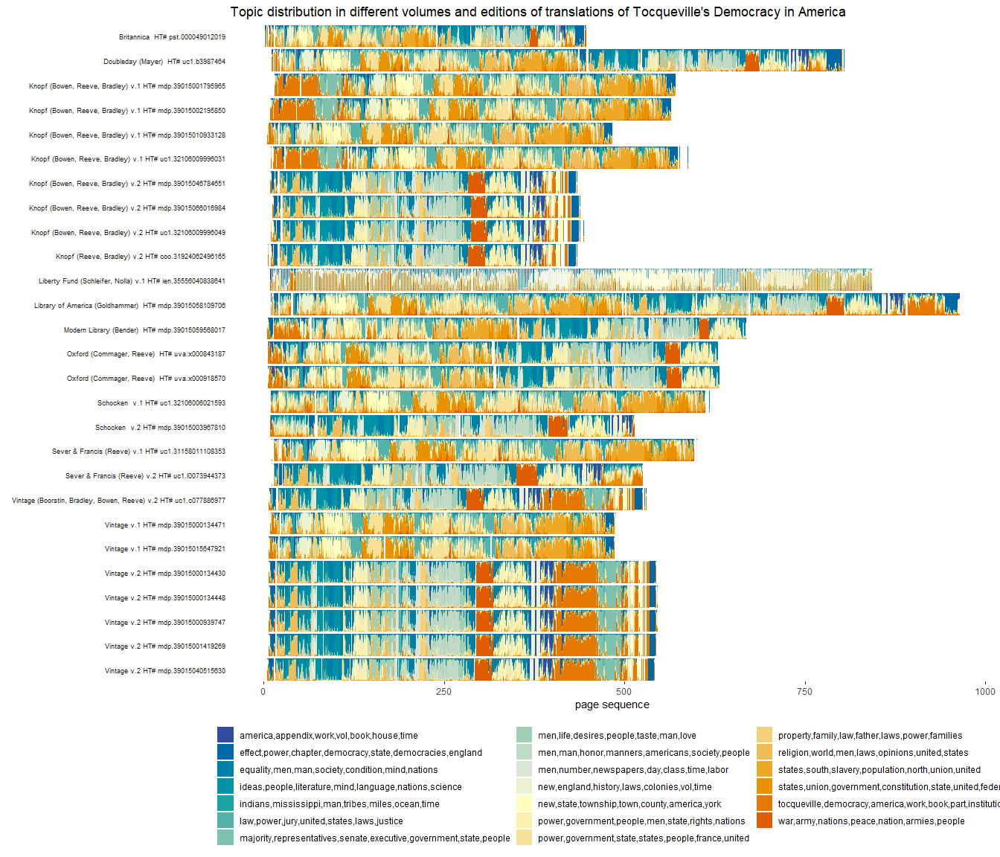

# Topic Modeling using the Hathi Trust Extracted Features Files

The Hathi Trust digital library makes available “extracted features”
files (files with per-page word count and part of speech information)
for millions of digitized volumes from large research libraries. One
attraction of these files is that even though they do not contain the
full text of each page, page-level “bags of words” are more than
sufficient for a vast variety of tasks in the Digital Humanities, from
topic modeling to basic word vector models to predictive models. This
vignette explains how one can use these files to do basic topic modeling
of many volumes.

## An example: A page-level topic model of different editions of Tocqueville’s *Democracy in America*

Alexis de Tocqueville’s *Democracy in America* is a very influential
text. Ever since its original publication in 1835, it has been
translated into multiple languages and republished many times. In this
vignette, we use the Hathi Trust extracted features files of its many
editions to train a page-level topic model that can help visualize how
these translations and editions vary.

### Selecting the sample

As a starting point, we can download the IDs of all volumes where Alexis
the Tocqueville appears as an author in the 17 million volumes indexed
by the Hathi Trust [Workset
Builder](https://solr2.htrc.illinois.edu/solr-ef/):

``` r
library(hathiTools)
library(tidyverse)
library(jsonlite) # For processing some results
library(stm)

tocqueville <- workset_builder(name = "Alexis de Tocqueville")
tocqueville
#> # A tibble: 464 × 2
#>    htid                   n
#>    <chr>              <int>
#>  1 mdp.39015079304757  1358
#>  2 mdp.39015008706338  1213
#>  3 mdp.39015058109706   945
#>  4 nyp.33433081795357   910
#>  5 uva.x000469924       909
#>  6 hvd.32044051720316   906
#>  7 coo.31924030454809   904
#>  8 nyp.33433081795266   903
#>  9 ien.35556041207515   901
#> 10 nyp.33433081795381   901
#> # … with 454 more rows
#> # ℹ Use `print(n = ...)` to see more rows
```

There are over 400 volumes which list Tocqueville as an author. Many of
these are the same, but digitised from different libraries, or different
editions of the same text, and some are in different languages (French
and English, for example). We can get a glimpse of the variety by
downloading the metadata for a sample of 20 volumes:

``` r
set.seed(14)
tocqueville_meta <- get_workset_meta(tocqueville %>%
                                       slice_sample(n = 20))
tocqueville_meta %>%
  select(title, pubDate, publisher, contributor, language) %>%
  rowwise() %>%
  mutate(publisher = jsonlite::fromJSON(publisher) %>% pluck("name") %>% list(),
         contributor = jsonlite::fromJSON(contributor) %>% pluck("name") %>% list()) %>%
  ungroup() %>%
  knitr::kable()
```

| title                                                                                                                                          | pubDate | publisher                                                               | contributor                                                                                                 | language        |
|:-----------------------------------------------------------------------------------------------------------------------------------------------|--------:|:------------------------------------------------------------------------|:------------------------------------------------------------------------------------------------------------|:----------------|
| Democracy in America.                                                                                                                          |    1862 | Longman, Green, Longman, and Roberts                                    | Tocqueville, Alexis de, 1805-1859., Reeve, Henry, 1813-1895.                                                | eng             |
| Système pénitentiaire aux États-Unis et de son application en France; suivi d’un appendice sur les colonies pénales, et de notes statistiques, |    1845 | C. Gosselin                                                             | Beaumont, Gustave de, 1802-1866. , Tocqueville, Alexis de, 1805-1859                                        | fre             |
| Œuvres complètes d’Alexis de Tocqueville,                                                                                                      |    1877 | Michel Lévy frères                                                      | Tocqueville, Alexis de, 1805-1859., Tocqueville, Mary Mottley,                                              | fre             |
| L’Ancien Régime.                                                                                                                               |    1904 | Clarendon Press                                                         | Tocqueville, Alexis de, 1805-1859., Headlam, G. W.                                                          | fre             |
| On the penitentiary system in the United States and its application in France /                                                                |    1979 | Southern Illinois University Press                                      | Beaumont, Gustave de, 1802-1866. , Tocqueville, Alexis de, 1805-1859,                                       | eng             |
| Democracy in America.                                                                                                                          |    1839 | G. Adlard                                                               | Tocqueville, Alexis de, 1805-1859. , Spencer, John C. (John Canfield), 1788-1855,, Reeve, Henry, 1813-1895, | eng             |
| Oeuvres et correspondance inédites d’Alexis de Tocqueville /                                                                                   |    1861 | Michel Lévy Frères, Impr. de J. Claye                                   | Tocqueville, Alexis de, 1805-1859., Beaumont, Gustave de, 1802-1866,                                        | fre             |
| Egalité sociale et liberté politique : une introduction à l’œuvre de Tocqueville /                                                             |    1977 | Aubier-Montaigne                                                        | Tocqueville, Alexis de, 1805-1859, Gibert, Pierre                                                           | fre             |
| American institutions …                                                                                                                        |    1874 | John Allyn                                                              | Tocqueville, Alexis de, 1805-1859., Reeve, Henry, 1813-1895.                                                | \[“eng”,“fre”\] |
| Œuvres complètes.                                                                                                                              |    1952 | Gallimard                                                               | Tocqueville, Alexis de, 1805-1859.                                                                          | fre             |
| Œuvres, papiers et correspondances.                                                                                                            |    1951 | Gallimard                                                               | Tocqueville, Alexis de, 1805-1859. , Mayer, J. P. (Jacob Peter), 1903-1992                                  | fre             |
| Democracy in America,                                                                                                                          |    1838 | Adlard and Saunders, 46 Broadway; George Dearborn & Co., 38 Gold Street | Tocqueville, Alexis de, 1805-1859. , Spencer, John C. (John Canfield), 1788-1855,, Reeve, Henry, 1813-1895, | \[“eng”,“fre”\] |
| Recollections.                                                                                                                                 |    1970 | Doubleday                                                               | Tocqueville, Alexis de, 1805-1859.                                                                          | \[“eng”,“fre”\] |
| Democracy in America: part the second : the social influence of democracy /                                                                    |    1840 | J. & H. G. Langley; Philadelphia, Thomas, Cowperthwaite & Co. etc.      | Tocqueville, Alexis de, 1805-1859. , Spencer, John C. (John Canfield), 1788-1855,, Reeve, Henry, 1813-1895, | eng             |
| Œuvres complètes.                                                                                                                              |    1952 | Gallimard                                                               | Tocqueville, Alexis de, 1805-1859.                                                                          | fre             |
| Œuvres, papiers et correspondances.                                                                                                            |    1951 | Gallimard                                                               | Tocqueville, Alexis de, 1805-1859. , Mayer, J. P. (Jacob Peter), 1903-1992                                  | fre             |
| Oeuvres /                                                                                                                                      |    1991 | Gallimard                                                               | Tocqueville, Alexis de, 1805-1859., Jardin, André, 1912-                                                    | fre             |
| Oeuvres complètes /                                                                                                                            |    1866 | publisher not identified                                                | Tocqueville, Alexis de, 1805-1859., Beaumont, Gustave de, 1802-1866. , Tocqueville, Mary Mottley.           | fre             |
| De la démocratie en Amérique /                                                                                                                 |    1990 | J. Vrin                                                                 | Tocqueville, Alexis de, 1805-1859., Nolla, Eduardo.                                                         | fre             |
| De la démocratie en Amérique … et augmentée … d’un examen comparatif de la démocratie aux États-Unis et en Suisse.                             |    1848 | Pagnerre                                                                | Tocqueville, Alexis de, 1805-1859.                                                                          | fre             |

(Note that you normally won’t want to be using `get_workset_meta()` for
more than 100 or so volumes - it will take a long time; best to cache
the files locally and then extract their metadata, as explained in
`[the example workflow vignette](vignette("example_workflow"))`).

The function `workset_builder()` by default returns a data frame with
column for the Hathi Trust id and a column for how many times the
`token` key is mentioned; since we didn’t include any tokens to search
for in our query, the function just returned the number of pages in each
volume. If we instead search for the volumes where Tocqueville is an
author that *also* mention the word “democracy”, the function returns
both the volume id and the number of pages that contain the term.

``` r
tocqueville2 <- workset_builder("democracy", name = "Alexis de Tocqueville")

tocqueville2
#> # A tibble: 239 × 2
#>    htid                    n
#>    <chr>               <int>
#>  1 uc1.b3987464          239
#>  2 mdp.39015058109706    214
#>  3 uva.x000469924        201
#>  4 uva.x001179573        201
#>  5 hvd.32044051720316    200
#>  6 nyp.33433081795266    200
#>  7 nyp.33433081795357    200
#>  8 nyp.33433081795381    200
#>  9 umn.319510019923684   200
#> 10 hvd.hn2ul5            199
#> # … with 229 more rows
#> # ℹ Use `print(n = ...)` to see more rows
```

This is a smaller workset, since it only includes English tokens, and
only volumes by Tocqueville that include the word “democracy” (most of
them!). It’s also possible to get the exact page sequence numbers where
the term appears:

``` r
tocqueville3 <- workset_builder("democracy", name = "Alexis de Tocqueville", volumes_only = FALSE)

tocqueville3
#> # A tibble: 17,278 × 2
#>    htid                     id                                  
#>    <chr>                    <chr>                               
#>  1 aeu.ark:/13960/t0wq0sh3s aeu.ark:/13960/t0wq0sh3s.page-000118
#>  2 aeu.ark:/13960/t0wq0sh3s aeu.ark:/13960/t0wq0sh3s.page-000205
#>  3 aeu.ark:/13960/t0wq0sh3s aeu.ark:/13960/t0wq0sh3s.page-000083
#>  4 aeu.ark:/13960/t0wq0sh3s aeu.ark:/13960/t0wq0sh3s.page-000199
#>  5 aeu.ark:/13960/t0wq0sh3s aeu.ark:/13960/t0wq0sh3s.page-000249
#>  6 aeu.ark:/13960/t0wq0sh3s aeu.ark:/13960/t0wq0sh3s.page-000192
#>  7 aeu.ark:/13960/t0wq0sh3s aeu.ark:/13960/t0wq0sh3s.page-000102
#>  8 aeu.ark:/13960/t0wq0sh3s aeu.ark:/13960/t0wq0sh3s.page-000124
#>  9 aeu.ark:/13960/t0wq0sh3s aeu.ark:/13960/t0wq0sh3s.page-000149
#> 10 aeu.ark:/13960/t0wq0sh3s aeu.ark:/13960/t0wq0sh3s.page-000247
#> # … with 17,268 more rows
#> # ℹ Use `print(n = ...)` to see more rows
```

We can browse any of these pages interactively on the Hathi Trust
website, just to get a sense of what they look like. (Most will be in
the public domain; note that the page sequences are zero-indexed, so
they are one less than the actual page shown on the Hathi Trust
website).

``` r
browse_htids(tocqueville3)
```

For our topic modeling exercise, we will focus on volumes of Tocqueville
published since 1950 (better OCR!) with “Democracy in America” in the
title.

``` r
tocqueville4 <- workset_builder(name = "Alexis de Tocqueville", pub_date = 1950:2020, title = "Democracy in America")
tocqueville4
#> # A tibble: 27 × 2
#>    htid                   n
#>    <chr>              <int>
#>  1 mdp.39015058109706   945
#>  2 ien.35556040838641   845
#>  3 uc1.b3987464         781
#>  4 mdp.39015059568017   667
#>  5 uva.x000918570       627
#>  6 uva.x000843187       622
#>  7 uc1.32106006021593   610
#>  8 uc1.31158011108353   589
#>  9 uc1.32106009996031   566
#> 10 mdp.39015001795965   563
#> # … with 17 more rows
#> # ℹ Use `print(n = ...)` to see more rows
```

In principle we can download their full metadata using the function
get_workset_meta(), though the SOLR service hasn’t been working
recently. (Also, it’s a slow download, so use with care if you have a
lot of Hathi Trust ids!).

``` r
tocqueville_meta <- get_workset_meta(tocqueville4)
tocqueville_meta
#> # A tibble: 27 × 16
#>    htid      acces…¹ acces…² url   title dateC…³ lastR…⁴ pubDate schem…⁵ typeO…⁶
#>    <chr>     <chr>   <chr>   <chr> <chr>   <dbl>   <dbl>   <dbl> <chr>   <chr>  
#>  1 mdp.3901… google  ic      http… Demo…  2.02e7  2.02e7    2004 https:… http:/…
#>  2 ien.3555… google  ic      http… Demo…  2.02e7  2.02e7    2010 https:… http:/…
#>  3 uc1.b398… google  ic      http… Demo…  2.02e7  2.02e7    1969 https:… http:/…
#>  4 mdp.3901… google  ic      http… Demo…  2.02e7  2.02e7    1981 https:… http:/…
#>  5 uva.x000… google  ic      http… Demo…  2.02e7  2.02e7    1952 https:… http:/…
#>  6 uva.x000… google  ic      http… Demo…  2.02e7  2.02e7    1959 https:… http:/…
#>  7 uc1.3210… google  und     http… Demo…  2.02e7  2.02e7    1961 https:… http:/…
#>  8 uc1.3115… google  pdus    http… Demo…  2.02e7  2.02e7    1986 https:… http:/…
#>  9 uc1.3210… google  ic      http… Demo…  2.02e7  2.02e7    1980 https:… http:/…
#> 10 mdp.3901… google  ic      http… Demo…  2.02e7  2.02e7    1980 https:… http:/…
#> # … with 17 more rows, 6 more variables: language <chr>, oclc <dbl>,
#> #   genre <chr>, contributor <chr>, publisher <chr>, pubPlace <chr>, and
#> #   abbreviated variable names ¹​accessProfile, ²​accessRights, ³​dateCreated,
#> #   ⁴​lastRightsUpdateDate, ⁵​schemaVersion, ⁶​typeOfResource
#> # ℹ Use `print(n = ...)` to see more rows, and `colnames()` to see all variable names
```

There are 27 volumes listed here, but many are the same book; sometimes
the title has just been entered slightly differently in different
cataloguing systems, or republished multiple times, or it’s another
volume of the same edition. We find 14 distinct bibliographical records
with 14 distinct titles which we can investigate:

``` r
tocqueville_meta %>%
  summarise(n_records = n_distinct(htid),
            n_titles = n_distinct(title))
#> # A tibble: 1 × 2
#>   n_records n_titles
#>       <int>    <int>
#> 1        27        5
```

### Downloading and caching the associated Extracted Features files

We first download the “extracted features” files for these texts through
the Hathi Trust rsync server. The `rsync_from_hathi()` function attempts
to do this automatically (to the `"./hathi-ef"` directory by default,
which will be created if it doesn’t exist; this is the default option ).
This function requires that your system has access to `rsync`. (In
Windows, the easiest way to do this is to install the [Windows Subsystem
for Linux](https://docs.microsoft.com/en-us/windows/wsl/install);
`rsync` should come already installed in most Mac and Linux machines).

``` r
# The current directory for caching:
getOption("hathiTools.ef.dir")
#> [1] "./hathi-ef"

rsync_from_hathi(tocqueville4)
#> 0
#> [1] 0
```

The downloaded files are in JSON format, which is slow to load and parse
into data frames. We can cache these files to fast-loading CSVs (or to
other formats, including **Feather** or **Parquet** formats from the
{arrow} package) in the `"./hathi-ef"` directory also using the function
`cache_htids()`:

``` r
cached_files <- cache_htids(tocqueville4)
cached_files
#> # A tibble: 81 × 5
#>    htid               local_loc                           cache…¹ cache…² exists
#>    <chr>              <glue>                              <chr>   <chr>   <lgl> 
#>  1 mdp.39015058109706 ./hathi-ef/mdp/31500/mdp.390150581… csv.gz  ef      TRUE  
#>  2 ien.35556040838641 ./hathi-ef/ien/35434/ien.355560408… csv.gz  ef      TRUE  
#>  3 uc1.b3987464       ./hathi-ef/uc1/b86/uc1.b3987464.cs… csv.gz  ef      TRUE  
#>  4 mdp.39015059568017 ./hathi-ef/mdp/31561/mdp.390150595… csv.gz  ef      TRUE  
#>  5 uva.x000918570     ./hathi-ef/uva/x080/uva.x000918570… csv.gz  ef      TRUE  
#>  6 uva.x000843187     ./hathi-ef/uva/x037/uva.x000843187… csv.gz  ef      TRUE  
#>  7 uc1.32106006021593 ./hathi-ef/uc1/30029/uc1.321060060… csv.gz  ef      TRUE  
#>  8 uc1.31158011108353 ./hathi-ef/uc1/35105/uc1.311580111… csv.gz  ef      TRUE  
#>  9 uc1.32106009996031 ./hathi-ef/uc1/30093/uc1.321060099… csv.gz  ef      TRUE  
#> 10 mdp.39015001795965 ./hathi-ef/mdp/31096/mdp.390150017… csv.gz  ef      TRUE  
#> # … with 71 more rows, and abbreviated variable names ¹​cache_format,
#> #   ²​cache_type
#> # ℹ Use `print(n = ...)` to see more rows
```

The convenience function `find_cached_htids()`, when called with a
vector of Hathi Trust IDs or a workset, returns a data frame with the
Hathi Trust id, the local file paths of the cached EF files, and whether
each file exists or not (i.e., whether it was downloaded successfully
and cached).

``` r
cached_files <- find_cached_htids(tocqueville4)

cached_files
#> # A tibble: 81 × 5
#>    htid               local_loc                           cache…¹ cache…² exists
#>    <chr>              <glue>                              <chr>   <chr>   <lgl> 
#>  1 mdp.39015058109706 ./hathi-ef/mdp/31500/mdp.390150581… csv.gz  ef      TRUE  
#>  2 ien.35556040838641 ./hathi-ef/ien/35434/ien.355560408… csv.gz  ef      TRUE  
#>  3 uc1.b3987464       ./hathi-ef/uc1/b86/uc1.b3987464.cs… csv.gz  ef      TRUE  
#>  4 mdp.39015059568017 ./hathi-ef/mdp/31561/mdp.390150595… csv.gz  ef      TRUE  
#>  5 uva.x000918570     ./hathi-ef/uva/x080/uva.x000918570… csv.gz  ef      TRUE  
#>  6 uva.x000843187     ./hathi-ef/uva/x037/uva.x000843187… csv.gz  ef      TRUE  
#>  7 uc1.32106006021593 ./hathi-ef/uc1/30029/uc1.321060060… csv.gz  ef      TRUE  
#>  8 uc1.31158011108353 ./hathi-ef/uc1/35105/uc1.311580111… csv.gz  ef      TRUE  
#>  9 uc1.32106009996031 ./hathi-ef/uc1/30093/uc1.321060099… csv.gz  ef      TRUE  
#> 10 mdp.39015001795965 ./hathi-ef/mdp/31096/mdp.390150017… csv.gz  ef      TRUE  
#> # … with 71 more rows, and abbreviated variable names ¹​cache_format,
#> #   ²​cache_type
#> # ℹ Use `print(n = ...)` to see more rows
```

These files can now be loaded into R very quickly:

``` r
tocqueville_ef <- read_cached_htids(tocqueville4)
tocqueville_ef
#> # A tibble: 3,318,779 × 44
#>    htid        token POS   count section  page schem…¹ id    type  dateC…² title
#>    <chr>       <chr> <chr> <int> <chr>   <int> <chr>   <chr> <chr>   <int> <chr>
#>  1 mdp.390150… ALEX… UNK       1 body        5 https:… http… "[[\…  2.02e7 Demo…
#>  2 mdp.390150… TOCQ… UNK       1 body        5 https:… http… "[[\…  2.02e7 Demo…
#>  3 mdp.390150… DE    UNK       1 body        5 https:… http… "[[\…  2.02e7 Demo…
#>  4 mdp.390150… IN    IN        1 body        9 https:… http… "[[\…  2.02e7 Demo…
#>  5 mdp.390150… Gold… NNP       1 body        9 https:… http… "[[\…  2.02e7 Demo…
#>  6 mdp.390150… *     SYM       4 body        9 https:… http… "[[\…  2.02e7 Demo…
#>  7 mdp.390150… Arth… NNP       1 body        9 https:… http… "[[\…  2.02e7 Demo…
#>  8 mdp.390150… DEMO… NNP       1 body        9 https:… http… "[[\…  2.02e7 Demo…
#>  9 mdp.390150… THE   DT        1 body        9 https:… http… "[[\…  2.02e7 Demo…
#> 10 mdp.390150… Tran… VBN       1 body        9 https:… http… "[[\…  2.02e7 Demo…
#> # … with 3,318,769 more rows, 33 more variables: contributor <chr>,
#> #   pubDate <int>, publisher <chr>, pubPlace <chr>, language <chr>,
#> #   accessRights <chr>, accessProfile <chr>, sourceInstitution <chr>,
#> #   mainEntityOfPage <chr>, lcc <chr>, lccn <chr>, oclc <chr>, category <chr>,
#> #   isbn <chr>, genre <chr>, typeOfResource <chr>, lastRightsUpdateDate <int>,
#> #   enumerationChronology <chr>, alternateTitle <lgl>, seq <chr>,
#> #   version <chr>, tokenCount <int>, lineCount <int>, emptyLineCount <int>, …
#> # ℹ Use `print(n = ...)` to see more rows, and `colnames()` to see all variable names
```

Note that `cache_htids()` automatically caches not only the extracted
features file, but also the volume-level and page-level metadata; the
function `read_cached_htids()` by default adds both of these forms of
metadata to your data frame. But we can also extract the page-level and
volume-level metadata separately:

``` r

tocqueville_ef <- read_cached_htids(tocqueville4, cache_type = "ef")
tocqueville_meta <- read_cached_htids(tocqueville4, cache_type = "meta")
tocqueville_pagemeta <- read_cached_htids(tocqueville4, cache_type = "pagemeta")

tocqueville_ef
#> # A tibble: 3,318,779 × 6
#>    htid               token       POS   count section  page
#>    <chr>              <chr>       <chr> <int> <chr>   <int>
#>  1 mdp.39015058109706 ALEXIS      UNK       1 body        5
#>  2 mdp.39015058109706 TOCQUEVILLE UNK       1 body        5
#>  3 mdp.39015058109706 DE          UNK       1 body        5
#>  4 mdp.39015058109706 IN          IN        1 body        9
#>  5 mdp.39015058109706 Goldhammer  NNP       1 body        9
#>  6 mdp.39015058109706 *           SYM       4 body        9
#>  7 mdp.39015058109706 Arthur      NNP       1 body        9
#>  8 mdp.39015058109706 DEMOCRACY   NNP       1 body        9
#>  9 mdp.39015058109706 THE         DT        1 body        9
#> 10 mdp.39015058109706 Translated  VBN       1 body        9
#> # … with 3,318,769 more rows
#> # ℹ Use `print(n = ...)` to see more rows
tocqueville_meta
#> # A tibble: 27 × 25
#>    htid        schem…¹ id    type  dateC…² title contr…³ pubDate publi…⁴ pubPl…⁵
#>    <chr>       <chr>   <chr> <chr>   <int> <chr> <chr>     <int> <chr>   <chr>  
#>  1 mdp.390150… https:… http… "[[\…  2.02e7 Demo… "[{\"i…    2004 "[{\"i… "{\"id…
#>  2 ien.355560… https:… http… "[[\…  2.02e7 Demo… "[{\"i…    2010 "{\"id… "{\"id…
#>  3 uc1.b39874… https:… http… "[[\…  2.02e7 Demo… "[{\"i…    1969 "{\"id… "{\"id…
#>  4 mdp.390150… https:… http… "[[\…  2.02e7 Demo… "[{\"i…    1981 "{\"id… "{\"id…
#>  5 uva.x00091… https:… http… "[[\…  2.02e7 Demo… "[{\"i…    1952 "{\"id… "{\"id…
#>  6 uva.x00084… https:… http… "[[\…  2.02e7 Demo… "[{\"i…    1959 "{\"id… "{\"id…
#>  7 uc1.321060… https:… http… "[[\…  2.02e7 Demo… "{\"id…    1961 "{\"id… "{\"id…
#>  8 uc1.311580… https:… http… "[[\…  2.02e7 Demo… "[{\"i…    1986 "{\"id… "{\"id…
#>  9 uc1.321060… https:… http… "[[\…  2.02e7 Demo… "[{\"i…    1980 "{\"id… "{\"id…
#> 10 mdp.390150… https:… http… "[[\…  2.02e7 Demo… "[{\"i…    1980 "{\"id… "{\"id…
#> # … with 17 more rows, 15 more variables: language <chr>, accessRights <chr>,
#> #   accessProfile <chr>, sourceInstitution <chr>, mainEntityOfPage <chr>,
#> #   lcc <chr>, lccn <chr>, oclc <chr>, category <chr>, isbn <chr>, genre <chr>,
#> #   typeOfResource <chr>, lastRightsUpdateDate <int>,
#> #   enumerationChronology <chr>, alternateTitle <lgl>, and abbreviated variable
#> #   names ¹​schemaVersion, ²​dateCreated, ³​contributor, ⁴​publisher, ⁵​pubPlace
#> # ℹ Use `print(n = ...)` to see more rows, and `colnames()` to see all variable names
tocqueville_pagemeta
#> # A tibble: 28,492 × 17
#>    htid       page seq   version token…¹ lineC…² empty…³ sente…⁴ calcu…⁵ secti…⁶
#>    <chr>     <int> <chr> <chr>     <int>   <int>   <int>   <int> <chr>     <int>
#>  1 mdp.3901…     5 0000… af2e37…       3       1       0      NA so            3
#>  2 mdp.3901…     9 0000… 6cb0ed…      20       8       0       1 en           20
#>  3 mdp.3901…    10 0000… 12a1f3…     139      20       0       6 en          139
#>  4 mdp.3901…    11 0000… 7338b1…      20       5       0       3 en           20
#>  5 mdp.3901…    13 0000… 8a3246…      52       9       0       1 en           52
#>  6 mdp.3901…    15 0000… 7ca902…     272      33       0      16 en            1
#>  7 mdp.3901…    15 0000… 7ca902…     272      33       0      16 en          271
#>  8 mdp.3901…    16 0000… ce432e…     261      33       0       8 en          261
#>  9 mdp.3901…    17 0000… c7c8d5…     224      35       0       2 en            2
#> 10 mdp.3901…    17 0000… c7c8d5…     224      35       0       2 en          222
#> # … with 28,482 more rows, 7 more variables: sectionLineCount <int>,
#> #   sectionEmptyLineCount <int>, sectionSentenceCount <int>,
#> #   sectionCapAlphaSeq <int>, sectionBeginCharCount <chr>,
#> #   sectionEndCharCount <chr>, section <chr>, and abbreviated variable names
#> #   ¹​tokenCount, ²​lineCount, ³​emptyLineCount, ⁴​sentenceCount,
#> #   ⁵​calculatedLanguage, ⁶​sectionTokenCount
#> # ℹ Use `print(n = ...)` to see more rows, and `colnames()` to see all variable names
```

### Creating a document-term matrix and fitting the model

This large data frame can be converted into a `quanteda::dfm()`
document-feature matrix using the `{tidytext}` package (with each page a
different document). Here we filter the data frame so that it contains
only nouns (POS = “NN” or “NNP” or “NOUN”) in the “body” section of the
page, excluding all strings smaller than 3 characters and all pages that
end up with fewer than 10 tokens. We will use the results to calculate a
per-page topic model.

``` r
library(tidytext)
library(quanteda)

tocqueville_meta <- tocqueville_meta %>%
  rowwise() %>%
  mutate(contributor = jsonlite::fromJSON(contributor) %>% 
              pluck("name") %>%
              paste(collapse = ", "),
         publisher = jsonlite::fromJSON(publisher) %>% 
              pluck("name") %>%
              paste(collapse = ", "),
         editor = str_remove(contributor, "Tocqueville, Alexis de, 1805-1859.?, ") %>%
           str_extract_all("Goldhammer|Schleifer|Nolla|Mayer|Bender|Commager|Reeve|Bowen|Bradley|Boorstin", 
                           simplify = TRUE) %>%
           paste(collapse = ", "),
         short_publisher = str_extract(publisher, "Knopf|Vintage|Britannica|Schocken |Sever & Francis|Oxford|Modern Library|Liberty Fund|Doubleday|Library of America") %>%
           paste(collapse = ", "),
         edition = str_c(short_publisher, " (", editor, ") ", 
                         ifelse(is.na(enumerationChronology), "", str_to_lower(str_remove(enumerationChronology, 
                                                                                          " ")))) %>%
           str_remove(" \\(\\)"),
         volume = parse_number(enumerationChronology) * 10 %>%
           as.integer()) %>%
  ungroup()

tocqueville_meta %>%
  select(htid, pubDate, edition, volume)
#> # A tibble: 27 × 4
#>    htid               pubDate edition                               volume
#>    <chr>                <int> <chr>                                  <dbl>
#>  1 mdp.39015058109706    2004 "Library of America (Goldhammer) "        NA
#>  2 ien.35556040838641    2010 "Liberty Fund (Schleifer, Nolla) v.1"      1
#>  3 uc1.b3987464          1969 "Doubleday (Mayer) "                      NA
#>  4 mdp.39015059568017    1981 "Modern Library (Bender) "                NA
#>  5 uva.x000918570        1952 "Oxford (Commager, Reeve) "               NA
#>  6 uva.x000843187        1959 "Oxford (Commager, Reeve) "               NA
#>  7 uc1.32106006021593    1961 "Schocken  v.1"                            1
#>  8 uc1.31158011108353    1986 "Sever & Francis (Reeve) v.1"              1
#>  9 uc1.32106009996031    1980 "Knopf (Bowen, Reeve, Bradley) v.1"        1
#> 10 mdp.39015001795965    1980 "Knopf (Bowen, Reeve, Bradley) v.1"        1
#> # … with 17 more rows
#> # ℹ Use `print(n = ...)` to see more rows
```

``` r

tocqueville_ef <- tocqueville_ef %>%
  filter(section == "body", !str_detect(token, "[^[:alnum:]]"),
         str_detect(POS, "NN|NOUN"), str_length(token) > 2) %>%
  mutate(text_id = paste(htid, page, sep = "_")) %>%
  group_by(text_id) %>%
  mutate(num_tokens = n()) %>%
  group_by(htid) %>%
  mutate(prop_page = page/max(page)) %>%
  ungroup() %>%
  filter(num_tokens > 10) %>% # This selects pages with at least 10 tokens
  left_join(tocqueville_meta) %>%
  left_join(tocqueville_pagemeta) %>%
  filter(calculatedLanguage == "en")

tocqueville_dfm <- tocqueville_ef %>%
  cast_dfm(text_id, token, count)

docvars(tocqueville_dfm) <- tocqueville_ef %>%
  select(-token, -POS, -count, -section) %>%
  distinct()

tocqueville_dfm
#> Document-feature matrix of: 14,442 documents, 28,562 features (99.76% sparse) and 47 docvars.
#>                        features
#> docs                    Putnam copyright Printing copying chronology Books All
#>   mdp.39015058109706_10      1         1        1       1          1     1   1
#>   mdp.39015058109706_13      0         0        0       0          0     0   0
#>   mdp.39015058109706_15      0         0        0       0          0     0   0
#>   mdp.39015058109706_16      0         0        0       0          0     0   0
#>   mdp.39015058109706_17      0         0        0       0          0     0   0
#>   mdp.39015058109706_18      0         0        0       0          0     0   0
#>                        features
#> docs                    permission Printed Number
#>   mdp.39015058109706_10          1       1      1
#>   mdp.39015058109706_13          0       0      0
#>   mdp.39015058109706_15          0       0      0
#>   mdp.39015058109706_16          0       0      0
#>   mdp.39015058109706_17          0       0      0
#>   mdp.39015058109706_18          0       0      0
#> [ reached max_ndoc ... 14,436 more documents, reached max_nfeat ... 28,552 more features ]
```

We can use this document-feature matrix in a variety of ways. Here I
train a page-level topic model using the `{stm}` package, using only the
English texts of Tocqueville.

First we subset the document-feature matrix, lowercase its features,
remove stopwords, and trim the vocabulary to the top 20,000 features.

``` r
tocqueville_dfm_eng <- dfm_tolower(tocqueville_dfm)  %>%
  dfm_trim(20000, termfreq_type = "rank") %>%
  dfm_remove(stopwords())

tocqueville_dfm_eng
#> Document-feature matrix of: 14,442 documents, 24,997 features (99.73% sparse) and 47 docvars.
#>                        features
#> docs                    putnam copyright printing copying chronology books
#>   mdp.39015058109706_10      1         1        1       1          1     1
#>   mdp.39015058109706_13      0         0        0       0          0     0
#>   mdp.39015058109706_15      0         0        0       0          0     0
#>   mdp.39015058109706_16      0         0        0       0          0     0
#>   mdp.39015058109706_17      0         0        0       0          0     0
#>   mdp.39015058109706_18      0         0        0       0          0     0
#>                        features
#> docs                    permission printed number penguin
#>   mdp.39015058109706_10          1       1      1       2
#>   mdp.39015058109706_13          0       0      0       0
#>   mdp.39015058109706_15          0       0      0       0
#>   mdp.39015058109706_16          0       0      0       0
#>   mdp.39015058109706_17          0       0      0       0
#>   mdp.39015058109706_18          0       0      0       0
#> [ reached max_ndoc ... 14,436 more documents, reached max_nfeat ... 24,987 more features ]
```

We then fit a structural topic model with 20 topics. This takes a while;
normally you’d also do some sensitivity analysis and check whether the
model works better with more or fewer topics, but this model is only
illustrative (see [this very useful article by Julia
Silge](https://juliasilge.com/blog/evaluating-stm/) on training,
evaluating, and interpreting topic models). I also don’t incorporate any
prevalence correlates, but this is trivial to do given that the metadata
is incorporated into the document-feature matrix.

``` r
library(stm)

if(interactive()) {
  verbose <- TRUE
} else {
  verbose <- FALSE
}

model <- stm(tocqueville_dfm_eng, K = 20, verbose = verbose)
```

We then tidy this model using the tidiers from the `{tidytext}` package.

``` r
tidy_model <- tidy(model, matrix = "gamma",
                   document_names =  docvars(tocqueville_dfm_eng)$text_id)

docs <- docvars(tocqueville_dfm_eng) %>%
  as_tibble() %>%
  mutate(document = text_id)

tidy_model <- tidy_model %>%
  left_join(docs)

labels <- labelTopics(model)$prob %>%
  t() %>%
  as_tibble(.name_repair = "unique") %>%
  pivot_longer(everything(), names_to = "topic", values_to = "word") %>%
  group_by(topic) %>%
  summarise(label = paste(word, collapse = ",")) %>%
  ungroup() %>%
  mutate(topic = str_remove(topic, fixed("...")) %>%
           as.integer()) %>%
  arrange(topic)

tidy_model <- tidy_model %>%
  left_join(labels)

tidy_model
#> # A tibble: 288,840 × 51
#>    docum…¹ topic   gamma htid   page text_id num_t…² prop_…³ schem…⁴ id    type 
#>    <chr>   <int>   <dbl> <chr> <int> <chr>     <int>   <dbl> <chr>   <chr> <chr>
#>  1 mdp.39…     1 0.0746  mdp.…    10 mdp.39…      48  0.0104 https:… http… "[[\…
#>  2 mdp.39…     1 0.00442 mdp.…    13 mdp.39…      17  0.0135 https:… http… "[[\…
#>  3 mdp.39…     1 0.0330  mdp.…    15 mdp.39…      46  0.0156 https:… http… "[[\…
#>  4 mdp.39…     1 0.0862  mdp.…    16 mdp.39…      60  0.0166 https:… http… "[[\…
#>  5 mdp.39…     1 0.00436 mdp.…    17 mdp.39…      53  0.0176 https:… http… "[[\…
#>  6 mdp.39…     1 0.00726 mdp.…    18 mdp.39…      50  0.0187 https:… http… "[[\…
#>  7 mdp.39…     1 0.0107  mdp.…    19 mdp.39…      55  0.0197 https:… http… "[[\…
#>  8 mdp.39…     1 0.00459 mdp.…    20 mdp.39…      56  0.0207 https:… http… "[[\…
#>  9 mdp.39…     1 0.00812 mdp.…    23 mdp.39…      64  0.0239 https:… http… "[[\…
#> 10 mdp.39…     1 0.0117  mdp.…    24 mdp.39…      90  0.0249 https:… http… "[[\…
#> # … with 288,830 more rows, 40 more variables: dateCreated <int>, title <chr>,
#> #   contributor <chr>, pubDate <int>, publisher <chr>, pubPlace <chr>,
#> #   language <chr>, accessRights <chr>, accessProfile <chr>,
#> #   sourceInstitution <chr>, mainEntityOfPage <chr>, lcc <chr>, lccn <chr>,
#> #   oclc <chr>, category <chr>, isbn <chr>, genre <chr>, typeOfResource <chr>,
#> #   lastRightsUpdateDate <int>, enumerationChronology <chr>,
#> #   alternateTitle <lgl>, editor <chr>, short_publisher <chr>, edition <chr>, …
#> # ℹ Use `print(n = ...)` to see more rows, and `colnames()` to see all variable names
```

We can now visualize the topic distribution per book:

``` r
library(ggtext)


tidy_model %>%
  mutate(editions = paste(edition, "HT#", htid)) %>%
  ggplot() +
  geom_col(aes(x = page,  y = gamma, fill = label),
           position = "fill",
           width = 1) +
  facet_grid(editions~., switch = 'y') +
  # geom_vline(data = chapters, aes(xintercept = page)) +
  theme_bw() +
    theme(
      panel.spacing.y=unit(0, "lines"),
      strip.text.y.left = element_text(size = 7, angle = 0, hjust = 1),
      legend.position = "bottom",
      axis.text.y = element_blank(),
      axis.title.y = element_blank(),
      axis.ticks.y = element_blank(),
      panel.border = element_blank(),
      strip.background = element_blank(),
      plot.title = element_markdown(),
      panel.grid= element_blank()
      ) +
  scale_x_continuous() +
  scale_fill_discrete(type =  hcl.colors(23, palette = "RdYlBu", rev = TRUE)) +
  labs(title = "Topic distribution in different volumes and editions of translations of Tocqueville's *Democracy in America*",
       x = "page sequence",
       fill = "") +
  guides(fill = guide_legend(ncol = 3))
```



We can see here some broad patterns: volume 2 of *Democracy in America*
has more “abstract” topics (about equality, power, virtue, science,
etc.) than volume 1; abridgements preserve roughtly the distribution of
topics of the non-abridged versions (except for sections at the very
end); Schelifer and Nolla’s critical edition has facing-page French
(which appears as missing pages, excluded from the analysis because the
language is not English) and critical apparatus in footnotes (so the
distribution of topics looks different); etc. More could be said here,
but this is just a starting point!
