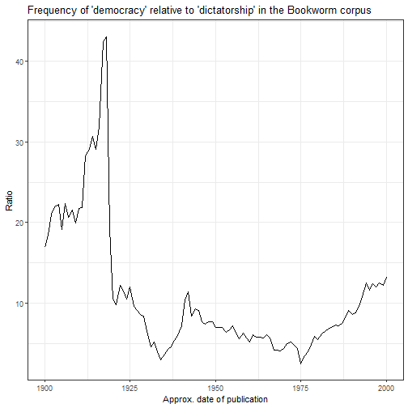
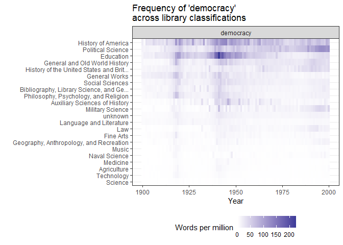
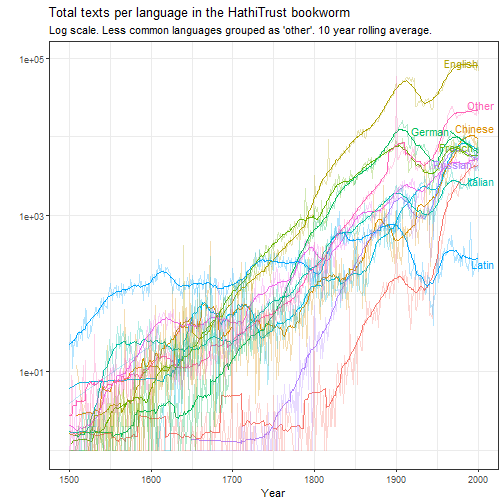

The Hathi Trust Bookworm (https://bookworm.htrc.illinois.edu/develop/) is a tool similar to the [Google Books Ngram viewer](https://books.google.com/ngrams) that allows one to retrieve word frequency data from the texts in the [Hathi Trust Digital Library](https://www.hathitrust.org/). With about 13 million digitised volumes in its database (many of them originally digitised for the Google Books project), the Hathi Trust Bookworm is a very powerful tool to explore trends in word frequencies over time. Moreover, in contrast to the Google Ngram viewer, the Bookworm can search over the metadata of the collection, making possible more informative queries about the sources of particular word frequency trends.[^Ngram]

[^Ngram]: The Google Ngram Viewer does have some advantages over the bookworm, primarily the ability to retrieve data about bigram, trigram, 4-gram, and 5-gram frequencies over time, and to conduct wildcard and part-of-speech searches.

This package offers one function, `query_bookworm()`, that makes it relatively easy to retrieve word frequency and other data from the Hathi Trust Bookworm into R, and to use it for exploratory analyses of word frequency trends.

For example, suppose we are interested in the changing frequencies of terms like "democracy", "dictatorship", "monarchy", and so on. We can download the frequency of these terms (according to various metrics) with a single call:


```r
library(hathiTools)
library(tidyverse)
library(slider) # For moving averages

res <- query_bookworm(c("democracy", "dictatorship", "monarchy",
                        "aristocracy", "oligarchy", "tyranny",
                        "autocracy"),
                      counttype = c("WordsPerMillion", "TextPercent"),
                      lims = c(1700, 2020))
```

This results in a nice, tidy tibble:


```r
res
#> # A tibble: 4,494 x 4
#>    word      date_year value counttype      
#>    <chr>         <int> <dbl> <chr>          
#>  1 democracy      1700 1.65  WordsPerMillion
#>  2 democracy      1700 1.27  TextPercent    
#>  3 democracy      1701 0.152 WordsPerMillion
#>  4 democracy      1701 1.05  TextPercent    
#>  5 democracy      1702 0.342 WordsPerMillion
#>  6 democracy      1702 1.85  TextPercent    
#>  7 democracy      1703 1.43  WordsPerMillion
#>  8 democracy      1703 1.13  TextPercent    
#>  9 democracy      1704 0.478 WordsPerMillion
#> 10 democracy      1704 1.20  TextPercent    
#> # ... with 4,484 more rows
```

Which can be used for plotting:


```r
res %>%
  mutate(counttype = case_when(counttype == "WordsPerMillion" ~ "Words per million",
                               TRUE ~ "Percent of volumes containing word")) %>%
  group_by(word, counttype) %>%
  mutate(rolling_avg = slide_dbl(value, mean, .before = 10, .after = 10)) %>%
  ggplot(aes(x = date_year, color = word)) +
  geom_line(aes(y = value), alpha = 0.3) +
  geom_line(aes(x = date_year, y = rolling_avg)) +
  facet_wrap(~counttype) +
  labs(x = "Approx. year of publication", y = "", subtitle = "10 year rolling average, books published between 1700-2020",
       title = "Frequency of 'democracy' and other political terms in the HathiTrust corpus") +
  theme_bw() +
  scale_color_viridis_d()
```


The trends are clear: "democracy" becomes a much more salient term during the 19th and 20th centuries, with big peaks around the World Wars and the end of the Cold War.

We can also look at the frequency of democracy *relative* to another word (e.g., dictatorship) across time by using `counttype = "WordsRatio"`:


```r
res2 <- query_bookworm(word = "democracy", compare_to = "dictatorship",
                          lims = c(1900, 2000), counttype = "WordsRatio")

res2 %>%
  ggplot(aes(x = date_year, y = value)) +
  geom_line() +
  theme_bw() +
  labs(title = "Frequency of 'democracy' relative to 'dictatorship' in the Bookworm corpus",
       x = "Approx. date of publication",
       y = "Ratio")
```



'Democracy' is always used more frequently than 'dictatorship' in the 20th century, but especially right around the First World War.

We can also explore the kinds of books where 'democracy' is mentioned in the 20th century. This query groups the volumes that mention 'democracy' by both the year of publication and the volume classification in the Hathi Trust metadata:


```r
res2 <- query_bookworm(word = "democracy", groups = c("date_year", "class"),
                          lims = c(1900,2000))

res2 %>%
  ggplot(aes(x = date_year, y = fct_reorder(str_trunc(class, 40), value))) +
  geom_tile(aes(fill = value)) +
  facet_wrap(~word, scales = "free_y") +
  scale_fill_gradient2() +
  theme_bw() +
  labs(y = "", x = "Year", title = "Frequency of 'democracy' \nacross library classifications",
       fill = "Words per million") +
  theme(legend.position = "bottom")
```



As we might expect, most volumes classified as "Political Science", "History", and "Social Sciences" mention democracy more often than medicine or agriculture, especially in the second half of the 20th century. But a surprising number of books classified as "Education" mention democracy quite a bit, especially right around the Second World War.

It is also possible to further limit the query to, e.g., books published in a particular language or written by a particular author. For example, this gives the number of English-language texts that use the word "democracy" in 1900-2000, grouped by library classification.


```r
res3 <- query_bookworm(word = c("democracy"),
                       lims = c(1900, 2000),
                       groups = "class",
                       counttype = "TotalTexts",
                       language = "English")

res3
#> # A tibble: 21 x 4
#>    word      class                                                                             value counttype 
#>    <chr>     <chr>                                                                             <int> <chr>     
#>  1 democracy N/A                                                                             2717605 TotalTexts
#>  2 democracy Agriculture                                                                      100664 TotalTexts
#>  3 democracy Education                                                                        100170 TotalTexts
#>  4 democracy World History And History Of Europe, Asia, Africa, Australia, New Zealand, Etc.  202428 TotalTexts
#>  5 democracy History Of The Americas                                                          143957 TotalTexts
#>  6 democracy Fine Arts                                                                         70854 TotalTexts
#>  7 democracy Science                                                                          347394 TotalTexts
#>  8 democracy General Works                                                                     42162 TotalTexts
#>  9 democracy Military Science                                                                  20246 TotalTexts
#> 10 democracy Geography.  Anthropology.  Recreation                                             60933 TotalTexts
#> # ... with 11 more rows
```
Among texts which have some classification (most don't!), ~100,000 education and political science texts mention the term.

And this query finds how many volumes between 1900 and 2000 had Alexis de Tocqueville as a first author and mentioned the word "democracy", grouped by date of publication and the library where the digitised volume was taken from:


```r
res3 <- query_bookworm(word = "democracy",
                       lims = c(1900, 2000),
                       groups = c("date_year", "contributing_library"),
                       counttype = "TotalTexts",
                       first_author_name = c("Tocqueville, Alexis de, 1805-1859.",
                                             "Tocqueville, Alexis de, 1805-1859"))

res3 %>%
  arrange(date_year)
#> # A tibble: 60 x 5
#>    word      date_year contributing_library      value counttype 
#>    <chr>         <int> <chr>                     <int> <chr>     
#>  1 democracy      1900 New York Public Library       2 TotalTexts
#>  2 democracy      1900 The Ohio State University     2 TotalTexts
#>  3 democracy      1900 University of Virginia        2 TotalTexts
#>  4 democracy      1900 Harvard University            1 TotalTexts
#>  5 democracy      1903 University of Wisconsin       1 TotalTexts
#>  6 democracy      1904 Indiana University            1 TotalTexts
#>  7 democracy      1904 University of California      2 TotalTexts
#>  8 democracy      1904 Harvard University            1 TotalTexts
#>  9 democracy      1908 University of Michigan        1 TotalTexts
#> 10 democracy      1908 University of California      1 TotalTexts
#> # ... with 50 more rows
```

Tocqueville has been republished and collected by big libraries quite a bit in the 20th century!

One can use `method = "returnPossibleFields"` to return the fields available for limiting a query or grouping the results:


```r
query_bookworm(word = "", method = "returnPossibleFields")
#> # A tibble: 21 x 6
#>    name                tablename                 dbname              type      anchor description
#>    <chr>               <chr>                     <chr>               <chr>     <chr>  <chr>      
#>  1 language            languageLookup            language            character bookid ""         
#>  2 publication_country publication_countryLookup publication_country character bookid ""         
#>  3 publication_state   publication_stateLookup   publication_state   character bookid ""         
#>  4 subclass            subclassLookup            subclass            character bookid ""         
#>  5 narrow_class        narrow_classLookup        narrow_class        character bookid ""         
#>  6 class               classLookup               class               character bookid ""         
#>  7 resource_type       resource_typeLookup       resource_type       character bookid ""         
#>  8 target_audience     target_audienceLookup     target_audience     character bookid ""         
#>  9 scanner             scannerLookup             scanner             character bookid ""         
#> 10 first_author_birth  first_author_birthLookup  first_author_birth  character bookid ""         
#> # ... with 11 more rows
```

We can also get a sample of the book titles and links for a particular year. (It's a limited sample; the database will only pull the top 100 books mentioning the term, weighted by the frequency of the term in the volume). For example, we can pull out the top 100 books in the category "Education" that mention the word "democracy" in 1941, the year where education books seem to be most likely to mention democracy:


```r

res4 <- query_bookworm(word = "democracy",
                       date_year = "1941",
                       class = "Education",
                       method = "search_results")

res4
#> # A tibble: 100 x 3
#>    htid                      title                                                                       url                                       
#>    <chr>                     <chr>                                                                       <chr>                                     
#>  1 nc01.ark:/13960/t2v41mn4r Teaching democracy in the North Carolina public schools /--- 1941           https://babel.hathitrust.org/cgi/pt?id=nc~
#>  2 uc1.$b67929               The education of free men in American democracy.                            https://babel.hathitrust.org/cgi/pt?id=uc~
#>  3 mdp.39015062763720        The education of free men in American democracy.                            https://babel.hathitrust.org/cgi/pt?id=md~
#>  4 mdp.39015068297905        The education of free men in American democracy.--- suppl.                  https://babel.hathitrust.org/cgi/pt?id=md~
#>  5 uc1.$b67873               Pennsylvania bill of rights week. Recommendations for school observance ... https://babel.hathitrust.org/cgi/pt?id=uc~
#>  6 mdp.39015035886111        Education in a world of fear,                                               https://babel.hathitrust.org/cgi/pt?id=md~
#>  7 mdp.39015031665543        Education and the morale of a free people.                                  https://babel.hathitrust.org/cgi/pt?id=md~
#>  8 uc1.$b67928               Education and the morale of a free people.                                  https://babel.hathitrust.org/cgi/pt?id=uc~
#>  9 uiug.30112108068831       Proceedings of the convention.--- 19 1941                                   https://babel.hathitrust.org/cgi/pt?id=ui~
#> 10 uc1.b4305220              Guidance in democratic living,--- copy D11                                  https://babel.hathitrust.org/cgi/pt?id=uc~
#> # ... with 90 more rows
```

If you need a bigger sample, use the function `workset_builder()` to query the Hathi Trust's [Workset Builder 2.0](https://solr2.htrc.illinois.edu/solr-ef/); this can help you download even hundreds of thousands of volume IDs that meet specified criteria. See the article on "Creating and Using Hathi Trust Worksets" for more.

We can investigate further any of these volumes by downloading their associated "Extracted Features" file (that is, a file with token counts and part of speech information that the Hathi Trust makes available). Here we download the word frequencies for the second Hathi Trust id, The education of free men in American democracy., available at https://babel.hathitrust.org/cgi/pt?id=uc1.$b67929, as a nice tidy `tibble` suitable for analysis with a package like `{tidytext}`.


```r

tmp <- tempdir()

extracted_features <- get_hathi_counts(res4$htid[2], dir = tmp)
#> Rows: 18763 Columns: 5
#> -- Column specification ---------------------------------------------------------------------------------------------------------------------------
#> Delimiter: ","
#> chr (3): token, POS, section
#> dbl (2): count, page
#> 
#> i Use `spec()` to retrieve the full column specification for this data.
#> i Specify the column types or set `show_col_types = FALSE` to quiet this message.

extracted_features
#> # A tibble: 18,763 x 6
#>    htid        token      POS   count section  page
#>    <chr>       <chr>      <chr> <dbl> <chr>   <dbl>
#>  1 uc1.$b67929 COMMISSION NNP       1 body        1
#>  2 uc1.$b67929 N35        CD        1 body        1
#>  3 uc1.$b67929 in         IN        1 body        1
#>  4 uc1.$b67929 uc-male    JJ        1 body        1
#>  5 uc1.$b67929 *          SYM       1 body        1
#>  6 uc1.$b67929 .          .         1 body        1
#>  7 uc1.$b67929 Free       NNP       1 body        1
#>  8 uc1.$b67929 Men        NNP       1 body        1
#>  9 uc1.$b67929 Democracy  NNP       1 body        1
#> 10 uc1.$b67929 School     NNP       1 body        1
#> # ... with 18,753 more rows
```

And we can extract the full metadata for that particular volume, which tells us this title was created by the Educational Policies Commission, National Education Association of the United States and the American Association of School Administrators:


```r
meta <- get_hathi_meta(res4$htid[2], dir = tmp)

meta
#> # A tibble: 35 x 3
#>    field         value                                                            htid       
#>    <chr>         <chr>                                                            <chr>      
#>  1 schemaVersion https://schemas.hathitrust.org/EF_Schema_MetadataSubSchema_v_3.0 uc1.$b67929
#>  2 id            http://hdl.handle.net/2027/uc1.$b67929                           uc1.$b67929
#>  3 type          DataFeedItem                                                     uc1.$b67929
#>  4 type          Book                                                             uc1.$b67929
#>  5 dateCreated   20200209                                                         uc1.$b67929
#>  6 title         The education of free men in American democracy.                 uc1.$b67929
#>  7 contributor   http://www.viaf.org/viaf/144709713                               uc1.$b67929
#>  8 contributor   http://id.loc.gov/ontologies/bibframe/Organization               uc1.$b67929
#>  9 contributor   Educational Policies Commission.                                 uc1.$b67929
#> 10 contributor   http://www.viaf.org/viaf/136691592                               uc1.$b67929
#> # ... with 25 more rows
```

We can also get the metadata for all of these volumes at the same time:


```r
meta <- get_workset_meta(res4, metadata_dir = tmp)
#> Metadata has already been downloaded. Returning cached metadata.
#> Rows: 100 Columns: 36
#> -- Column specification ---------------------------------------------------------------------------------------------------------------------------
#> Delimiter: ","
#> chr  (31): htBibUrl, volumeIdentifier, rightsAttributes, title, genre, pubPlace, typeOfResource, bibliographicFormat, language, imprint, isbn, ...
#> dbl   (3): schemaVersion, pubDate, hathitrustRecordNumber
#> dttm  (2): dateCreated, lastUpdateDate
#> 
#> i Use `spec()` to retrieve the full column specification for this data.
#> i Specify the column types or set `show_col_types = FALSE` to quiet this message.

meta
#> # A tibble: 100 x 36
#>    htBibUrl      schemaVersion volumeIdentifier  rightsAttributes title          genre    pubDate pubPlace typeOfResource bibliographicFo~ language
#>    <chr>                 <dbl> <chr>             <chr>            <chr>          <chr>      <dbl> <chr>    <chr>          <chr>            <chr>   
#>  1 http://catal~           1.3 nc01.ark:/13960/~ und              Teaching demo~ "[\"bib~    1941 ncu      text           BK               eng     
#>  2 http://catal~           1.3 uc1.$b67929       pd               The education~ "[\"bib~    1941 dcu      text           BK               eng     
#>  3 http://catal~           1.3 mdp.390150627637~ pd               The education~ "[\"bib~    1941 dcu      text           BK               eng     
#>  4 http://catal~           1.3 mdp.390150682979~ pd               The education~ "[\"bib~    1941 dcu      text           BK               eng     
#>  5 http://catal~           1.3 uc1.$b67873       pd               Pennsylvania ~ "[\"not~    1941 pau      text           BK               eng     
#>  6 http://catal~           1.3 mdp.390150358861~ ic               Education in ~ "[\"not~    1941 mau      text           BK               eng     
#>  7 http://catal~           1.3 mdp.390150316655~ pd               Education and~ "[\"not~    1941 dcu      text           BK               eng     
#>  8 http://catal~           1.3 uc1.$b67928       pd               Education and~ "[\"not~    1941 dcu      text           BK               eng     
#>  9 http://catal~           1.3 uiug.30112108068~ ic               Proceedings o~ "[\"con~    1941 onc      text           SE               eng     
#> 10 http://catal~           1.3 uc1.b4305220      ic               Guidance in d~ "[\"bib~    1941 nyu      text           BK               eng     
#> # ... with 90 more rows, and 25 more variables: dateCreated <dttm>, lastUpdateDate <dttm>, imprint <chr>, isbn <chr>, issn <chr>, oclc <chr>,
#> #   lccn <chr>, classification <chr>, handleUrl <chr>, hathitrustRecordNumber <dbl>, sourceInstitutionRecordNumber <chr>, sourceInstitution <chr>,
#> #   accessProfile <chr>, enumerationChronology <chr>, governmentDocument <chr>, names <chr>, issuance <chr>, subjectGenre <chr>,
#> #   subjectTopic <chr>, subjectName <chr>, subjectTitleInfo <chr>, subjectTemporal <chr>, subjectGeographic <chr>, subjectOccupation <chr>,
#> #   subjectCartographics <chr>
```
And browse interactively these titles on the Hathi Trust website:

```r
browse_htids(res4)

```

If you want to download lots of volumes and have [rsync](https://linux.die.net/man/1/rsync) installed in your system, the functions `rsync_from_hathi()` and `htid_to_rsync()` can facilitate the process; see the article on "Creating and Using Hathi Trust Worksets" for more.

One can get info about the Bookworm corpus itself by using `counttype = "TotalWords"` or `counttype = "TotalTexts"` and omitting the word key. This query, for example gives you the total number of texts per language in the corpus used to build the Bookworm.


```r
res5 <- query_bookworm(counttype = "TotalTexts",
                       groups = c("date_year", "language"),
                       lims = c(1500,2000))

library(ggrepel)

res5 %>%
  mutate(language = fct_lump_n(language, 10, w = value)) %>%
  group_by(date_year, language) %>%
  summarise(value = sum(value)) %>%
  group_by(language) %>%
  mutate(label = ifelse(date_year == max(date_year), as.character(language), NA_character_)) %>%
  group_by(language) %>%
  mutate(rolling_avg = slider::slide_dbl(value, mean, .before = 10, .after = 10)) %>%
  ggplot() +
  geom_line(aes(x = date_year, y = rolling_avg, color = language), show.legend = FALSE) +
  geom_line(aes(x = date_year, y = value, color = language), show.legend = FALSE, alpha = 0.3) +
  geom_text_repel(aes(x = date_year, y = value, label = label, color = language), show.legend = FALSE) +
  scale_y_log10() +
  theme_bw() +
  labs(title = "Total texts per language in the HathiTrust bookworm",
       subtitle = "Log scale. Less common languages grouped as 'other'. 10 year rolling average.",
       x = "Year", y = "")
#> `summarise()` has grouped output by 'date_year'. You can override using the `.groups` argument.
#> Warning: Removed 4838 rows containing missing values (geom_text_repel).
#> Warning: ggrepel: 3 unlabeled data points (too many overlaps). Consider increasing max.overlaps
```



The bookworm does not index every text in the Hathi Digital Library; it containsabout 13 million volumes, while the full Hathi Trust library contains more than digitised 17,000,000 volumes. For a full list (with some metadata) for *all* volumes in the Hathi Trust collection, use the functions `download_hathifile()` and `load_raw_hathifile()`.
