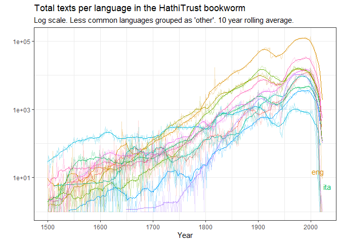

# Using the Hathi Trust Bookworm Tool

The Hathi Trust Bookworm (https://bookworm.htrc.illinois.edu/develop/)
is a tool similar to the [Google Books Ngram
viewer](https://books.google.com/ngrams) that allows one to retrieve
word frequency data from the texts in the [Hathi Trust Digital
Library](https://www.hathitrust.org/). With about 17 million digitised
volumes in its database (many of them originally digitised for the
Google Books project), the Hathi Trust Bookworm is a very powerful tool
to explore trends in word frequencies over time. Moreover, in contrast
to the Google Ngram viewer, the Bookworm can search over the metadata of
the collection, making possible more informative queries about the
sources of particular word frequency trends.[^1]

This package offers one function, `query_bookworm()`, that makes it
relatively easy to retrieve word frequency and other data from the Hathi
Trust Bookworm into R, and to use it for exploratory analyses of word
frequency trends.

For example, suppose we are interested in the changing frequencies of
terms like “democracy”, “dictatorship”, “monarchy”, and so on. We can
download the frequency of these terms (according to various metrics)
with a single call:

``` r
library(hathiTools)
library(tidyverse)
library(slider) # For moving averages

res <- query_bookworm(c("democracy", "dictatorship", "monarchy",
                        "aristocracy", "oligarchy", "tyranny",
                        "autocracy"),
                      counttype = c("WordsPerMillion"),
                      lims = c(1700, 2020))
```

This results in a nice, tidy tibble:

``` r
res
#> # A tibble: 2,247 × 4
#>    word      date_year  value counttype      
#>    <chr>         <int>  <dbl> <chr>          
#>  1 democracy      1700 2.70   WordsPerMillion
#>  2 democracy      1701 0.123  WordsPerMillion
#>  3 democracy      1702 1.34   WordsPerMillion
#>  4 democracy      1703 0.765  WordsPerMillion
#>  5 democracy      1704 0.428  WordsPerMillion
#>  6 democracy      1705 0.0989 WordsPerMillion
#>  7 democracy      1706 0.163  WordsPerMillion
#>  8 democracy      1707 0.446  WordsPerMillion
#>  9 democracy      1708 0.0652 WordsPerMillion
#> 10 democracy      1709 0.0681 WordsPerMillion
#> # … with 2,237 more rows
#> # ℹ Use `print(n = ...)` to see more rows
```

Which can be used for plotting:

``` r
res %>%
  mutate(counttype = "Words per million") %>%
  group_by(word) %>%
  mutate(rolling_avg = slide_dbl(value, mean, .before = 10, .after = 10)) %>%
  ggplot(aes(x = date_year, color = word)) +
  geom_line(aes(y = value), alpha = 0.3) +
  geom_line(aes(x = date_year, y = rolling_avg)) +
  facet_wrap(~counttype) +
  labs(x = "Approx. year of publication", y = "", subtitle = "10 year rolling average, books published between 1700-2020",
       title = "Frequency of 'democracy' and other political terms in the HathiTrust corpus") +
  theme_bw() +
  scale_color_viridis_d()
```


The trends are clear: “democracy” becomes a much more salient term
during the 19th and 20th centuries, with big peaks around the World Wars
and the end of the Cold War, and an increasing level of usage in this
corpus since the 1970s.

We can also look at the frequency of democracy *relative* to another
word (e.g., dictatorship) across time by using
`counttype = "WordsRatio"`:

``` r
res2 <- query_bookworm(word = "democracy", compare_to = "dictatorship",
                          lims = c(1900, 2000), counttype = "WordsRatio")

res2 %>%
  ggplot(aes(x = date_year, y = value)) +
  geom_line() +
  theme_bw() +
  labs(title = "Frequency of 'democracy' relative to 'dictatorship' in the Bookworm corpus",
       x = "Approx. date of publication",
       y = "Ratio")
```


‘Democracy’ is always used more frequently than ‘dictatorship’ in this
corpus during the 20th century, but especially right around the First
World War.

We can also explore the kinds of books where ‘democracy’ is mentioned in
the 20th century. This query groups the volumes that mention ‘democracy’
by both the year of publication and the volume classification in the
Hathi Trust metadata:

``` r
res2 <- query_bookworm(word = "democracy", groups = c("date_year", "lc_classes"),
                          lims = c(1900,2000))

res2 %>%
  ggplot(aes(x = date_year, y = fct_reorder(str_trunc(lc_classes, 40), value))) +
  geom_tile(aes(fill = value)) +
  facet_wrap(~word, scales = "free_y") +
  scale_fill_gradient2() +
  theme_bw() +
  labs(y = "", x = "Year", title = "Frequency of 'democracy' \nacross library classifications",
       fill = "Words per million") +
  theme(legend.position = "bottom")
```


As we might expect, most volumes classified as “Political Science”,
“History”, and “Social Sciences” mention democracy more often than
medicine or agriculture, especially in the second half of the 20th
century. But a surprising number of books classified as “Education”
mention democracy quite a bit, especially right around the Second World
War.

It is also possible to further limit the query to, e.g., books published
in a particular language or written by a particular author. For example,
this gives the number of texts that use the word “democracy” in
1900-2000, grouped by library classification and language.

``` r
res3 <- query_bookworm(word = "democracy",
                       lims = c(1900, 2000),
                       groups = c("lc_classes", "languages"),
                       counttype = c("TextCount"))

res3 %>% 
  filter(languages == "eng") %>% 
  arrange(desc(value))
#> # A tibble: 22 × 7
#>    word      lc_classes                   langu…¹  value count…² min_y…³ max_y…⁴
#>    <chr>     <chr>                        <chr>    <int> <chr>     <dbl>   <dbl>
#>  1 democracy unknown                      eng     697511 TextCo…    1900    2000
#>  2 democracy Social Sciences              eng     186912 TextCo…    1900    2000
#>  3 democracy General and Old World Histo… eng     133276 TextCo…    1900    2000
#>  4 democracy Language and Literature      eng     117172 TextCo…    1900    2000
#>  5 democracy Political Science            eng      91759 TextCo…    1900    2000
#>  6 democracy Education                    eng      65825 TextCo…    1900    2000
#>  7 democracy Philosophy, Psychology, and… eng      61692 TextCo…    1900    2000
#>  8 democracy Law                          eng      56733 TextCo…    1900    2000
#>  9 democracy Bibliography, Library Scien… eng      55101 TextCo…    1900    2000
#> 10 democracy History of America           eng      48800 TextCo…    1900    2000
#> # … with 12 more rows, and abbreviated variable names ¹​languages, ²​counttype,
#> #   ³​min_year, ⁴​max_year
#> # ℹ Use `print(n = ...)` to see more rows
```

Among texts which have some classification (most don’t!), \~90,000
political science texts mention the term.

And this query finds how many volumes between 1900 and 2000 had Alexis
de Tocqueville as a first author published in English:

``` r
res3 <- query_bookworm(lims = c(1900, 2000),
                       groups = c("date_year"),
                       counttype = "TotalTexts",
                       mainauthor = c("Tocqueville, Alexis de, 1805-1859.",
                                             "Tocqueville, Alexis de, 1805-1859"),
                       languages = "eng")

res3
#> # A tibble: 23 × 3
#>    date_year value counttype 
#>        <int> <int> <chr>     
#>  1      1900     9 TotalTexts
#>  2      1904     2 TotalTexts
#>  3      1909     1 TotalTexts
#>  4      1948     4 TotalTexts
#>  5      1949     1 TotalTexts
#>  6      1952     2 TotalTexts
#>  7      1954     7 TotalTexts
#>  8      1958     1 TotalTexts
#>  9      1959     4 TotalTexts
#> 10      1961     2 TotalTexts
#> # … with 13 more rows
#> # ℹ Use `print(n = ...)` to see more rows
```

One can use `method = "returnPossibleFields"` to return the fields
available for limiting a query or grouping the results:

``` r
query_bookworm(word = "", method = "returnPossibleFields")
#> # A tibble: 17 × 6
#>    name                    type      description tablename         dbname anchor
#>    <chr>                   <chr>     <chr>       <chr>             <chr>  <chr> 
#>  1 lc_classes              character ""          lc_classesLookup  lc_cl… bookid
#>  2 lc_subclass             character ""          lc_subclassLookup lc_su… bookid
#>  3 fiction_nonfiction      character ""          fiction_nonficti… ficti… bookid
#>  4 genres                  character ""          genresLookup      genres bookid
#>  5 languages               character ""          languagesLookup   langu… bookid
#>  6 htsource                character ""          htsourceLookup    htsou… bookid
#>  7 digitization_agent_code character ""          digitization_age… digit… bookid
#>  8 mainauthor              character ""          mainauthorLookup  maina… bookid
#>  9 publisher               character ""          publisherLookup   publi… bookid
#> 10 format                  character ""          formatLookup      format bookid
#> 11 is_gov_doc              character ""          is_gov_docLookup  is_go… bookid
#> 12 page_count_bin          character ""          page_count_binLo… page_… bookid
#> 13 word_count_bin          character ""          word_count_binLo… word_… bookid
#> 14 publication_country     character ""          publication_coun… publi… bookid
#> 15 publication_state       character ""          publication_stat… publi… bookid
#> 16 publication_place       character ""          publication_plac… publi… bookid
#> 17 date_year               integer   ""          fastcat           date_… bookid
```

We can also get a sample of the book titles and links for a particular
year. (It’s a limited sample; the database will only pull the top 100
books mentioning the term, weighted by the frequency of the term in the
volume). For example, we can pull out the top 100 books in the category
“Education” that mention the word “democracy” in 1941, the year where
education books seem to be most likely to mention democracy:

``` r

res4 <- query_bookworm(word = "democracy",
                       date_year = "1941",
                       lc_classes = "Education",
                       method = "search_results")

res4
#> # A tibble: 100 × 3
#>    htid                      title                                         url  
#>    <chr>                     <chr>                                         <chr>
#>  1 nc01.ark:/13960/t2v41mn4r Teaching democracy in the North Carolina pub… http…
#>  2 mdp.39015062763720        The education of free men in American democr… http…
#>  3 uc1.$b67929               The education of free men in American democr… http…
#>  4 mdp.39015068297905        The education of free men in American democr… http…
#>  5 uc1.$b67873               Pennsylvania bill of rights week. Recommenda… http…
#>  6 mdp.39015035886111        Education in a world of fear,                 http…
#>  7 coo.31924013433044        Education in a world of fear,                 http…
#>  8 mdp.39015031665543        Education and the morale of a free people.    http…
#>  9 uiug.30112108068831       Proceedings of the convention.                http…
#> 10 uc1.$b67928               Education and the morale of a free people.    http…
#> # … with 90 more rows
#> # ℹ Use `print(n = ...)` to see more rows
```

If you need a bigger sample, use the function `workset_builder()` to
query the Hathi Trust’s [Workset Builder
2.0](https://solr2.htrc.illinois.edu/solr-ef/); this can help you
download even hundreds of thousands of volume IDs that meet specified
criteria. (See also the article on example workflows for more).

We can investigate further any of these volumes by downloading their
associated “Extracted Features” file (that is, a file with token counts
and part of speech information that the Hathi Trust makes available).
Here we download the word frequencies for the second Hathi Trust id, The
education of free men in American democracy., available at
http://hdl.handle.net/2027/mdp.39015062763720, as a nice tidy `tibble`
suitable for analysis with a package like `{tidytext}`.

``` r

tmp <- tempdir()

extracted_features <- get_hathi_counts(res4$htid[2], dir = tmp)

extracted_features
#> # A tibble: 20,600 × 6
#>    htid               token       POS   count section  page
#>    <chr>              <chr>       <chr> <int> <chr>   <int>
#>  1 mdp.39015062763720 COMMISSION  NNP       1 body        1
#>  2 mdp.39015062763720 in          IN        1 body        1
#>  3 mdp.39015062763720 Free        NNP       1 body        1
#>  4 mdp.39015062763720 Men         NNP       1 body        1
#>  5 mdp.39015062763720 Democracy   NNP       1 body        1
#>  6 mdp.39015062763720 School      NNP       1 body        1
#>  7 mdp.39015062763720 POLICIES    NNPS      1 body        1
#>  8 mdp.39015062763720 National    NNP       1 body        1
#>  9 mdp.39015062763720 The         DT        1 body        1
#> 10 mdp.39015062763720 Association NNP       2 body        1
#> # … with 20,590 more rows
#> # ℹ Use `print(n = ...)` to see more rows
```

And we can extract the full metadata for that particular volume, which
tells us this title was created by the Educational Policies Commission,
National Education Association of the United States and the American
Association of School Administrators:

``` r
meta <- get_hathi_meta(res4$htid[2], dir = tmp)

meta
#> # A tibble: 1 × 22
#>   htid         schem…¹ id    type  dateC…² title contr…³ pubDate publi…⁴ pubPl…⁵
#>   <chr>        <chr>   <chr> <chr>   <int> <chr> <chr>     <int> <chr>   <chr>  
#> 1 mdp.3901506… https:… http… "[[\…  2.02e7 The … "[{\"i…    1941 "{\"id… "{\"id…
#> # … with 12 more variables: language <chr>, accessRights <chr>,
#> #   accessProfile <chr>, sourceInstitution <chr>, mainEntityOfPage <chr>,
#> #   lcc <chr>, lccn <chr>, oclc <chr>, category <chr>, genre <chr>,
#> #   typeOfResource <chr>, lastRightsUpdateDate <int>, and abbreviated variable
#> #   names ¹​schemaVersion, ²​dateCreated, ³​contributor, ⁴​publisher, ⁵​pubPlace
#> # ℹ Use `colnames()` to see all variable names
```

You can also browse interactively these titles on the Hathi Trust
website:

``` r
browse_htids(res4)
```

If you want to download lots of volumes and have
[rsync](https://linux.die.net/man/1/rsync) installed in your system, the
functions `rsync_from_hathi()` and `htid_to_rsync()` can facilitate the
process; see the article on “Creating and Using Hathi Trust Worksets”
for more.

One can get info about the Bookworm corpus itself by using
`counttype = "TotalWords"` or `counttype = "TotalTexts"` and omitting
the ‘word’ key. This query, for example gives you the total number of
texts per language in the corpus used to build the Bookworm.

``` r
res5 <- query_bookworm(counttype = "TotalTexts",
                       groups = c("date_year", "languages"),
                       lims = c(1500,2022))

library(ggrepel)

res5 %>%
  mutate(language = fct_lump_n(languages, 10, w = value)) %>%
  group_by(date_year, language) %>%
  summarise(value = sum(value)) %>%
  group_by(language) %>%
  mutate(label = ifelse(date_year == max(date_year), as.character(language), NA_character_)) %>%
  group_by(language) %>%
  mutate(rolling_avg = slider::slide_dbl(value, mean, .before = 10, .after = 10)) %>%
  ggplot() +
  geom_line(aes(x = date_year, y = rolling_avg, color = language), show.legend = FALSE) +
  geom_line(aes(x = date_year, y = value, color = language), show.legend = FALSE, alpha = 0.3) +
  geom_text_repel(aes(x = date_year, y = value, label = label, color = language), show.legend = FALSE) +
  scale_y_log10() +
  theme_bw() +
  labs(title = "Total texts per language in the HathiTrust bookworm",
       subtitle = "Log scale. Less common languages grouped as 'other'. 10 year rolling average.",
       x = "Year", y = "")
```



For a full list (with some metadata) for *all* volumes in the Hathi
Trust collection, use the functions `download_hathifile()` and
`load_raw_hathifile()`.

[^1]: The Google Ngram Viewer does have some advantages over the
    bookworm, primarily the ability to retrieve data about bigram,
    trigram, 4-gram, and 5-gram frequencies over time, and to conduct
    wildcard and part-of-speech searches. This is not currently possible
    with the Bookworm.
